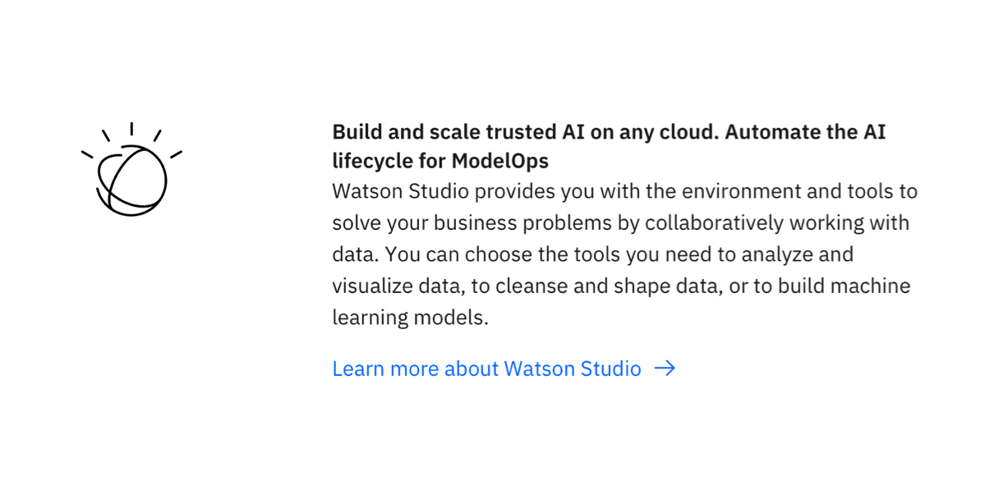

import ComponentDescription from 'components/ComponentDescription';
import ComponentFooter from 'components/ComponentFooter';
import ResourceLinks from 'components/ResourceLinks';

<ComponentDescription name="Pictogram item" type="layout" />

<AnchorLinks>

<AnchorLink>Resources</AnchorLink>
<AnchorLink>Overview</AnchorLink>
<AnchorLink>Content guidance</AnchorLink>
<AnchorLink>Feedback</AnchorLink>

</AnchorLinks>

<ResourceLinks name="Pictogram item" type="layout" />

## Overview

<Row>
<Column colMd={6} colLg={8}>

</Column>
</Row>

## Content guidance

| Element                                                          | Content type | Required | Instances | Character limit  (English / translated) | Notes                |
| ---------------------------------------------------------------- | ------------ | -------- | --------- | ------------------------------------------- | -------------------- |
| Heading                                                          | Text         | Yes      | 1         | 120 / 150                                   |                      |
| Copy                                                             | Text         | Yes      | 1         | 350 / 450                                   |                      |
| Pictogram                                                        | Icon         | Yes      | 1         | –                                           |                      |
| [CTA](https://www.ibm.com/standards/carbon/components/cta/#text) | Component    | No       | 1         | –                                           | Text style CTA only. |

For more information, see the [character count standards](https://www.ibm.com/standards/carbon/guidelines/content#character-count-standards).

<ComponentFooter name="Pictogram item" type="layout" />
