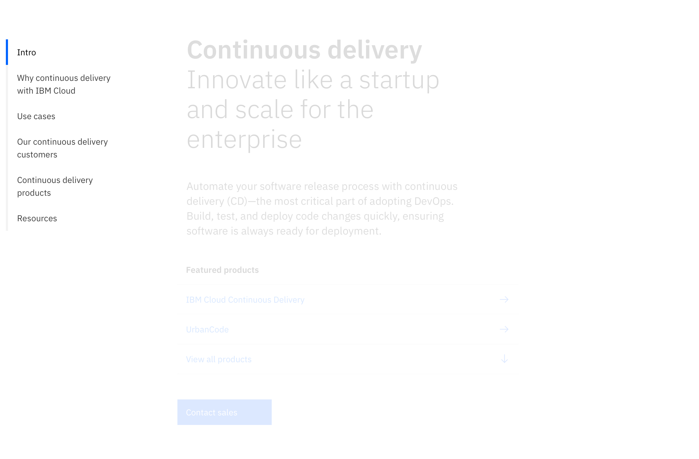
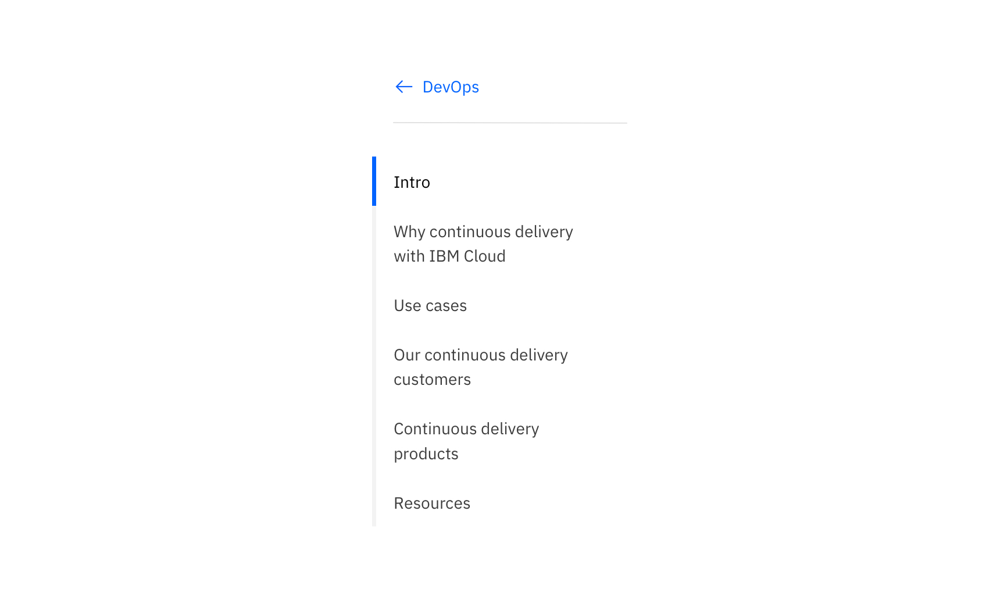
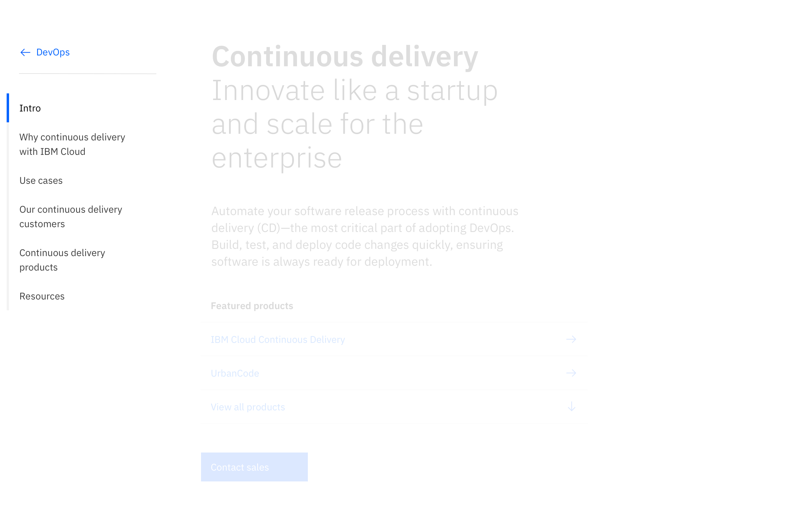
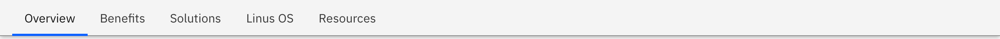
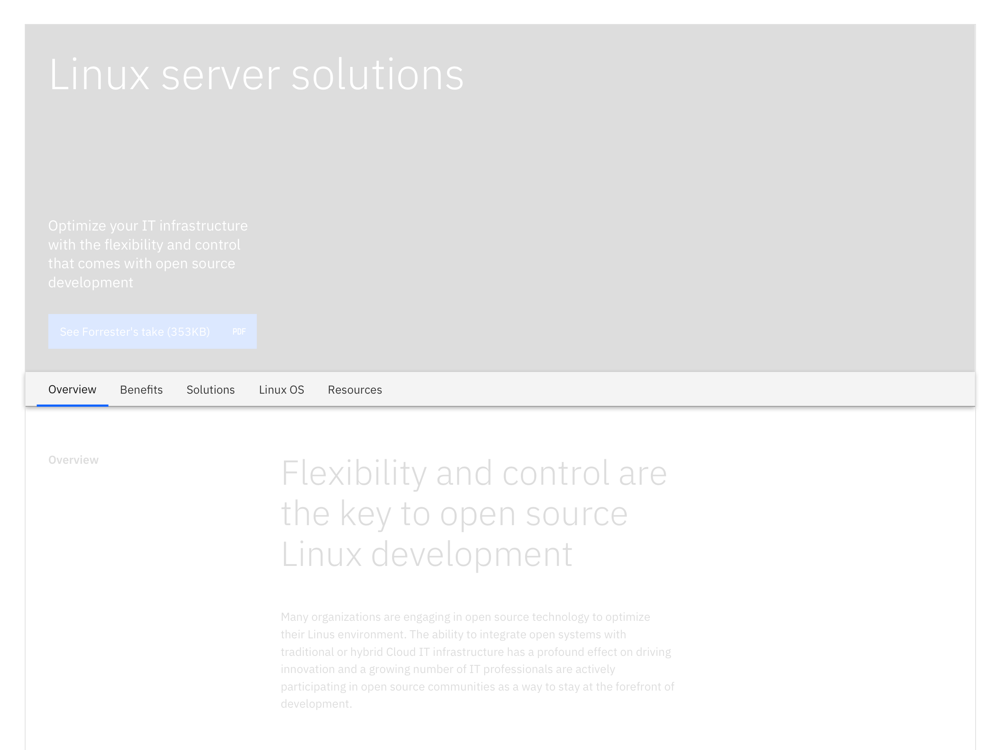

import ComponentDescription from 'components/ComponentDescription';
import ComponentFooter from 'components/ComponentFooter';
import ResourceLinks from 'components/ResourceLinks';

<ComponentDescription name="Table of contents" type="layout" />

<AnchorLinks>

<AnchorLink>Resources</AnchorLink>
<AnchorLink>Overview</AnchorLink>
<AnchorLink>Variations</AnchorLink>
<AnchorLink>Behaviors</AnchorLink>
<AnchorLink>Tips and techniques</AnchorLink>
<AnchorLink>Content guidance</AnchorLink>
<AnchorLink>Feedback</AnchorLink>

</AnchorLinks>

<ResourceLinks name="Table of contents" type="layout" />

## Overview

The Table of contents (ToC) component renders as left navigation that includes anchor links to various locations on the page. The links themselves can either be dynamically generated based on anchor links and associated title attributes or manually entered by the author.

<Row>
<Column colMd={8} colLg={8}>

</Column>
</Row>

<Title>Use case</Title>

**When to use:**

- When the page length is long and requires a lot of scrolling.
- When users need to know what is included in a page, the table of contents can serve as an outline or summary of the page content.
- When users need to navigate to a specific section on the page quickly.

**When not to use:**

- When there is only one section there is no need to the ToC.
- When a page is relatively short and the user will not have to scroll very far.
- When users need to read all the content in a specific order.

 

## Variations

### Vertical with heading content

This variation only applies to the vertical Table of Contents (ToC). The area above the Table of contents can be utilized in many ways—showing navigational links, the page title, or an image.

<Row>
<Column colMd={8} colLg={8}>

</Column>
</Row>

<Title>Use case</Title>

### Horizontal

The horizontal variation lays the table of content navigation links into a row. When present, it sticks to the top of the page while scrolling. It then replaces the masthead sticky navigation when the top of its container meets the top of the window.

<Title>Use case</Title>

**When to use:**

- Your experience needs to use full width section components or the first 4 columns of the 2x grid.
- The table of contents needs to be used across alternating full width themed sections throughout a page.

**When not to use:**

- The horizontal version should not be used with a center aligned lead space because the text alignment disrupts the users reading flow, consider using the vertical version with Lead space centered or Lead space block.
- The horizontal version should not be placed immediately below the IBM masthead.

## Behaviors

### Sticky behavior

The Table of contents is sticky to provide context to the user about where they are within a given page.

#### Larger breakpoints (lg, xl, max)

- The default or vertical ToC is sticky within the first four columns on lg. xlg, and max breakpoints.
- The horizontal ToC is sticks to the top of the page and pushes the masthead out of view on the lg, xlg abd max breakpoints. When the user scrolls up the masthead re-appears and pushes the ToC down.

#### Smaller breakpoints (sm and med)

Both vertical and horizontal versions of the ToC change to a dropdown on md and sm breakpoints, and stick to the top of the page, and pushes the masthead out of view. When the user scrolls up the masthead re-appears and pushes the ToC down.

## Tips and techniques

### Labels

Table of contents labels and the section headlines they link to should be the same or a shortened version of the headline. The default or vertical ToC can accommdoate multi-line labels, and therefor can generally match the section headline.

#### Examples

- Label: Connect; Section: Connect with IBM
- Label: Connect with IBM; Section: Connect with IBM

### Number of ToC items

We recommend having a maximum of 7 items in the vertical Table of contents. This is becase too many ToC items can cause the component to become taller than the screen height, resulting in a double scroll for users and defeating the sticky behavior.

The ToC should never extend more than the screen height for it to be effective as a sticky element.

## Content guidance

| Element         | Content type | Required | Instances | Character limit  (English / translated) | Notes                                                                              |
| --------------- | ------------ | -------- | --------- | ------------------------------------------- | ---------------------------------------------------------------------------------- |
| Child container | Component    | No       | 1         | –                                           | A container area that child components and other content types can be passed into. |
| Anchor link     | Link         | Yes      | 3–7       | 25 / 35                                     | Character count applies to TOC heading overrides.                                  |
| Orientation     | Option list  | Yes      | 1         | –                                           | Vertical or horizontal.                                                            |

For more information, see the [character count standards](https://www.ibm.com/standards/carbon/guidelines/content#character-count-standards).

<ComponentFooter name="Table of contents" type="layout" />
