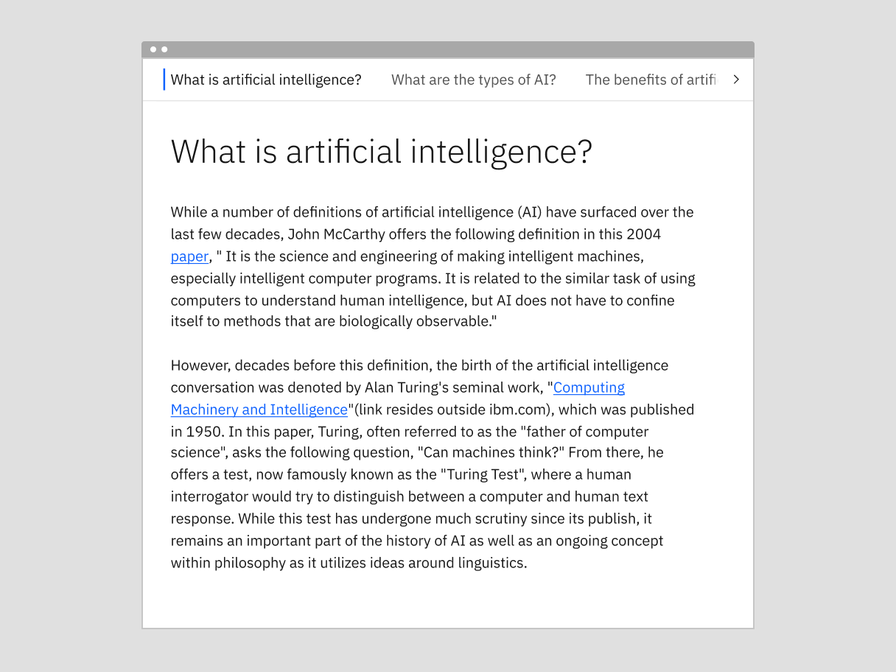
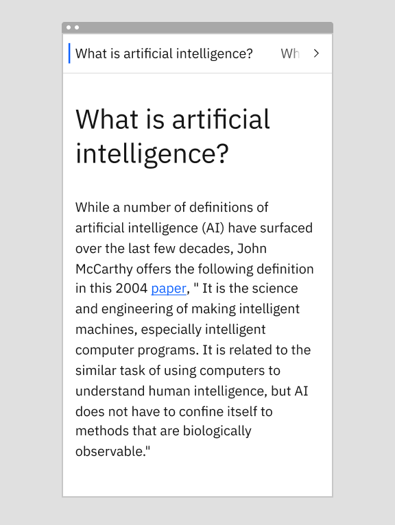
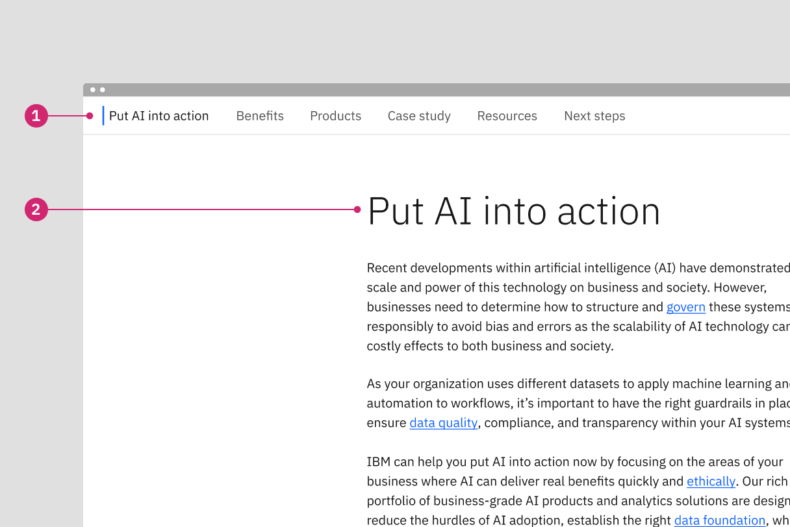

import ComponentDescription from 'components/ComponentDescription';
import ComponentFooter from 'components/ComponentFooter';
import ResourceLinks from 'components/ResourceLinks';

<ComponentDescription name="Table of contents" type="layout" />

<AnchorLinks>

<AnchorLink>Overview</AnchorLink>
<AnchorLink>Vertical</AnchorLink>
<AnchorLink>Horizontal</AnchorLink>
<AnchorLink>Tips and techniques</AnchorLink>
<AnchorLink>Resources</AnchorLink>
<AnchorLink>Content guidance</AnchorLink>
<AnchorLink>Feedback</AnchorLink>

</AnchorLinks>

## Overview

The table of contents (ToC) component acts as in-page navigation that includes anchor links to various locations on the page. The links themselves can either be dynamically generated based on content sections with their corresponding anchor links and associated title attributes, or manually entered by the author.

<Row>

<Column colMd={6} colLg={8}>

</Column>

</Row>

<Caption>
  Vertical table of contents on the left, horizontal table of contents on the
  right
</Caption>

### Deciding what to use

| Variants                  | Use cases                                                                                                                                 |
| ------------------------- | ----------------------------------------------------------------------------------------------------------------------------------------- |
| [Vertical](#vertical)     | This is the default variant and occupies the first 4 columns of the 16 column grid.                                                       |
| [Horizontal](#horizontal) | This variant is is best used with components that span the full 16 column grid, such as [Feature section](../components/feature-section). |

## Vertical

The vertical table of contents renders as a vertical list of anchor links in the first 4 columns of the 16 column grid.

<Caption>Example of the vertical table of contents within a page.</Caption>

#### When to use:

- When the page length is long and requires a lot of scrolling.
- When users need to know what is included in a page, the table of contents can serve as an outline or summary of the page content.
- When users need to navigate to a specific section on the page quickly.

#### When not to use:

- When there is only one section, there is no need to include the ToC
- When a page is relatively short and the user will not have to scroll very far.
- When users need to read all the content in a specific order.

### Behaviors

#### Desktop

The default or vertical ToC is sticky within the first four columns on lg, xlg, and max breakpoints and follows the user down the page. The section the user is in will be highlighted as they scroll down the page.

#### Mobile

In smaller breakpoints the vertical table of contents transitions to a horizontal orientation, similar to the horizontal variant. The user can swipe to the right and left to access the links that are outside of the browser viewport.

<Row>

<Column colMd={8} colLg={8}>

<Caption>
  Example of vertical table of contents at the medium breakpoint
</Caption>

</Column>

<Column colMd={8} colLg={4}>

<Caption>Example of vertical table of contents at the small breakpoint</Caption>

</Column>

</Row>

## Horizontal

The horizontal variation displays the table of content navigation links in a row. When present, it sticks to the top of the page while scrolling. It then replaces the masthead sticky navigation when the top of its container meets the top of the window.

<Caption>Example of the horizontal table of contents within a page.</Caption>

#### When to use:

- Your experience needs to use full width section components or the first four columns of the 2x grid.
- The table of contents needs to be used across alternating full width sections throughout a page.

#### When not to use:

- The horizontal version should not be used with a center aligned lead space because the text alignment disrupts the user's reading flow. In that situation, consider using the vertical ToC with lead space centered or lead space block.
- The horizontal version should not be placed immediately below the IBM masthead.

### Behaviors

#### Sticky behavior

The table of contents is sticky to provide context to the user about where they are within a given page. We recommend focusing the user and showcasing a single form of navigation at a time on a given page, as the user scrolls down the page the table of contents will stick to the top of the browser window and push the masthead out of the viewport. If the user scrolls back up the page, the masthead will come back into view.

#### Desktop (lg, xl, and max)

The horizontal ToC sticks to the top of the page and pushes the masthead out of view on the lg, xlg and max breakpoints.

#### Mobile

In smaller breakpoints the horizontal table of contents maintains the same form as the desktop, and the user can swipe to the right and left to access the links that are outside of the browser viewport.

<Row>

<Column colMd={8} colLg={8}>

<Caption>
  Example of horizontal table of contents at the medium breakpoint
</Caption>

</Column>

<Column colMd={8} colLg={4}>

<Caption>
  Example of horizontal table of contents at the small breakpoint
</Caption>

</Column>

</Row>

## Tips and techniques

### Number of ToC items

We recommend having a maximum of seven items in the vertical Table of contents. When there are too many ToC items, the component can become taller than the screen height, resulting in a double scroll for users and disrupting the sticky behavior.

The ToC should never extend more than the screen height so that it can be effective as a sticky element.

### Labels

The table of contents labels should inform users what information they will find within a given section of a page.

Table of contents labels and the page headers they link to should be the same or a shortened version of the content block heading to establish a clear relationship between the ToC and the corresponding page section, see the example image below.

#### Vertical

The default ToC can accommodate multi-line labels, and therefore can generally match the page header.

<Row>

<Column colMd={8} colLg={8}>

</Column>

</Row>

1. ToC label
2. Content block header

#### Horizontal

The horizontal ToC is best suited for simple one to two word labels that are shortened versions of the content section or content block heading. The horizontal ToC is typically used in conjunction with [content section](https://www.ibm.com/standards/carbon/components/content-section) components that render a header in the first four columns from the left, allowing for a more descriptive [content block](https://www.ibm.com/standards/carbon/components/content-block) headline. However, the horizontal ToC can also be paired with the content block heading as seen in the example image below.

<Row>

<Column colMd={8} colLg={8}>

</Column>

</Row>

1. ToC label
2. Content block header

<ResourceLinks name="Table of contents" type="layout" />

## Content guidance

| Element         | Content type | Required | Instances | Character limit  (English / translated) | Notes                                                                              |
| --------------- | ------------ | -------- | --------- | ------------------------------------------- | ---------------------------------------------------------------------------------- |
| Child container | Component    | No       | 1         | –                                           | A container area that child components and other content types can be passed into. |
| Anchor link     | Link         | Yes      | 3–7       | 25 / 35                                     | Character count applies to ToC heading overrides.                                  |
| Orientation     | Option list  | Yes      | 1         | –                                           | Vertical or horizontal.                                                            |

For more information, see the [character count standards](https://www.ibm.com/standards/carbon/guidelines/content#character-count-standards).

<ComponentFooter name="Table of contents" type="layout" />
