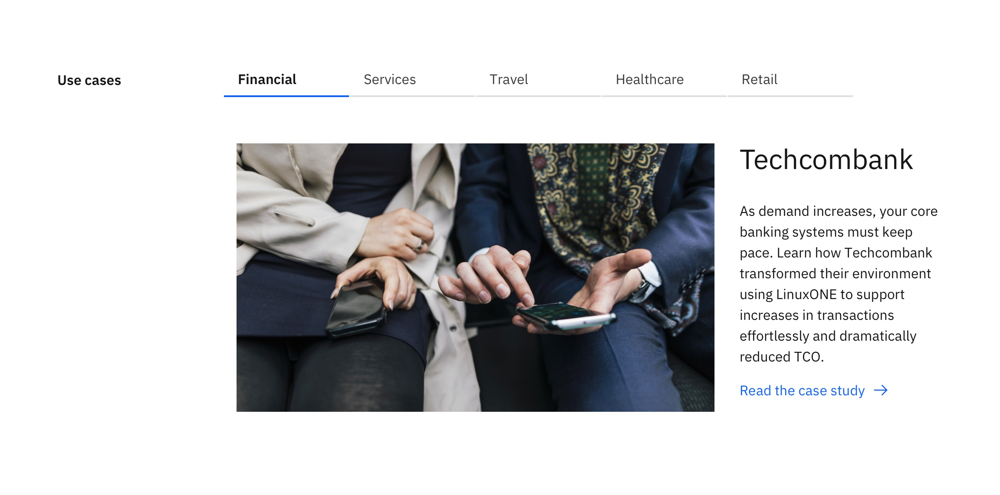
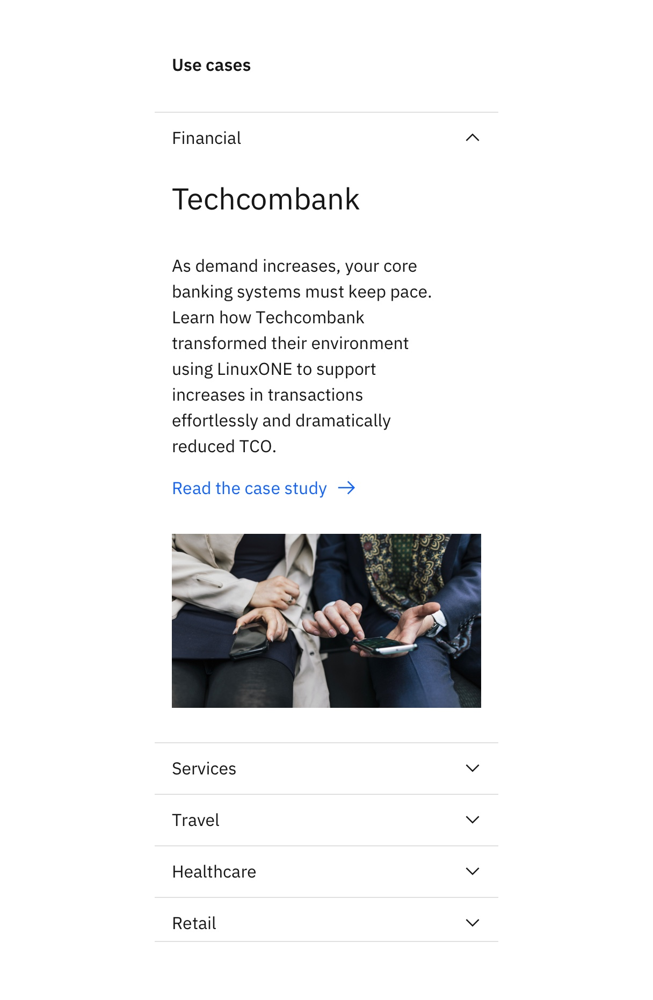

import { ComponentStatus } from "components/ComponentList";
import ComponentDescription from "components/ComponentDescription";
import ComponentFeedback from "components/ComponentFeedback";

<ComponentDescription name="Tabs extended media" type="layout" />

<InlineNotification>

**Note:** Additional usage guidelines are coming soon.

</InlineNotification>

<AnchorLinks>

<AnchorLink>Default</AnchorLink>
<AnchorLink>Design and functional specifications</AnchorLink>
<AnchorLink>Development documentation</AnchorLink>
<AnchorLink>Feedback</AnchorLink>

</AnchorLinks>

## Default

Tabs extended media component uses [Tabs extended](/components/tabs-extended) and [Content item horizontal](/components/content-item-horizontal) with media to create an organized section optimized for content with media. This is useful especially when reducing page length is desired. Keep in mind some content will be hidden until user interaction, so they should not be critical information.

<Row>
<Column colMd={8} colLg={12}>

</Column>
</Row>

### Behavior

On mobile, Tabs extended media component renders as an accordion for easier browsing.

<Row>
<Column colMd={4} colLg={6}>

</Column>
</Row>

## Design and functional specifications

For more details on Tabs extended media, [see design](https://ibm.box.com/s/3sun8lo3gu2b4uaa4oxgpxrqit1m7t6i) and [functional specs]().

## Development documentation

<ComponentStatus name="Tabs extended media" type="layout" />

## Feedback

<ComponentFeedback />
