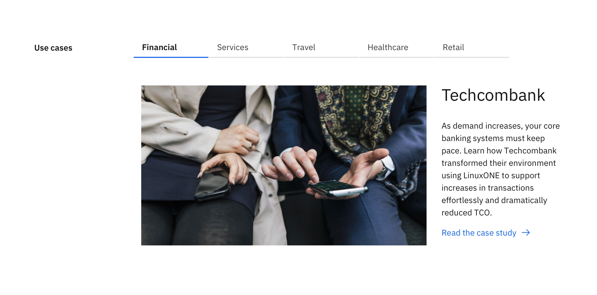
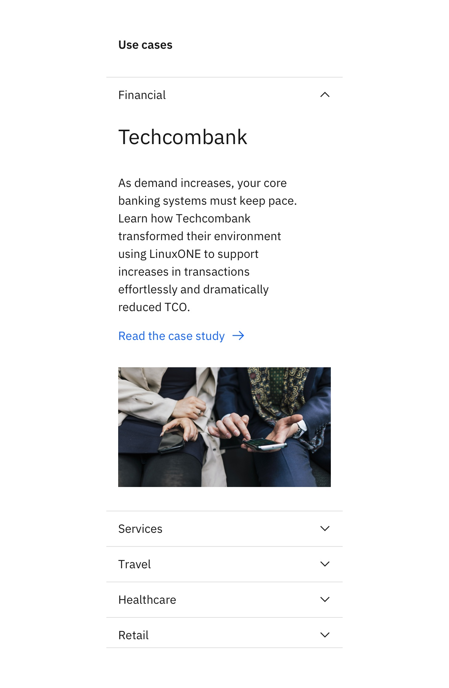

import ComponentDescription from "components/ComponentDescription";
import ComponentFooter from "components/ComponentFooter";

<ComponentDescription name="Tabs extended" type="ui" />

<InlineNotification>

**Note:** Additional usage guidelines are coming soon.

</InlineNotification>

<AnchorLinks>

<AnchorLink>Overview</AnchorLink>
<AnchorLink>Options</AnchorLink>
<AnchorLink>Design and functional specifications</AnchorLink>
<AnchorLink>Development documentation</AnchorLink>
<AnchorLink>Feedback</AnchorLink>

</AnchorLinks>

## Overview

Tabs extended uses the Carbon Design System's [tabs component](https://carbondesignsystem.com/components/tabs/usage/). On desktop, the component renders as tabs, allowing for large amounts of content to be organized using less vertical space on the page. On mobile, the component renders as an accordion, making it easy to read and access each section while scrolling.

The tab labels may wrap up to two lines when truncated.

<Row>
<Column colMd={8} colLg={8}>

  <Caption>Example of the tabs extended, on desktop</Caption>

</Column>
</Row>

On mobile, Tabs extended switches to an accordion for easier browsing.

<Row>
<Column colMd={6} colLg={6}>

  <Caption>Example of the tabs extended, on mobile</Caption>

</Column>
</Row>

## Options

### Media

Tabs extended provides an option to include media. It uses [Content item horizontal](/components/content-item-horizontal) with media to create an organized section for displaying content with media. This is useful especially when reducing page length is desired. Keep in mind that when using tabs, some content will be hidden until the user interacts with the component, so they should not be used for information that is considered critical.

<Row>
<Column colMd={8} colLg={12}>

  <Caption>Example of the tabs extended media, on desktop</Caption>

</Column>
</Row>

On mobile, Tabs extended media renders as an accordion for easier browsing.

<Row>
<Column colMd={4} colLg={6}>

  <Caption>Example of the tabs extended media, on mobile</Caption>

</Column>
</Row>

#### Resources
For more information about Tabs extended media, see the following resources. 
<CardGroup>
  <MiniCard
    title="Tabs extended media design spec"
    href="https://ibm.ent.box.com/folder/133803243554"
  />
  <MiniCard
    title="Tabs extended media functional spec"
    href="https://github.com/carbon-design-system/carbon-for-ibm-dotcom-website/wiki/Tabs-extended-media"
  />
  <MiniCard
    title="Web components Storybook"
    href="https://www.ibm.com/standards/carbon/web-components/?path=/story/components-tabs-extended-with-media--default"
  />
</CardGroup>

<ComponentFooter name="Tabs extended" type="ui" />
