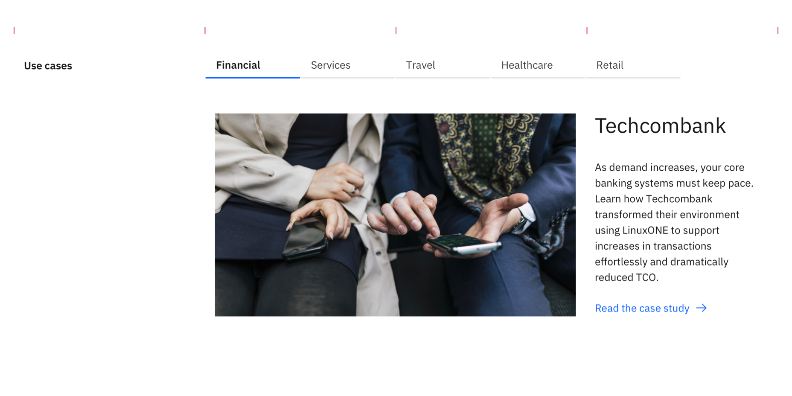
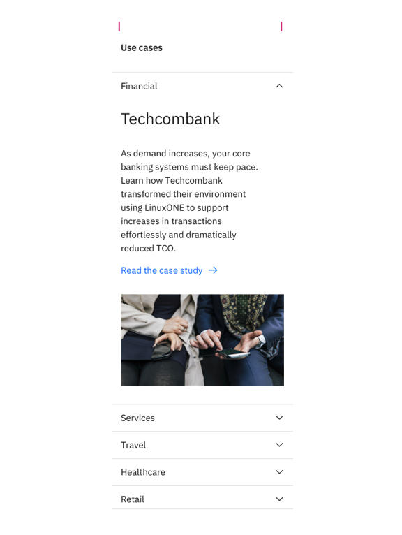

import ComponentDescription from 'components/ComponentDescription';
import ComponentFooter from 'components/ComponentFooter';
import sketchSymbol from '../../images/sketch-symbol.svg';
import githubSymbol from '../../images/icon/github-icon.svg';
import reactSymbol from '../../images/react-icon.svg';
import webComponentsSymbol from '../../images/web-components-icon.svg';
import ResourceLinks from 'components/ResourceLinks';

<ComponentDescription name="Tabs extended" type="ui" />

<AnchorLinks>
  <AnchorLink>Overview</AnchorLink>
  <AnchorLink>Tabs extended</AnchorLink>
  <AnchorLink>Tabs extended media</AnchorLink>
  <AnchorLink>Feedback</AnchorLink>
</AnchorLinks>

## Overview

Tabs extended uses the Carbon Design System's [tabs component](https://carbondesignsystem.com/components/tabs/usage/). On desktop, the component renders as tabs, allowing for large amounts of content to be organized using less vertical space on the page. On mobile, the component renders as an accordion, making it easy to read and access each section while scrolling.

Tab labels wrap up to two lines before being truncated. Truncated labels are fully displayed in tooltips on hover and focus.

## Tabs extended

<Row>
<Column colMd={8} colLg={12}>

<Caption>Example of the tabs extended, on desktop</Caption>

</Column>
</Row>

On mobile, Tabs extended switches to an accordion for easier browsing.

<Row>
<Column colMd={6} colLg={6}>

<Caption>Example of the tabs extended, on mobile</Caption>

</Column>
</Row>

### Modifiers

#### Orientation

Tabs orientation on desktop can be set to horizontal or vertical. When using the vertical orientation, the tabs are displayed stacked in one column. This allows for longer tab labels.

<Row>
<Column colMd={8} colLg={12}>

<Caption>Example of the tabs extended using vertical orientation</Caption>

</Column>
</Row>

<ResourceLinks name="Tabs extended" type="ui" multiComponent />

### Content guidance for Tabs extended

| Element                                                                                                                | Content type | Required | Instances | Character limit  (English / translated) | Notes                                                                                         |
| ---------------------------------------------------------------------------------------------------------------------- | ------------ | -------- | --------- | ------------------------------------------- | --------------------------------------------------------------------------------------------- |
| Child container                                                                                                        | Component    | Yes      | Min 2     | –                                           | Container areas that child components and other content types can be passed into (1 per tab). |
| <a href="https://www.carbondesignsystem.com/components/tabs/usage/" target="_blank" rel="noopener noreferrer">Tabs</a> | Component    | Yes      | 2–6       | –                                           | Tab renders as an accordion for medium breakpoint and smaller.                                |
| Tab item                                                                                                               | Text         | Yes      | –         | 25 / 35                                     | When using vertical orientation max character count = 40 / 55.                                |

For more information, see the [character count standards](https://www.ibm.com/standards/carbon/guidelines/content#character-count-standards).

## Tabs extended media

Tabs extended provides an option to include media. It uses [Content item horizontal](/components/content-item-horizontal) with media to create an organized section for displaying content with media. This is useful especially when reducing page length is desired. Keep in mind that when using tabs, some content will be hidden until the user interacts with the component, so they should not be used for information that is considered critical.

<Row>
<Column colMd={8} colLg={12}>

<Caption>Example of the tabs extended media, on desktop</Caption>

</Column>
</Row>

On mobile, Tabs extended media renders as an accordion for easier browsing.

<Row>
<Column colMd={4} colLg={6}>

<Caption>Example of the tabs extended media, on mobile</Caption>

</Column>
</Row>

<ResourceLinks name="Tabs extended media" type="layout" multiComponent />

### Content guidance for Tabs extended media

| Element                                                                                                                                          | Content type | Required | Instances | Character limit  (English / translated) | Notes          |
| ------------------------------------------------------------------------------------------------------------------------------------------------ | ------------ | -------- | --------- | ------------------------------------------- | -------------- |
| Tabs extended                                                                                                                                    | Component    | Yes      | 1         | –                                           |                |
| [Content item horizontal with media](https://www.ibm.com/standards/carbon/components/content-item-horizontal#content-item-horizontal-with-media) | Component    | Yes      | 1         | –                                           | Max 1 per tab. |

For more information, see the [character count standards](https://www.ibm.com/standards/carbon/guidelines/content#character-count-standards).

<ComponentFooter name="Tabs extended" type="ui" />
