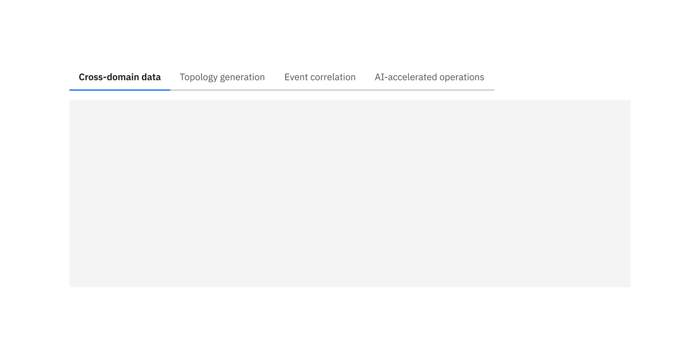
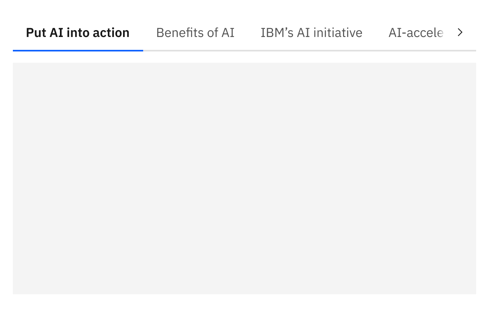
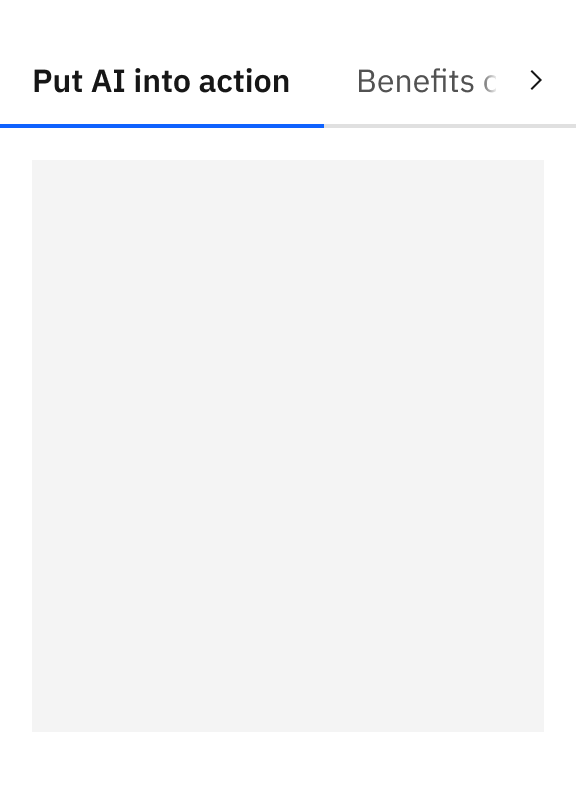

import ComponentDescription from 'components/ComponentDescription';
import ComponentFooter from 'components/ComponentFooter';
import sketchSymbol from '../../images/icon/sketch-symbol.svg';
import githubSymbol from '../../images/icon/github-icon.svg';
import reactSymbol from '../../images/icon/react-icon.svg';
import webComponentsSymbol from '../../images/icon/web-components-icon.svg';
import ResourceLinks from 'components/ResourceLinks';

<ComponentDescription name="Tabs extended" type="ui" />

<AnchorLinks>
  <AnchorLink>Overview</AnchorLink>
  <AnchorLink>Tabs extended</AnchorLink>
  <AnchorLink>Tabs extended with media</AnchorLink>
  <AnchorLink>Behaviors</AnchorLink>
  <AnchorLink>Feedback</AnchorLink>
</AnchorLinks>

<InlineNotification>

**Breaking change:** Previously, tabs extended was a separate component in Carbon for IBM.com v1. In v2, tabs extended will use Carbon Design System's [tab](https://carbondesignsystem.com/components/tabs/usage/) directly with automatic style updates.

</InlineNotification>

## Overview

Tabs extended displays parallel pieces of related content, allowing users to explore the displayed content of their choice. It also has the benefit of reducing the amount of scrolling the user may have to do on a given page, but should be used carefully because some information is hidden on load. If the information within a tab is essential for the user, consider using a different component that will not hide the content.

The tabs extended component uses the Carbon Design System's [tabs](https://carbondesignsystem.com/components/tabs/usage/) component directly, and includes automatic style updates to optimize for editorial content.

<Row>
<Column colMd={8} colLg={8}>

<Caption>Example of the tabs extended on desktop</Caption>

</Column>
</Row>

Like tabs, tabs extended will expand a given item horizontally to display the whole label without truncating. Keep this in mind as you write selection items for tabs extended, as overly long labels can push other options out of the initial view. Also consider translation lengthening the label.

## Tabs extended

Tabs extended can nest other components inside its content area to display them based on the user's selection. We recommend nesting similar components in sequence, rather than varying the types of components displayed in a given tabs experience.

<ResourceLinks name="Tabs extended" type="ui" multiComponent />

### Content guidance for Tabs extended

| Element                                                                                                                | Content type | Required | Instances | Character limit  (English / translated) | Notes                                                                                         |
| ---------------------------------------------------------------------------------------------------------------------- | ------------ | -------- | --------- | ------------------------------------------- | --------------------------------------------------------------------------------------------- |
| Child container                                                                                                        | Component    | Yes      | Min 2     | –                                           | Container areas that child components and other content types can be passed into (1 per tab). |
| <a href="https://www.carbondesignsystem.com/components/tabs/usage/" target="_blank" rel="noopener noreferrer">Tabs</a> | Component    | Yes      | 2–6       | –                                           |                                                                                               |
| Tab item                                                                                                               | Text         | Yes      | –         | 25 / 35                                     |                                                                                               |

For more information, see the [character count standards](https://www.ibm.com/standards/carbon/guidelines/content#character-count-standards).

## Tabs extended with media

Tabs extended with media is a prebuilt variant of tabs extended which provides an option where the tab panel is pre-populated with the [Content item row](/components/content-item-row) with media component to create an organized section for displaying content paired with media.

<Row>
<Column colMd={8} colLg={8}>

<Caption>Example of the tabs extended on desktop</Caption>

</Column>
</Row>

As with tabs extended, some content will be hidden until the user interacts with the component, so tabs extended with media should not be used for information that is considered critical.

<Row>

<Column colMd={6} colLg={6}>

<Caption>
  Tabs extended with media displaying the first instance of content
</Caption>

</Column>

<Column colMd={6} colLg={6}>

<Caption>
  Tabs extended with media displaying the second instance of content
</Caption>

</Column>

</Row>

<ResourceLinks name="Tabs extended media" type="layout" multiComponent />

### Content guidance for Tabs extended media

| Element                                                                                   | Content type | Required | Instances | Character limit  (English / translated) | Notes          |
| ----------------------------------------------------------------------------------------- | ------------ | -------- | --------- | ------------------------------------------- | -------------- |
| Tabs extended                                                                             | Component    | Yes      | 1         | –                                           |                |
| [Content item row with media](../components/content-item-row#content-item-row-with-media) | Component    | Yes      | 1         | –                                           | Max 1 per tab. |

## Behaviors

### Overflow

When the tabs extended options would be hidden due to the window becoming too small, overflow buttons will automatically appear on the sides of the component. These buttons allow users to navigate the entire tabs extended to see all options regardless of screen size. Note that this functionality occurs across all breakpoints, not just mobile.

<Row>

<Column colMd={8} colLg={8}>

<Caption>Tabs extended with an overflow on desktop</Caption>

</Column>

<Column colMd={4} colLg={4}>

<Caption>Tabs extended with an overflow on mobile</Caption>

</Column>

</Row>

<ComponentFooter name="Tabs extended" type="ui" />
