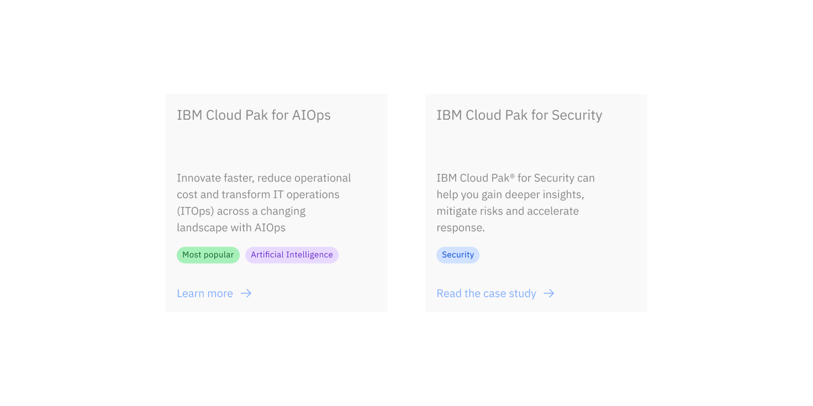
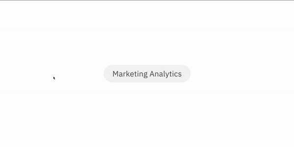

import ComponentDescription from 'components/ComponentDescription';
import ComponentFeedback from 'components/ComponentFeedback';
import ResourceLinks from 'components/ResourceLinks';

<ComponentDescription name="Tags" type="ui" />

<AnchorLinks>

<AnchorLink>Resources</AnchorLink>
<AnchorLink>Overview</AnchorLink>
<AnchorLink>Tag</AnchorLink>
<AnchorLink>Tag link</AnchorLink>
<AnchorLink>Tag group</AnchorLink>
<AnchorLink>Feedback</AnchorLink>
  
</AnchorLinks>

## Overview

Tags are used to add additional context to, or categorize content that they appear in. In Carbon for IBM.com, the Carbon tag is used directly in the card component. Tag link is a clickable version of the Carbon tag that is often used inside a tag group to represent poly-hierarchy.

## Tag

The Carbon tag is primarily used inside the [card](https://www.ibm.com/standards/carbon/components/cards) component in Carbon for IBM.com. This enables cards to display labels that categorize the card's contents or highlight aspects of the content.

For more information, visit Carbon Design System's tag [guidance](https://carbondesignsystem.com/components/tag/usage/) page.

<Row>
<Column colMd={8} colLg={12}>

</Column>
</Row>

<Caption>An example of tags appearing inside cards.</Caption>

## Tag link

Tag link is a clickable component that accepts a URL and is used to navigate users to a topic page, or additional information related to the tag link. It uses Carbon's [tag](https://carbondesignsystem.com/components/tag/usage/) as a base, and uses a larger type token and additional spacing around the label. Unlike tag, tag link has limited color styles for the label and background.

Tag link is primarily used inside of a tag group (see more below).

<Row>

<Column colMd={8} colLg={10}>

</Column>

</Row>

<Caption>An example of a tag link navigating a user to a related page</Caption>

<ResourceLinks name="Tag link" type="ui" multiComponent />

### Content guidance for Tag link

| Element | Content type | Required | Instances | Character limit  (English / translated) | Notes               |
| ------- | ------------ | -------- | --------- | ------------------------------------------- | ------------------- |
| Label   | Text         | No       | 1         | 25 / 35                                     | URL added in setup. |

## Tag group

Tag group is a collection of tag links that can be added to the [lead space](https://www.ibm.com/standards/carbon/components/leadspace). Tag group is typically used in cases where the navigation does not have a clear, linear hierarchy. We recommend using more than one Tag link to represent a polyhierarchical structure. When there is a clear, linear hierachy, we recommend utilizing breadcrumbs, see the lead space [parent navigation](https://www.ibm.com/standards/carbon/components/leadspace#parent-navigation) for additional guidance.

<Row>
<Column colMd={8} colLg={12}>

</Column>
</Row>

<Caption>An example of a tag group appearing inside a lead space.</Caption>

<ResourceLinks name="Tag group" type="ui" multiComponent />

## Feedback

<ComponentFeedback />
