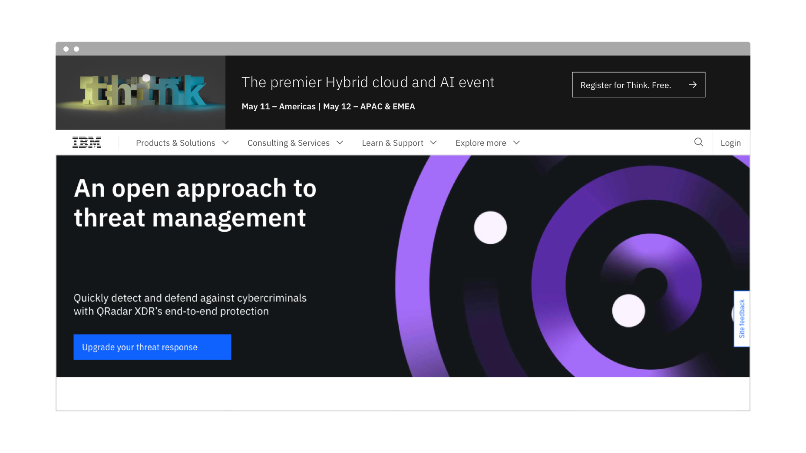
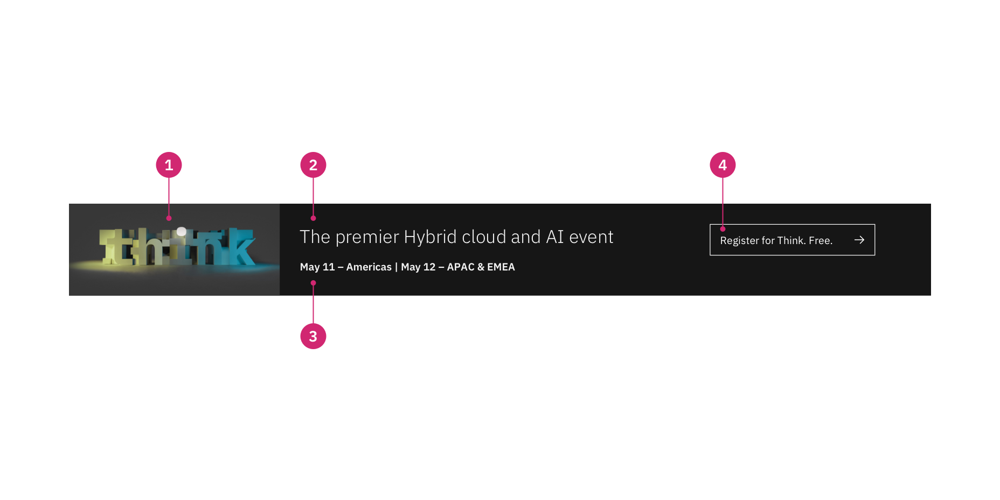
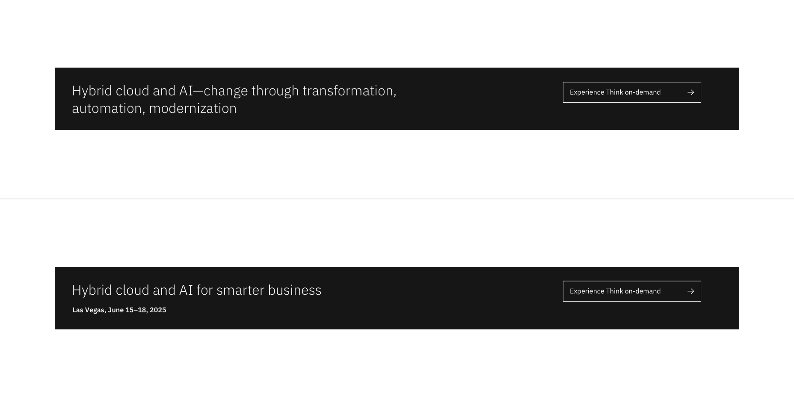
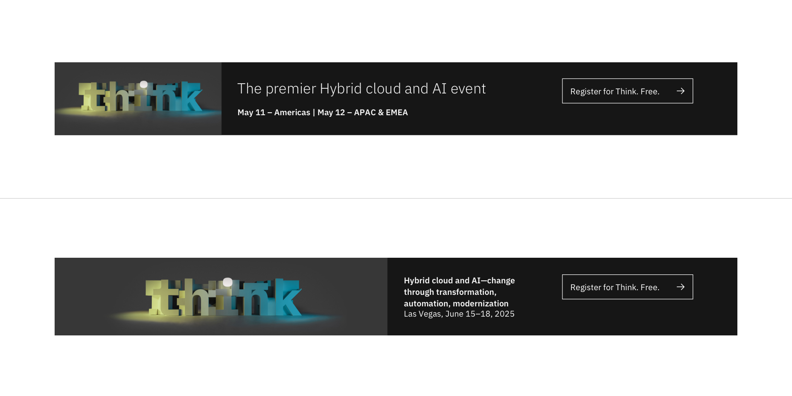
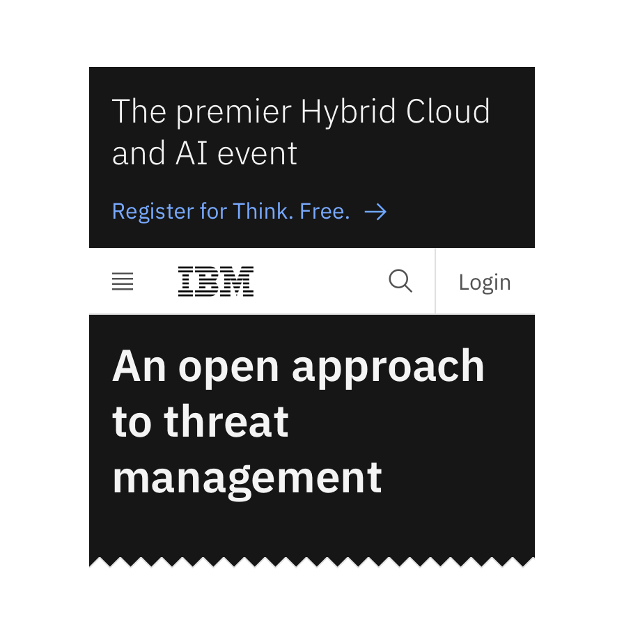

import { ComponentStatus } from 'components/ComponentList';
import ComponentDescription from 'components/ComponentDescription';
import ComponentFeedback from 'components/ComponentFeedback';
import ResourceLinks from 'components/ResourceLinks';

<ComponentDescription name="Universal banner" type="layout" />

<AnchorLinks>

<AnchorLink>Overview</AnchorLink>
<AnchorLink>Banner with text only</AnchorLink>
<AnchorLink>Banner with image</AnchorLink>
<AnchorLink>Behaviors</AnchorLink>
<AnchorLink>Resources</AnchorLink>
<AnchorLink>Content guidance</AnchorLink>
<AnchorLink>Feedback</AnchorLink>

</AnchorLinks>

## Overview

Universal banner is intended for high level and critical announcements such as IBM's THINK global event or COVID-19 messaging. The banner is the only component that can be positioned above the masthead. It has a max height to encourage succinct messaging and optional fields for an image, heading, body copy, and CTA.

For non-critical announcements and callouts, use the [Content group banner](https://www.ibm.com/standards/carbon/components/content-group-banner/) component instead.

<Caption>Example of universal banner</Caption>

### Anatomy

1. **Image:** Optional image with two size options.
2. **Heading:** A succinct and optional heading about the announcement.
3. **Body copy:** A short optional description.
4. **CTA type:** The optional call to action for the user.

## Banner with text only

Universal banner accommodates heading and body copy options. For information about content in universal banner with text only, see the [content guidance table](#content-guidance-for-banner-with-text-only).

<Caption>Example of universal banner with text only</Caption>

## Banner with image

Universal banner accommodates two different image size options, small and large. For information about content in universal banner with image, see the [content guidance table](#content-guidance-for-banner-with-image).

<Caption>Example of universal banner with image</Caption>

## Behaviors

Note that if the content extends beyond the component's fixed height, the content will be cut off.

### Smaller breakpoints (sm and md)

The Universal banner is presented differently at the smaller breakpoints.

- The image is hidden.
- The CTA changes from a button to a link with icon at the small breakpoint.
- The entire banner is clickable the small breakpoint.

<Row>

<Column colMd={4} colLg={6}>

<Caption>Example of the universal banner at the small breakpoint</Caption>

</Column>

</Row>

<ResourceLinks name="Universal banner" type="layout" />

## Content guidance for banner with text only

| Element                                                    | Content type | Required | Instances | Character limit  (English / translated) | Notes                                                               |
| ---------------------------------------------------------- | ------------ | -------- | --------- | ------------------------------------------- | ------------------------------------------------------------------- |
| Heading                                                    | Text         | No       | 1         | 40 / 55                                     | Character count can go up to 75 / 100 if not using body copy.       |
| Copy                                                       | Text         | No       | 1         | 40 / 55                                     |                                                                     |
| [CTA](https://www.ibm.com/standards/carbon/components/cta) | Component    | No       | 1         | 25 / 35                                     | Tertiary button style CTA only, link with icon at small breakpoint. |

For more information, see the [character count standards](https://www.ibm.com/standards/carbon/guidelines/content#character-count-standards).

## Content guidance for banner with image

| Element                                                    | Content type                                                     | Required | Instances | Character limit  (English / translated) | Notes                                                                             |
| ---------------------------------------------------------- | ---------------------------------------------------------------- | -------- | --------- | ------------------------------------------- | --------------------------------------------------------------------------------- |
| Media                                                      | [Image](https://www.ibm.com/standards/carbon/components/images/) | No       | 1         | –                                           | Small or large image.                                                             |
| Heading                                                    | Text                                                             | No       | 1         | 40 / 55                                     | Character count be go up to 75 / 100 if using large image or not using body copy. |
| Copy                                                       | Text                                                             | No       | 1         | 40 / 55                                     | Character count reduces to 25 / 35 when using large image.                        |
| [CTA](https://www.ibm.com/standards/carbon/components/cta) | Component                                                        | No       | 1         | 20 / 30                                     | Tertiary button style CTA only, link with icon at small breakpoint.               |

For more information, see the [character count standards](https://www.ibm.com/standards/carbon/guidelines/content#character-count-standards).

## Feedback

<ComponentFeedback />
