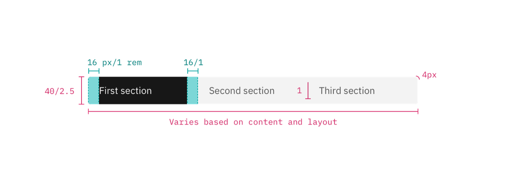

<PageDescription>

Component contributions can take different forms. Most contributions are enhancements to an existing component
or a brand new component.

</PageDescription>

<AnchorLinks>
  <AnchorLink>Steps to contributing</AnchorLink>
  <AnchorLink>How to write component guidance</AnchorLink>
  <AnchorLink>Parts of a component contribution</AnchorLink>
</AnchorLinks>

## Steps to contributing

To contribute a component to Carbon for IBM.com, start by opening a <a href="https://github.com/carbon-design-system/carbon-for-ibm-dotcom/issues/new/choose" target="_blank">GitHub issue</a> and select Feature Request.

Include a detailed description in which you:

- Explain the rationale for the request
- Detail the intent and/or usage
- Clarify whether it's a variation of an existing component, or a new component
- Include mockups of any fidelity (optional)
- Include any inspirations from other products (optional)
- Include component guidance

## How to write component guidance

Component documentation typically contains a definition of the component, and a visual reference of what the component will look like along with any variations. Some components are more complex than others but you should cover each topic included in these templates.

You can copy the Markdown from the templates below and create a new page for your contribution [here](https://github.com/carbon-design-system/carbon-for-ibm-dotcom-website/new/main/src/pages/components).

If you would prefer to work in Sketch first, the templates are available in a Sketch file [here](https://ibm.ent.box.com/folder/151926798678).

#### Template for components with one variant

Use this Markdown template for documenting components with only one variant.

```markdown
---
title: Component name
description: Explains what the component is in one or two sentences.
---

import { ComponentStatus } from 'components/ComponentList';
import ComponentDescription from 'components/ComponentDescription';
import ComponentFeedback from 'components/ComponentFeedback';

<ComponentDescription name="Component name" type="ui or layout" />

<!--
The description answers the question, "What is this component?" Use two sentences, and no more than three lines, to describe what it is and what it is used for.
-->

<AnchorLinks>

<AnchorLink>Overview</AnchorLink>
<AnchorLink>Behaviors</AnchorLink>
<AnchorLink>Modifiers</AnchorLink>
<AnchorLink>Tips and techniques</AnchorLink>
<AnchorLink>Resources</AnchorLink>
<AnchorLink>Content guidance</AnchorLink>
<AnchorLink>Related components</AnchorLink>
<AnchorLink>Feedback</AnchorLink>

</AnchorLinks>

<!--
Include additional <AnchorLinks> if you add additional sections within the page. Text must match header text.
-->

## Overview

<!--
This section answers the questions, “What is this component  and is it the right one for me to use?” Try to answer the following questions:

- What does this component do?
- What is it used for?
- When to use
- When not to use

For simpler components, this overview may also cover the content included in Behaviors.

The anatomy image answers the questions “What does this component look like? What are its key characteristics?” See the Image production guidelines kit available at Carbon > Other resources for specifications on creating images with callouts and a legend below. Alternatively, you could use a real image.


-->

## Behaviors

<!--
If more detail is required, use this section to cover the following topics:

— Any interactions and states
— Recommendations
— Mobile considerations

If necessary, create a storyboard or animated gif to illustrate the behavior you would normally see in a Live Demo.
-->

## Modifiers

<!--
This section shows different ways of styling the component. For an example, see Card group on Carbon for IBM.com.

Here are some additional examples from the Carbon website:

- Adding an icon to a button
- Adding a button to a notification
- Using high and low contrast styles for notification
-->

## Tips and techniques

<!--
Use this section to explain design decisions and recommendations in more detail. Be sure to include the rationale behind the recommendations.

Examples include:
— Why the masthead stays white
— Placement of arrows on cards
-->

## Resources

<!--
This section is auto-generated includes mini cards with links to Design specifications, Functional specifications, React Storybook, and Web Components Storybook. Be sure to add the component name below.

<ResourceLinks name="Insert component name" type="layout" />
-->

## Content guidance

<!--
This section contains a table with the content requirements of the component. Replace the content below with the relevant content guidance for your component.


| Element                                                    | Content type | Required | Instances | Character limit <br/>(English / translated) | Notes                                                                               |
| ---------------------------------------------------------- | ------------ | -------- | --------- | ------------------------------------------- | ----------------------------------------------------------------------------------- |
| Heading                                                    | Text         | Yes      | 1         | 40 / 55                                     |                                                                                     |
| Copy                                                       | Text         | No       | 1         | 350 / 450                                   |                                                                                     |
| Child container                                            | Component    | No       | 1         | –                                           | A container area that child components, and other content types can be passed into. |
| [CTA](https://www.ibm.com/standards/carbon/components/cta) | Component    | No       | 1         | –                                           | Only card link and local type allowed.                                              |

For more information, see the [character count standards](https://www.ibm.com/standards/carbon/guidelines/content#character-count-standards).
-->

## Feedback

<ComponentFeedback />
```

#### Template for components with multiple variants

Use this template whenever there are two or more components on the page. The title takes a generic name that covers all components. Each component type gets an H2 heading and anchorlink for ease of navigation.

```markdown
---
title: Component name
description: Explains what the component is in one or two sentences.
---

import { ComponentStatus } from 'components/ComponentList';
import ComponentDescription from 'components/ComponentDescription';
import ComponentFeedback from 'components/ComponentFeedback';

<ComponentDescription name="Component name" type="ui or layout" />

<!--
The description answers the question, "What are the components that will be discussed on this page?" Use no more than three lines to describe what is included here.
-->

<AnchorLinks>

<AnchorLink>Overview</AnchorLink>
<AnchorLink>Component one</AnchorLink>
<AnchorLink>Component two</AnchorLink>
<AnchorLink>Component three</AnchorLink>
<AnchorLink>Related components</AnchorLink>
<AnchorLink>Feedback</AnchorLink>

</AnchorLinks>

<!--
Include additional <AnchorLinks> if you add additional sections within the page. Text must match header text.
<AnchorLink>Header text you're linking to</AnchorLink>
-->

## Overview

<!--
This section is used to set context, introducing the components that are featured on the page. It answers the questions, “What are the components?” and “What are they used for?”

An introductory paragraph provides a high-level explanation, followed by an image grid with a preview of the components side by side. The images allow the user to visually orientate themselves. Real-life images can be helpful to differentiate between similar-looking components. Place labels above each image instead of a caption at the bottom, to reduce the work for the reader.


An alternative is to use abstract mini-components, built using the Image production guidelines kit, and accompanied here with a caption. This option is useful for highlighting  structural differences between the components.

#### Deciding what to use

| Component name                                    | Use cases                                    |
| ------------------------------------------------- | -------------------------------------------- |
| [_Component one_](link to Component one H2)       | Describe when to use this variant.           |
| [_Component two_](link to Component two H2)       | Describe when to use this variant.           |
| [_Component three_](link to Component three H2)   | Describe when to use this variant.           |

-->

## Component one

### Overview

<!--
This section answers the questions, “What is this component  and is it the right one for me to use?” Try to answer the following questions.

- What does this component do?
- What is it used for?
- When to use
- When not to use

The anatomy image answers the questions “What does this component look like? What are its key characteristics?”  See the Image production guidelines kit on the Carbon site for specifications on creating these images. Alternatively, you could use a real image.


-->

### Behaviors

<!--
If more detail is required, use this section to cover the following topics:

- Any interactions and states that need further explanation
- Mobile considerations

If necessary, create a storyboard or animated gif to illustrate the behavior you would normally see in a Live Demo.
-->

### Modifiers

<!--
This section shows different ways of styling the component. For an example, see Card group on Carbon for IBM.com.

Here are some additional examples from the Carbon website:
- Adding an icon to a button
- Adding a button to a notification
- Using high and low contrast styles for notification
-->

### Tips and techniques

<!--
Use this section to explain design decisions and recommendations in more detail. Be sure to include the rationale behind the recommendations.

Examples include:
— Why the masthead stays white
— Placement of arrows on cards
-->

### Resources for Component one

<!--
This section is auto-generated includes mini cards with links to Design specifications, Functional specifications, React Storybook, and Web Components Storybook. Be sure to add the component name below.

<ResourceLinks name="Insert component name" type="layout" />
-->

### Content guidance for Component one

<!--
This section contains a table with the content requirements of the component. Replace the content below with the relevant content guidance for your component.


| Element                                                    | Content type | Required | Instances | Character limit <br/>(English / translated) | Notes                                                                               |
| ---------------------------------------------------------- | ------------ | -------- | --------- | ------------------------------------------- | ----------------------------------------------------------------------------------- |
| Heading                                                    | Text         | Yes      | 1         | 40 / 55                                     |                                                                                     |
| Copy                                                       | Text         | No       | 1         | 350 / 450                                   |                                                                                     |
| Child container                                            | Component    | No       | 1         | –                                           | A container area that child components, and other content types can be passed into. |
| [CTA](https://www.ibm.com/standards/carbon/components/cta) | Component    | No       | 1         | –                                           | Only card link and local type allowed.                                              |

For more information, see the [character count standards](https://www.ibm.com/standards/carbon/guidelines/content#character-count-standards).
-->

## Component two

<!--
Copy and paste the sections from above for each component variant you are documenting.
-->

## Feedback

<ComponentFeedback />
```

## Parts of a component contribution

Component contributions ideally include all of the following parts.

#### 1. A rationale

Explain how your component will add value to the system. Carbon for IBM.com serves the
widest possible range of IBM.com needs, and contributions that increase the scope of
the system are more likely to be accepted. Be sure to include any user
experience and interaction descriptions.

#### 2. A design spec

Create sizing and styling annotations for all aspects of the component. This
spec should provide a developer with everything they need to create the design
in code. Check out Carbon's <a href="https://github.com/carbon-design-system/carbon-website/wiki/Production-guidelines#spec-guidelines" target="_blank">production guidelines</a> to get started.

You should include color tokens and type tokens used.

<Row>
<Column colLg={8}>



<Caption>Example of a design spec</Caption>

</Column>
</Row>

#### 3. A Sketch symbol

Any new components or changes to existing components will also live in the
[Carbon for IBM.com kit](https://www.ibm.com/standards/carbon/designing#get-the-kit) and so we'll need a Sketch symbol.
Check out <a href="https://www.sketch.com/docs/symbols/creating-symbols/" target="_blank">Sketch's guide</a> for creating a symbol.

This symbol can be contributed with the asset or enhancement, but must be added
to the kit by one of its maintainers. To contribute a symbol, simply open an
issue in the
[kit repo](https://github.com/carbon-design-system/carbon-for-ibm-dotcom-design-kit/issues/new?assignees=oliviaflory&template=bug-report.md&title=%5BDesign+kit%5D%3A+Brief+description).

#### 4. Usage documentation

For guidance, see our Documentation requirements section above or reach out to us on <a href="https://ibm-studios.slack.com/archives/C2PLX8GQ6" target="_blank">#carbon-for-ibm-dotcom</a>. See the How to publish component usage documentation section below for detail.

#### 5. Working code

The component for **Carbon for IBM.com** must be built in one of our supported frameworks - React or Web Components. We'd like to prioritize working on Web Components since it has become our strategic direction. If you need help learning how to build it in Web Components, reach out to the engineers in our slack channel for training <a href="https://ibm-studios.slack.com/archives/C2PLX8GQ6" target="_blank">#carbon-for-ibm-dotcom</a>. Please read the [Developer guide](https://github.com/carbon-design-system/carbon-for-ibm-dotcom/blob/main/docs/developing.md) and the [Submissions guidelines](https://github.com/carbon-design-system/carbon-for-ibm-dotcom/blob/main/docs/submission-guidelines.md) for more details.
