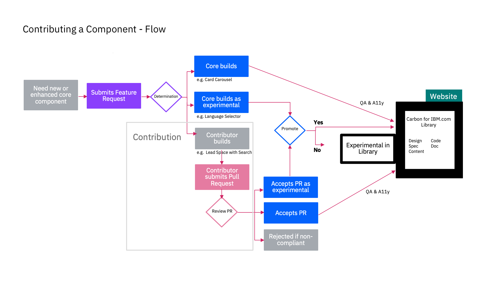

<PageDescription>

Contribution is an important part of scaling, growing and evolving Carbon for IBM.com. Contributing is a fairly straight forward process but in case it's your first time, here's what's involved:

</PageDescription>

## General flow

Here is an example of how a new component or an enhancement to an existing component is handled in our system.

<Row>
<Column colLg={8}>

<Caption>Contribution flow chart</Caption>

</Column>
</Row>

## What's involved at key decision points

### Determination

Determination step is where the request is sized, classified, and determined if it should be considered.

#### Questions for consideration:

- Does it already exist?
- Is it needed for short term, like a test or experiment, or more longer term?
- Is it a bug, minor change, major enhancement?
- Who could/should design and build it?
- Does it require an exception from Steering Committee or Design Chapter to move forward

#### Outcomes:

- Sized
- Classified
- If considered, who will design/build
- Tracked as contribution and/or exception.

### Review

Review step is where code has been submitted by a contributor in the form of a Pull Request(PR) and the core engineering team reviews the PR. If it passes the engineers criteria, code quality, and unit tests, the PR is merged and feature becomes part of the Library either as Experimental (Feature Flag turned on) or QA Production ready.

#### Possible outcomes:

- Approved
- Approved as Experimental
- Rejected as Non-compliant

### Promote

Promote step occurs only for Experimental components. This step is where anything opened as Experimental is reviewed for consideration to be promoted to QA Production ready.

#### Questions for consideration:

- Research and/or Analytics from User testing or Usability
- Full QA completed
- Full A11y completed
- Design specs and guidelines made available for publishing to website

#### Possible outcomes:

- Approved
- Remains Experimental
- Removed from Experimental
