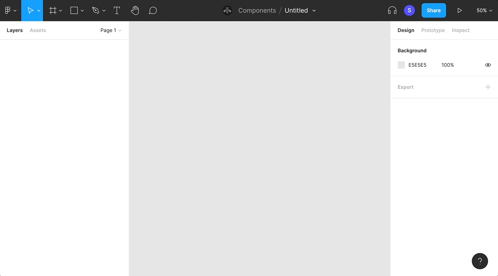
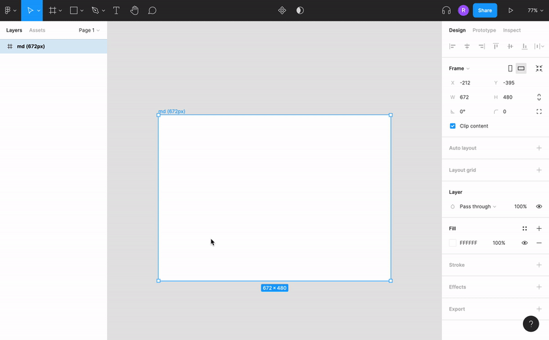
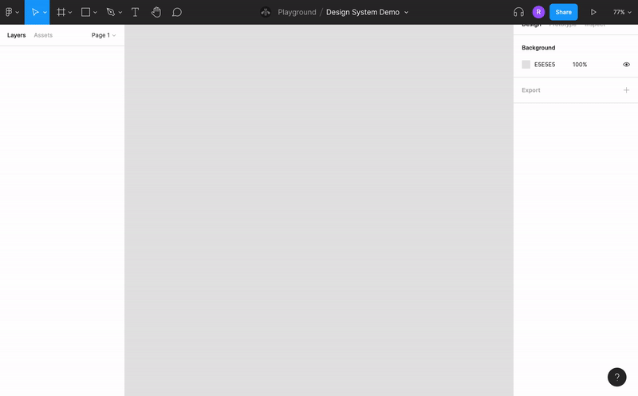
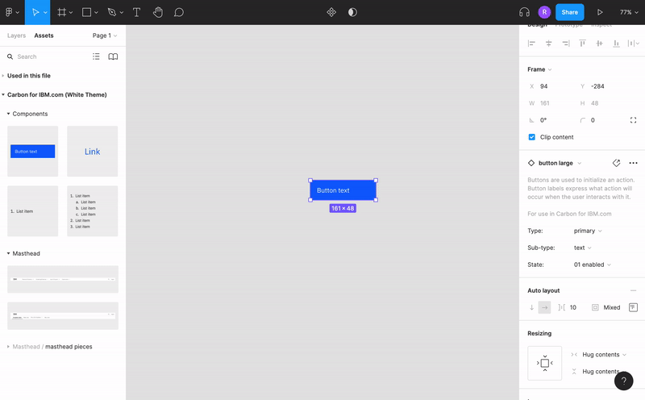

<PageDescription>

The Carbon for IBM.com team has developed a Figma design kit that contains components and grid styles.

</PageDescription>

<InlineNotification>

**The v2 Beta kit is now available!** The _Carbon for IBM.com v2 Figma library_ is now available to internal users. The library is marked as BETA as we continue to add new components and updates. As we make updates, some components may receive breaking changes due to these enhancements.

</InlineNotification>

<AnchorLinks>

<AnchorLink>Accessing the Figma kit</AnchorLink>
<AnchorLink>Using the Figma kit</AnchorLink>
<AnchorLink>Other Figma resources</AnchorLink>

</AnchorLinks>

## Accessing the new Figma kit

<Row>
<Column  colLg={8} colMd={8} colSm={4}>

We have a new Figma kit for delivering Carbon for IBM.com components. The kit contains a single library for all Carbon themes and includes components and grid templates. We’ll be adding more components over time, and Figma will notify you when library updates are available.

Once you are in the IBM organization, you will automatically have access to the Carbon for IBM.com v2 Figma library.

### Adding the library to your file

If you are part of the IBM organization in Figma, you can enable the Figma library from within a new file. Be sure to login to Figma using SSO and your IBM ID. This will ensure you are in the IBM organization and have access to the library.

#### To add one or all of the themes in your design:

1. In the menu, click the Figma dropdown then select `Libraries`. Alternatively, click the `Asset` panel, and then the open book, or `Library` icon.
2. In the Libraries list, search for `Carbon for IBM.com v2`.
3. Select the theme to enable. Note that any themes marked with 🚫 and have _[To be deprecated]_ in the name will eventually be removed. You may need to swap instances with new libraries as they are released.

</Column>
<Column colMd={2} colLg={3} offsetMd={1} offsetLg={1}>
  <Aside>

**Figma access**

IBMers can learn more about accessing Figma in the <a href="https://w3.ibm.com/design/toolbox/#/ui-design-tools/figma/README" target="_blank" rel="noopener noreferrer" >Design Toolbox</a>

  </Aside>
</Column>

</Row>

<Column  colLg={12} colMd={8} colSm={4}>

<Caption>
  The Carbon for IBM.com themes are available from the Libraries list.
</Caption>

</Column>

### Figma tutorials

If you are new to Figma, they offer <a href="https://www.youtube.com/c/Figmadesign/playlists?view=50&sort=dd&shelf_id=3" target="_blank" rel="noopener noreferrer">video tutorials</a> on their official YouTube channel.

## Using the Figma kit

Our Figma resources are set up to help you design using key IBM assets. Learn more about using the [2x Grid](#2x-grid) and [Components](#components) in Figma below.

### 2x Grid

The IBM 2x Grid is the framework for laying out all visual elements.

#### Understanding the grid

For a detailed walkthrough of the 2x Grid, see the foundational 2x Grid guidance on the Carbon Design System site. The [Overview](https://www.carbondesignsystem.com/guidelines/2x-grid/overview) provides the background and design rationale for the 2x Grid. [Implementation](https://www.carbondesignsystem.com/guidelines/2x-grid/implementation) will get you up and running, designing with the grid.

For information about using the 2x Grid with web pages, including best practices, see our [Layout guidelines](../guidelines/layout).

#### Start using the grid

#### To apply the grid template to a frame in Figma:

1. Select the frame.
2. In `Design panel → Layout Grid`, click `Style`.
3. Choose your breakpoint to display the grid.

You can click the eye icon to hide or show the grid.

<Column  colLg={12} colMd={8} colSm={4}>

<Caption>
  Add the grid template to a frame via Design panel → Layout grid.
</Caption>

</Column>

### Components

Carbon for IBM.com components are available in the design kit.

#### To bring components into your file:

1. In the Layers panel, select `Layers → Assets`.
2. Choose one of the Carbon for IBM.com themes.
3. Select a component and drag it onto the canvas. Alternatively, search for the component by name.

<Column  colLg={12} colMd={8} colSm={4}>

<Caption>
  Components can be dragged from the Assets panel onto the canvas.
</Caption>

</Column>

#### Component variants

Some components contain variants that allow you to change properties such as breakpoint, type, and interactive state. If a component contains variants, you will see them in the `Design` panel when you select a component. Before making updates directly to a component, check to see if the option is available as a variant.

<Caption>Component variants are accessed in the Design panel</Caption>

#### Description and documentation

Some components will contain additional guidance and links to documentation. When selecting a component, check the `Design` panel for a description and link to any relevant documentation.

### Other Figma resources

#### Using Carbon text styles

The Carbon for IBM.com libraries use the type tokens from the `(v10) Text Styles - IBM Design Language` library. If you have the Text styles library active, you can apply those type tokens to your designs. To apply text styles to text:

1. Select the text element to change.
2. In the `Design panel → Text`, click `Style`.
3. Select the text style to apply from the `(v10) Text Styles - IBM Design Language` library. Hover for additional usage guidance.

#### Using Carbon color tokens

The Carbon for IBM.com libraries use the color tokens from the [v10 Carbon core libraries](https://carbondesignsystem.com/designing/kits/figma). The color tokens used from the Carbon core libraries should match the Carbon for IBM.com library (ex. the Carbon core White theme color tokens should be used for Carbon for IBM.com White theme components). If you have one or more of the Carbon core libraries active, you can apply those type tokens to your designs. To apply color tokens to an element:

1. Select the element to change.
2. In the `Design panel → Fill`, click `Style`.
3. Select the text style to apply. Hover for additional usage guidance.

#### Bring in icons and pictograms

Icons and pictograms live in the IBM Design Language libraries. In the `Libraries` overlay in Figma, select or search for “Icons and Pictograms - IBM Design Language”.

#### Figma guild

_For IBMers only_: Sign up for the <a href="https://ec.yourlearning.ibm.com/w3/series/10200299" target="_blank" rel="noopener noreferrer">Figma Guild Series in YourLearning</a> to stay up to date on future Figma Events at IBM. Figma Fridays offer in-depth tutorials and workshops for IBM employees. Recordings are available on the <a href="https://secure.video.ibm.com/channel/23570833/playlist/641336" target="_blank" rel="noopener noreferrer">Figma Fridays playlist</a> on Watson Media.
