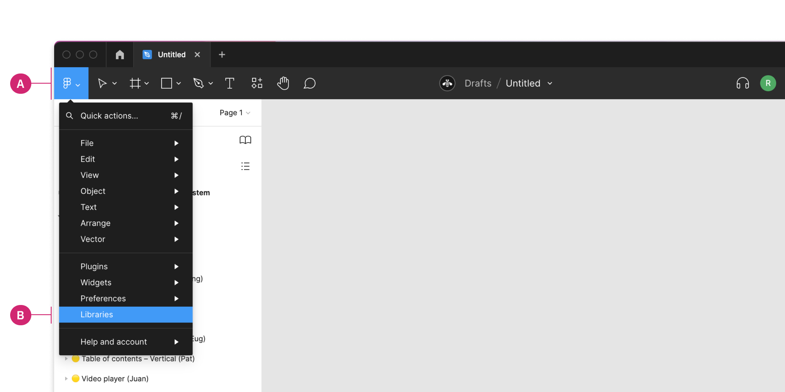
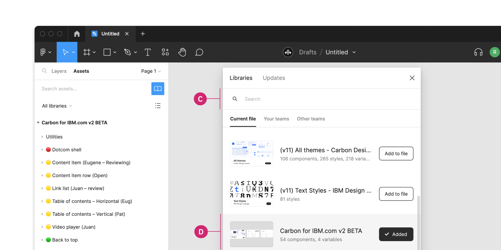

<PageDescription>

The Carbon for IBM.com team has developed a Figma design kit that contains components and grid styles.

</PageDescription>

<InlineNotification>

**The v2 Beta kit is now available!** The _Carbon for IBM.com v2 BETA_ Figma library is now available to internal users. The library is marked as BETA as we continue to add new components and updates.

</InlineNotification>

<AnchorLinks>

<AnchorLink>Accessing the Figma kit</AnchorLink>
<AnchorLink>Other Figma libraries</AnchorLink>
<AnchorLink>Start designing</AnchorLink>
<AnchorLink>Other Figma resources</AnchorLink>

</AnchorLinks>

## Accessing the library

### 1. Installing Figma

IBMers can learn more about accessing Figma in the <a href="https://w3.ibm.com/design/toolbox/#/ui-design-tools/figma/README" target="_blank" rel="noopener noreferrer" >Design Toolbox</a>

### 2. Sign into Figma using IBM SSO

You should be added to the IBM Figma organization automatically once you sign in. You do not need to join or request to join any specific team to access the libraries.

### 3. Turn on the Carbon for IBM.com v2 library.

The `Carbon for IBM.com v2 BETA` library includes components that map to Carbon's four themes, including two light (White and Gray 10) and two dark (Gray 90 and Gray 100).

Inside of a design file, navigate to the **Main menu panel** in the top left of the toolbar (A). Open the menu and select **Libraries** from the list (B).

<Row>
<Column  colLg={8} colMd={8} colSm={4}>

</Column>
</Row>

Then in the Libraries modal that appears, find the team name called Carbon for IBM.com (C) and switch the toggle beside the `Carbon for IBM.com v2 BETA` library to on (D).

<Row>
<Column  colLg={8} colMd={8} colSm={4}>

</Column>
</Row>

To preview the v2 library, visit the following view-only link.

<Row className="resource-card-group">
<Column colLg={4} colMd={4} noGutterSm>
  <ResourceCard
    subTitle="Carbon for IBM.com v2 Figma library"
    href="https://github.com/carbon-design-system/carbon-for-ibm-dotcom-design-kit">

</ResourceCard>
</Column>
</Row>

### Figma tutorials

If you are new to Figma, they offer <a href="https://www.youtube.com/c/Figmadesign/playlists?view=50&sort=dd&shelf_id=3" target="_blank" rel="noopener noreferrer">video tutorials</a> on their official YouTube channel.

### Figma guild

_For IBMers only_: Sign up for the <a href="https://ec.yourlearning.ibm.com/w3/series/10200299" target="_blank" rel="noopener noreferrer">Figma Guild Series in YourLearning</a> to stay up to date on future Figma Events at IBM. Figma Fridays offer in-depth tutorials and workshops for IBM employees. Recordings are available on the <a href="https://secure.video.ibm.com/channel/23570833/playlist/641336" target="_blank" rel="noopener noreferrer">Figma Fridays playlist</a> on Watson Media.

## Other Figma libraries

While the Carbon for IBM.com library can be used on its own, there are other libraries in the IBM organization that are useful for designing web pages. You can enable these inside your Figma file, or visit these view-only links.

<Row className="resource-card-group">
<Column colLg={4} colMd={4} noGutterSm>
  <ResourceCard
    subTitle="(v11) All themes - Carbon Design System"
    href="https://www.figma.com/file/YAnB1jKx0yCUL29j6uSLpg/(v11)-All-themes---Carbon-Design-System?type=design&node-id=58%3A2763&mode=design&t=RrMQrdXVIXGy6pYZ-1"
    actionIcon="launch"
    >

  </ResourceCard>
</Column>
<Column colLg={4} colMd={4} noGutterSm>
  <ResourceCard
    subTitle="IDL color styles"
    href="https://www.figma.com/file/Gvwx2RnAZzDKTjVuC5xOlO/Color-Styles---IBM-Design-Language?node-id=129%3A2"
    actionIcon="launch"
    >

  </ResourceCard>
</Column>
<Column colLg={4} colMd={4} noGutterSm>
  <ResourceCard
    subTitle="v11 Text styles"
    href="https://www.figma.com/file/rK06GY6bvEfokuzrFGdtWB/(v11)-Text-Styles---IBM-Design-Language?node-id=129%3A2"
    actionIcon="launch"
    >

  </ResourceCard>
</Column>
<Column colLg={4} colMd={4} noGutterSm>
  <ResourceCard
    subTitle="Icons"
    href="https://www.figma.com/file/J5c0d85dSJn9JnBhSYYLmD/Icons---IBM-Design-Language?node-id=129%3A2"
    actionIcon="launch"
    >

  </ResourceCard>
</Column>
<Column colLg={4} colMd={4} noGutterSm>
  <ResourceCard
    subTitle="Pictograms"
    href="https://www.figma.com/file/PkUl9UBuvA41GPpyl84NBc/Pictograms---IBM-Design-Language?node-id=0%3A1"
    actionIcon="launch"
    >

  </ResourceCard>
</Column>
</Row>

## Start designing

Our Figma resources are set up to help you design using key IBM assets. Learn more about using the [2x Grid](#2x-grid) and [Components](#components) in Figma below.

### Components

Included in the library are the Carbon for IBM.com components and their variants. To insert a component, go to the **Asset** panel and find the component you would like to use. Drag it from the asset panel onto the canvas.

View the name of the component in the right sidebar. If the component has variants, you’ll see fields underneath the component name to configure the properties and values of that component set.

For more help on how to use Figma components, see the [Figma doc](https://help.figma.com/hc/en-us/articles/360056440594-Create-and-use-variants#Use_variants).

### Grids

The [(v11) All themes - Carbon Design System](<https://www.figma.com/file/YAnB1jKx0yCUL29j6uSLpg/(v11)-All-themes---Carbon-Design-System?type=design&node-id=1756%3A1439&mode=design&t=RrMQrdXVIXGy6pYZ-1>) library comes with grids that can be applied to a frame that will display the appropriate grid layout for all five 2x grid breakpoints.

To enable the grid, select a frame at the appropriate breakpoint width, and select the \*Styles** button under **Layout grid\*\* in the right Design panel. Select the appropriate breakpoint to apply the grid to the selected frame.

---

### 2x Grid

The IBM 2x Grid is the framework for laying out all visual elements.

#### Understanding the grid

For a detailed walkthrough of the 2x Grid, see the foundational 2x Grid guidance on the Carbon Design System site. The [Overview](https://www.carbondesignsystem.com/guidelines/2x-grid/overview) provides the background and design rationale for the 2x Grid. [Implementation](https://www.carbondesignsystem.com/guidelines/2x-grid/implementation) will get you up and running, designing with the grid.

For information about using the 2x Grid with web pages, including best practices, see our [Layout guidelines](../guidelines/layout).

#### Start using the grid

#### To apply the grid template to a frame in Figma:

1. Select the frame.
2. In `Design panel → Layout Grid`, click `Style`.
3. Choose your breakpoint to display the grid.

You can click the eye icon to hide or show the grid.

<Column  colLg={12} colMd={8} colSm={4}>

<Caption>
  Add the grid template to a frame via Design panel → Layout grid.
</Caption>

</Column>

### Components

Carbon for IBM.com components are available in the design kit.

#### To bring components into your file:

1. In the Layers panel, select `Layers → Assets`.
2. Choose one of the Carbon for IBM.com themes.
3. Select a component and drag it onto the canvas. Alternatively, search for the component by name.

<Column  colLg={12} colMd={8} colSm={4}>

<Caption>
  Components can be dragged from the Assets panel onto the canvas.
</Caption>

</Column>

#### Component variants

Some components contain variants that allow you to change properties such as breakpoint, type, and interactive state. If a component contains variants, you will see them in the `Design` panel when you select a component. Before making updates directly to a component, check to see if the option is available as a variant.

<Caption>Component variants are accessed in the Design panel</Caption>

#### Description and documentation

Some components will contain additional guidance and links to documentation. When selecting a component, check the `Design` panel for a description and link to any relevant documentation.

### Other Figma resources

#### Using Carbon text styles

The Carbon for IBM.com libraries use the type tokens from the `(v10) Text Styles - IBM Design Language` library. If you have the Text styles library active, you can apply those type tokens to your designs. To apply text styles to text:

1. Select the text element to change.
2. In the `Design panel → Text`, click `Style`.
3. Select the text style to apply from the `(v10) Text Styles - IBM Design Language` library. Hover for additional usage guidance.

#### Using Carbon color tokens

The Carbon for IBM.com libraries use the color tokens from the [v10 Carbon core libraries](https://carbondesignsystem.com/designing/kits/figma). The color tokens used from the Carbon core libraries should match the Carbon for IBM.com library (ex. the Carbon core White theme color tokens should be used for Carbon for IBM.com White theme components). If you have one or more of the Carbon core libraries active, you can apply those type tokens to your designs. To apply color tokens to an element:

1. Select the element to change.
2. In the `Design panel → Fill`, click `Style`.
3. Select the text style to apply. Hover for additional usage guidance.

#### Bring in icons and pictograms

Icons and pictograms live in the IBM Design Language libraries. In the `Libraries` overlay in Figma, select or search for “Icons and Pictograms - IBM Design Language”.
