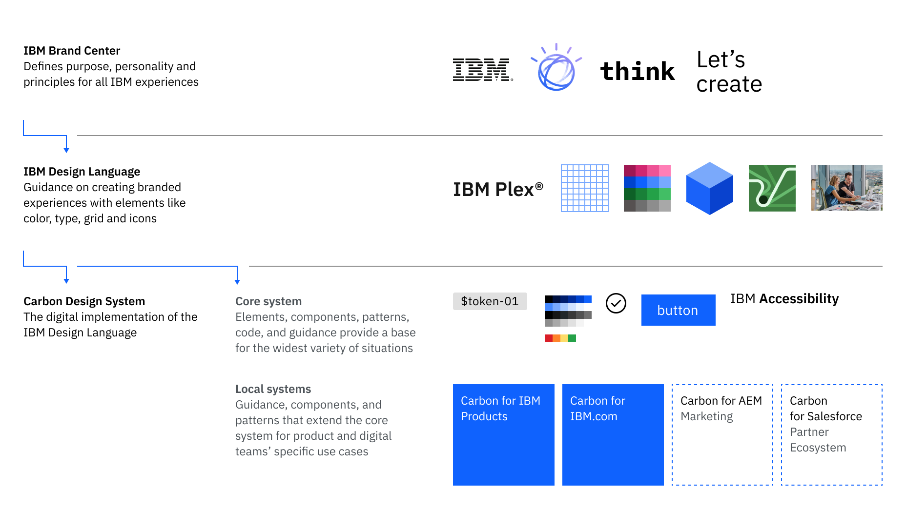

<PageDescription>

Welcome to Carbon for IBM.com. This page has the information you need to get
started designing web pages for IBM.com.

</PageDescription>

<AnchorLinks>

<AnchorLink>Overview</AnchorLink>
<AnchorLink>Install the design kit</AnchorLink>
<AnchorLink>Learn about the foundations</AnchorLink>
<AnchorLink>Designing with Carbon for IBM.com</AnchorLink>
<AnchorLink>Watch our tutorials</AnchorLink>
<AnchorLink>Ask questions</AnchorLink>

</AnchorLinks>

## Overview

Whether you're just getting started designing at IBM or you've been here a while, this page is a handy map to finding design guidance within this site and across the company—everything you need to design IBM web pages.

Carbon for IBM.com is just one part of the IBM ecosystem and you may have to go to different sites to find what you're looking for. We'll show you the way.

## Install the design kit

<Row>
<Column  colLg={8} colMd={8} colSm={4}>

_For IBMers only:_

IBMers should get a license for Figma, our primary design kit tool. You may also access Sketch, however, we no longer maintain or update the Sketch kit. We recommend you migrate to Figma to get the most updated assets we offer.

By using the kits you automatically get any updates made by the Carbon for IBM.com team so you don’t
need to go back and change any designs to match the latest release. And when
handing off to your developers there won’t be confusion about the component and
its behaviors.

</Column>

<Column colMd={2} colLg={3} offsetMd={1} offsetLg={1}>
  <Aside>

**Design software**

IBMers can learn more about accessing design software in the

<a
  href="https://w3.ibm.com/design/toolbox/#/ui-design-tools/"
  target="_blank"
  rel="noopener noreferrer"
>
  Design Toolbox
</a>
.

  </Aside>
</Column>

</Row>

#### Design kit

We provide a [Figma kit](designing/design-kit) that includes assets for the White theme which is primarily used throughout the IBM.com experience. The kit includes color tokens, the expressive and productive type styles, and select components.

## Learn about the foundations

### The Carbon ecosystem

When you hear people talking about Carbon, it’s important to know that it’s more than just one website.

The following diagram shows the interdependencies of assets and guidance across IBM—from the foundations of Brand and the IBM Design Language, to the digital implementation in the Carbon Design System that in turn provides the foundation for our products and web pages.

Carbon for IBM.com is built using the foundational components of the Carbon Design System, and the AEM team uses Carbon for IBM.com components for their marketing page templates.

<ArtDirection>

</ArtDirection>

<Caption>Carbon for IBM.com in the IBM ecosystem</Caption>

### IBM guidance across the ecosystem

Within the ecosystem are several sites that provide essential guidance for creating experiences that are consistent, provide an interoperability of experience with other offerings, and represent IBM as a company.

| Resource                                                            | What you'll find                                                                                                                                                                                                                                                                     |
| ------------------------------------------------------------------- | ------------------------------------------------------------------------------------------------------------------------------------------------------------------------------------------------------------------------------------------------------------------------------------ |
| [_Brand Center_](https://www.ibm.com/brand/)                        | IBM Brand Center is the home base for the IBM Brand story, visual brand elements, guidelines, and assets.                                                                                                                                                                            |
| [_Brand Systems_](https://www.ibm.com/brand/experience-guides)      | The IBM brand systems have been developed for various IBM businesses, audiences, categories, and offerings. Read them to understand the rationale behind every visual and verbal detail.                                                                                             |
| [_IBM Design Language_](https://www.ibm.com/design/language/)       | The IBM Design Language provides the guidance and assets used to express the IBM brand. You’ll fully understand what drives IBM’s design philosophy and principles, and be in a position to make informed choices for your product work.                                             |
| [_Carbon Design System_](http://carbondesignsystem.com/)            | Carbon is IBM’s open source design system for products and digital experiences. The system is the visual expression of the IBM Design Language and consists of working code, design tools and resources, and human interface guidelines.                                             |
| [_IBM Style_](https://ibmdocs-test.mybluemix.net/docs/en/ibm-style) | IBM Style is the corporate reference for all IBM writers and editors and applies to all content published by IBM. Its purpose is to ensure that content for external audiences is grammatically correct, clear, consistent, appropriate for global audiences, and easy to translate. |

## Designing with Carbon for IBM.com

### Component usage guidance

You’ll learn a lot about designing with Carbon for IBM.com by reading through the component documentation. Most components include anatomy images, details about variations and modifiers where available, and content guidance that provides character count limits for component areas. You can also learn by looking at the components in Storybook.

We are always working to make our guidance better and if there is information that you cannot find, please reach out to us on Slack at [#carbon-for-ibm-dotcom](https://ibm-studios.slack.com/archives/C2PLX8GQ6).

### Expressive styling

Expressive styling is fundamental to all of the designs on Carbon for IBM.com.
Read through the
[Expressive styling pages](/guidelines/expressive-styling/overview) and learn
how to apply the styles correctly and how to use productive styling in tandem,
where appropriate.

### The 2x Grid

Carbon for IBM.com inherits all the basic elements (grid, colors, typography, iconography) from the Carbon Design System. If you’re new to Carbon for IBM.com, the 2x Grid is a good place to start. The 2x Grid is the geometric foundation of all the visual elements of IBM Design and forms the basis for all designs at IBM and is therefore essential to understand.

You can learn about the fundamentals of <a href="https://carbondesignsystem.com/guidelines/2x-grid/overview/" target="_blank">using the 2x Grid</a> on the Carbon website.

### Accessibility

Accessible design not only helps users with disabilities; it provides better
user experiences for everyone. Review the <a href="https://www.ibm.com/able/" target="_blank">IBM Accessibility</a> website and the <a href="https://www.carbondesignsystem.com/guidelines/accessibility/overview" target="_blank">Accessibility guidelines</a> on the Carbon website to learn more about the accessibility best practices.

## Watch our tutorials

To help you get started, watch [Designing with Carbon for IBM.com](https://ec.yourlearning.ibm.com/w3/playback/10234118) to learn how to create pages for IBM.com in Sketch and Figma, using expressive type styles, color tokens, and out-of-the-box components.

We will be creating more tutorials in the future. If there is anything in particular you would like to learn more about, please let us know at our Slack channel [#carbon-for-ibm-dotcom](https://ibm-studios.slack.com/archives/C2PLX8GQ6).

## Ask questions

If you experience any issues while getting set up with Carbon for IBM.com, go to
our
[GitHub repo](https://github.com/carbon-design-system/carbon-for-ibm-dotcom-design-kit)
and
[create an issue](https://github.com/carbon-design-system/carbon-for-ibm-dotcom-design-kit/issues/new?assignees=oliviaflory&template=bug-report.md&title=%5BDesign+kit%5D%3A+Brief+description)
if your issue does not already exist.

#### For IBMers only

Join our Slack channel at [#carbon-for-ibm-dotcom](https://ibm-studios.slack.com/archives/C2PLX8GQ6) to ask questions, or check for similar questions. Your question may already have been answered.

Join our weekly Office Hours meetings for any questions and to share work in progress. More information about Office Hours can be found on our [Slack channel](https://ibm-studios.slack.com/archives/C2PLX8GQ6) and [Your Learning](https://ec.yourlearning.ibm.com/w3/series/10289694).
