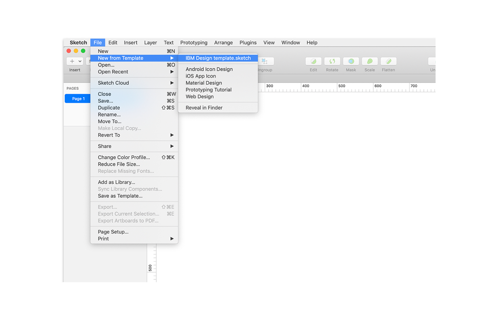
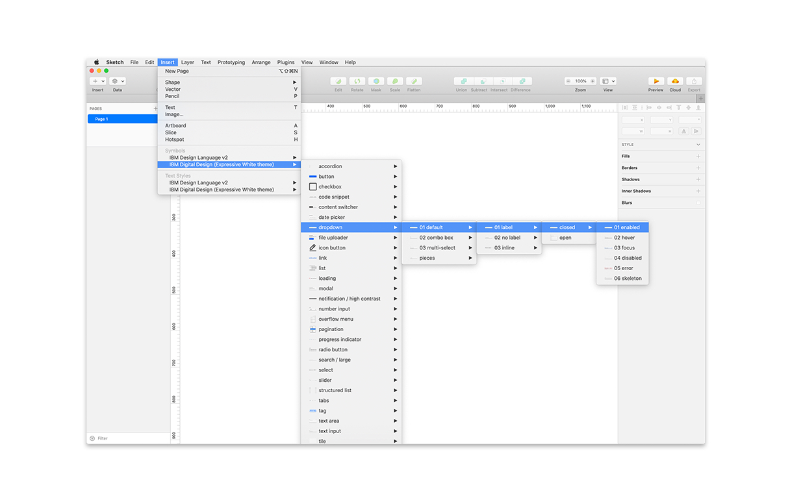
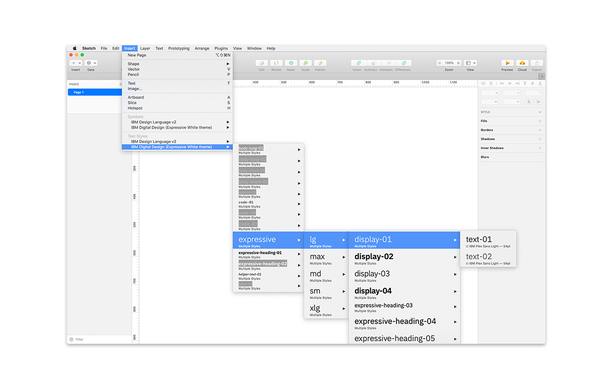
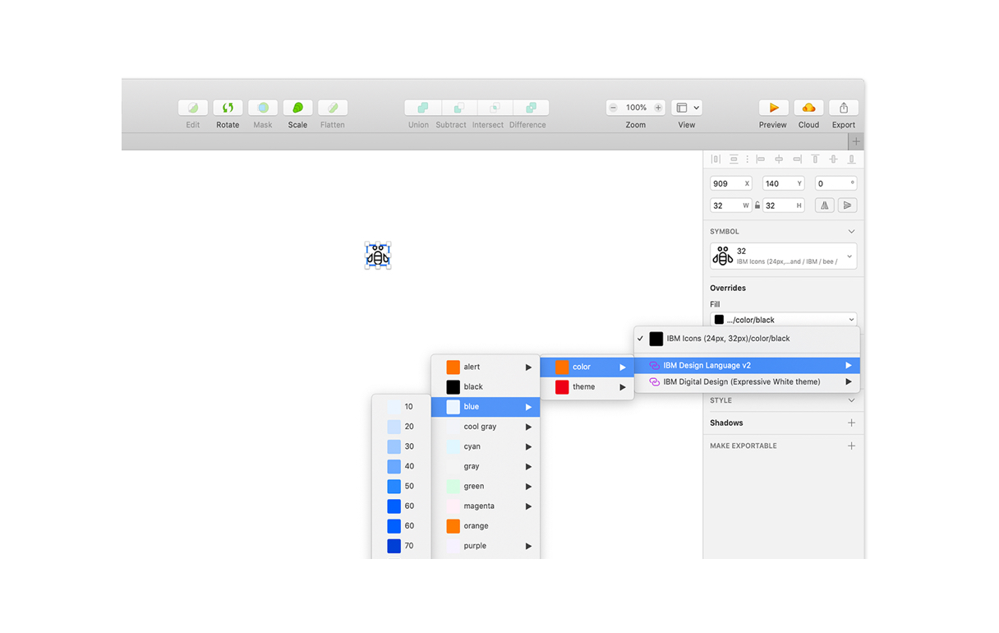

<PageDescription>

With the Carbon for IBM.com Sketch resources, you have everything you need to
get started designing web pages for IBM.com.

<InlineNotification>

**We no longer maintain or update Sketch libraries.** The instructions and resources listed below may be outdated. We recommend you migrate to Figma to get the most updated kits we offer.

</InlineNotification>

</PageDescription>

<AnchorLinks>

<AnchorLink>Install the Sketch kit</AnchorLink>
<AnchorLink>Get Carbon for IBM.com components</AnchorLink>
<AnchorLink>Other Sketch resources</AnchorLink>
<AnchorLink>Using the Sketch kit</AnchorLink>

</AnchorLinks>

## Install the Sketch kit

<Row>
<Column  colLg={8} colMd={8} colSm={4}>

We have a Sketch kit for delivering pre-built versions of the Carbon for
IBM.com components. It's available in each of the themes and includes color
tokens, expressive and productive type styles, and components.

For previous users of our Carbon Expressive Sketch kit, please note it is no
longer being maintained.

</Column>

<Column colMd={2} colLg={3} offsetMd={1} offsetLg={1}>
  <Aside>

**Sketch access**

IBMers can learn more about accessing Sketch in the <a href="https://w3.ibm.com/design/toolbox/#/ui-design-tools/sketch/README" target="_blank" rel="noopener noreferrer">Design Toolbox</a>.

  </Aside>
</Column>

</Row>

<Row className="resource-card-group">
  <Column colMd={4} colLg={4} noGutterSm>
    <ResourceCard
      subTitle="White theme"
      actionIcon="launch"
      href="sketch://add-library/cloud/20571650-189d-46ac-ab63-f6e8cc456424"
    >

</ResourceCard>
  </Column>

  <Column colMd={4} colLg={4} noGutterSm>
    <ResourceCard
      subTitle="Gray 10 theme"
      actionIcon="launch"
      href="sketch://add-library/cloud/8925339e-7e68-485a-ad49-e201a5b816e2"
    >

</ResourceCard>
  </Column>

  <Column colMd={4} colLg={4} noGutterSm>
    <ResourceCard
      subTitle="Gray 90 theme"
      actionIcon="launch"
      href="sketch://add-library/cloud/52524786-a6e5-4803-a4f8-35c8719d0a48"
    >

</ResourceCard>
  </Column>

  <Column colMd={4} colLg={4} noGutterSm>
    <ResourceCard
      subTitle="Gray 100 theme"
      actionIcon="launch"
      href="sketch://add-library/cloud/3aabfab0-f41f-4ea7-ba1a-01ea0ee45642"
    >

</ResourceCard>
  </Column>

</Row>

### Sketch updates

We make small adjustments and bug fixes to the kit on a regular basis. When we
make a change to any of the libraries, you will receive a notification in
Sketch.

The updates are opt-in, however we recommend you keep your kit as up to date as
possible. Once a change is accepted, you will not be able to revert to the
previous version.

We also recommend that you keep Sketch up to date with the latest version.

### Sketch tutorials

If you’re brand new to Sketch, they offer some great <a href="https://www.sketch.com/docs/" target="_blank" rel="noopener noreferrer">tutorials and documentation</a>.

## Get Carbon for IBM.com components

_For IBMers only_: If the component you're looking for is not in the Sketch kit,
we have Sketch files of all the Carbon for IBM.com components available on Box.

| Component types                                                               | Description                                                                                                                                                                                                      |
| ----------------------------------------------------------------------------- | ---------------------------------------------------------------------------------------------------------------------------------------------------------------------------------------------------------------- |
| [_Layout components_](https://ibm.box.com/s/67mx3puesjjz8lnosnrma8d45as3g33j) | Layout components show some of the common layouts used in IBM’s digital space. They are carefully designed and coded to communicate prescribed content types and are expressions of IBM’s distinct brand ethos.  |
| [_UI components_](https://ibm.box.com/s/yqwhif915fwn9avz8gytvkc1p1038ofo)     | UI components are designed and built to support or enable small UI tasks and actions. They can be paired with other components to create layout components, templates, and patterns.                             |
| [_Design only_](https://ibm.box.com/s/ixj9x7d1uis2eubqag3485cov7h2bsm1)       | These components have a design but are not yet available in code. If your team would like to build any of these components, please reach out to the Carbon for IBM.com team.                                     |
| [_Feature flag_](https://ibm.box.com/s/t4r3s0zsuo7ahbj0coi5yfy8ynzlgax0)      | These components are built under the feature flag branch and are being tested before adding to the library permanently. Use with caution as the Carbon for IBM.com team may sunset these components at any time. |

You can also access these resources from the Design specifications card on the
individual component pages.

## Other Sketch resources

#### Bring in colors and icons

Additional color collections live in the IBM Design Language library. Icons live
in two different libraries separated by size.

<Row className="resource-card-group">
  <Column colMd={4} colLg={4} noGutterSm>
    <ResourceCard
      subTitle="IBM Design Language library"
      actionIcon="download"
      href="sketch://add-library/cloud/4f1cbe6c-6626-405e-8c46-a9ae41a30cba"
    >

</ResourceCard>
  </Column>

  <Column colMd={4} colLg={4} noGutterSm>
    <ResourceCard
      subTitle="IBM Icons (16px, 20px) library"
      actionIcon="download"
      href="sketch://add-library/cloud/028e0598-591e-428c-a490-f6ec64b15ea7"
    >

</ResourceCard>
  </Column>

  <Column colMd={4} colLg={4} noGutterSm>
    <ResourceCard
      subTitle="IBM Icons (24, 32px) library"
      actionIcon="download"
      href="sketch://add-library/cloud/d530998a-c94c-4f1c-bc0e-c05417e067e3"
    >

</ResourceCard>
  </Column>
   
</Row>

 

#### Download the grid template

Visit the
[Sketch library](https://www.sketch.com/s/3a3f3f2d-94d7-4c16-8e2e-88ba80a6382e)
page and choose `Download Document` from the right-side panel.

Open the file in Sketch. Navigate to `File → Save as Template`. You can now
access the saved grid template at `File → New file from Template`.

<Row className="resource-card-group">
  <Column colLg={4} colMd={4} noGutterSm>
    <ResourceCard
      subTitle="IBM Grid template"
      href="https://www.sketch.com/s/3a3f3f2d-94d7-4c16-8e2e-88ba80a6382e"
    >

</ResourceCard>
  </Column>
</Row>

 

## Using the Sketch kit

Our Sketch resources are set up to help you design using key IBM assets. Learn
more about using the [2x Grid](designing#2x-grid), [Symbols](designing#symbols),
[Text styles](designing#text-styles), and [Layer styles](designing#layer-styles)
in Sketch.

### 2x Grid

The IBM 2x Grid is the framework for laying out all visual elements.

#### Understanding the grid

For a detailed walkthrough of the 2x Grid, see the foundational 2x Grid guidance
on the Carbon Design System site. The
[Overview](https://www.carbondesignsystem.com/guidelines/2x-grid/overview)
provides the background and design rationale for the 2x Grid.
[Implementation](https://www.carbondesignsystem.com/guidelines/2x-grid/implementation)
will get you up and running, designing with the grid.

For information about using the 2x Grid with web pages, including best
practices, see our [Layout guidelines](../guidelines/layout).

#### Start using the grid

You can find the grid template in the
[IBM Design template file](https://www.sketch.com/s/3a3f3f2d-94d7-4c16-8e2e-88ba80a6382e)
in Sketch.

<Caption>Sketch flyout menus for the IBM Design template</Caption>

The grid template includes templates for all breakpoints along with the
necessary formulas to design for custom screen sizes.

At the top of your screen, navigate to `File → New file from Template` and
select the "IBM Design template" file in Sketch. You'll always be able to find
the template here.

To toggle the grid on and off, use `Control+G`. To toggle the layout guide, use
`Control+L`.

### Symbols

Carbon for IBM.com components live in the design kit as Sketch symbols.

#### Library menu navigation 

There are two kinds of symbols—library symbols and document symbols. Library
symbols are available in any Sketch document, while document symbols are
specific to the document in which they are found.

From the Insert menu, select `Symbols → Carbon for IBM.com` to add symbols onto
your page.

Carbon for IBM.com symbols are built to be flexible, and designers should not
detach symbols from the library. Once a symbol is detached, you will no longer
receive updates as they are released.

#### Structure

Symbols are organized by components. After selecting a component, you’ll see the
variations and states of that component.

To add the whole component, select the desired variant and place it on your
artboard.

### Text styles

Text styles are based on the typography rules that are defined by the
[IBM Design Language](https://www.ibm.com/design/language/).

To insert a Carbon for IBM.com text style, go to the main menu and select
`Insert → Text Styles → Carbon for IBM.com`.

Text styles within components are carefully considered. It's important that you
do not detach the symbol to change default styles.

#### Library menu navigation

Carbon for IBM.com text styles in Sketch are organized similarly to symbols.

The menus show the productive and expressive type sets in the first panel. The
expressive set is most commonly used when designing for IBM.com, see the
[Expressive styling](../guidelines/expressive-styling/overview) guidelines for
more details.

The second level are the fixed type styles. (Fixed means the type size does not
change across different breakpoints.) There is also an option to view the fluid
type styles. (Fluid means the type size does adjust to different breakpoints.)
Choosing fluid allows you to further select for the breakpoint, and from there
the type style you need. You choose the color in the final menu.

### Layer styles

Layer styles are color selections for any shape in Sketch.

Color in the IBM Design System is carefully considered, and we discourage custom
layer styles. Use predetermined overrides when possible.

#### Library menu navigation 

- The first layer shows the theme selection, that is Carbon for IBM.com (White
  theme).
- The second layer shows core Carbon color tokens for the selected item, for
  example `ui-01`.
- The interaction state tokens are nested in a third layer under “state”.

