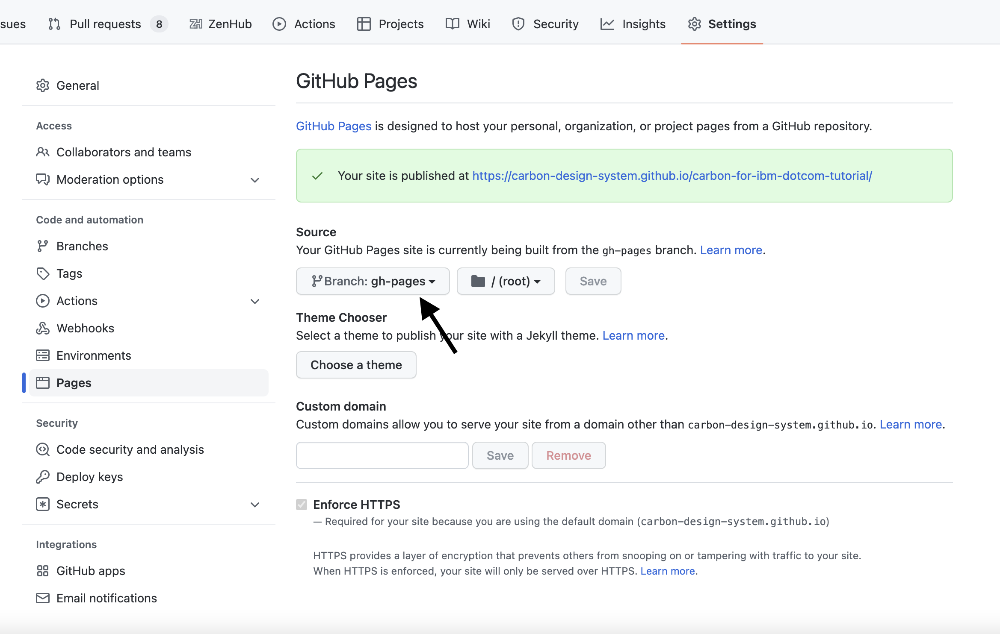

import Preview from 'components/Preview';
import { Link } from 'gatsby';

<PageDescription>

This step takes what we’ve built so far and prepares the app for a production environment.
We’ll be deploying the production build to GitHub Pages.

</PageDescription>

<AnchorLinks>

<AnchorLink>Fork, clone, and branch</AnchorLink>
<AnchorLink>Build for production</AnchorLink>
<AnchorLink>Deploying to GitHub Pages</AnchorLink>
<AnchorLink>Submit pull request</AnchorLink>

</AnchorLinks>

## Preview

Here's a [preview](https://carbon-design-system.github.io/carbon-for-ibm-dotcom-tutorial/step-5/) of what you’ll build. It's not different visually, but is now built for production.

<Preview
  height="400"
  title="Carbon for IBM.com tutorial step 5"
  src="https://carbon-design-system.github.io/carbon-for-ibm-dotcom-tutorial/step-5/"
  frameborder="no"
  allowtransparency="true"
  allowfullscreen="true"
  className="bx--iframe bx--iframe--border"
/>

## Fork, clone, and branch

This tutorial has an accompanying GitHub repository called
[carbon-for-ibm-dotcom-tutorial](https://github.com/carbon-design-system/carbon-for-ibm-dotcom-tutorial) that we'll use
as a starting point for each step. If you haven't forked and cloned that repository yet, and haven't added the upstream
remote, go ahead and do so by following the <Link to="/developing/web-components-tutorial">step 1 instructions</Link>.

### Branch

With your repository all set up, let's check out the branch for this tutorial step's starting point.

```bash
git fetch upstream
git checkout -b web-components-step-5 upstream/web-components-step-5
```

### Build and start app

If you’re starting fresh in your current directory and not continuing from the previous step, install the app's dependencies:

```bash
yarn install
```

## Build for production

Before we deploy our app, we need to create an optimized production build with this command.

Run in your terminal

```bash
yarn build
```

Looking at `package.json`, you’ll find `yarn build` runs the `webpack-prod` configurations. This builds the app for production to the `dist` folder.
It creates minified bundles, lighter weight source maps, and optimizes assets in production mode to improve load time.

## Deploying to Github Pages

Next we'll be deploying to [GitHub Pages](https://docs.github.com/en/pages/getting-started-with-github-pages/about-github-pages) which allows you to host your files directly from your repository in GitHub.

If you forked the tutorial earlier by copy only the `main` branch, you will have to create a `gh-pages` branch with the following steps. Otherwise, if you already have an existing `gh-pages` branch (you can easily check by going to your repository on `github.com` and checking the existing branches), skip the following `git` commands.

To do this, we'll first commit our `dist` folder so that git know we have a subtree (subfolder with our site).

```bash
git add dist && git commit -m "chore(deploy): publish build files"
```

Then we'll use `subtree push` to push to the `gh-pages` branch on Github.

```bash
git subtree push --prefix dist origin gh-pages
```

To have GitHub Pages point to the `gh-pages` branch, go to your forked Carbon for IBM.com Web Components tutorial repository on `github.com`. Go to your "Settings" and under the "Pages" tab, specify the branch, `gh-pages`, as your source.



Once you click save, you should be able to see your site published at the `*.github.io/carbon-for-ibm-dotcom-tutorial/step-5/` link shown on the page.

Congratulations! Your work is now hosted on GitHub Pages!

## Submit pull request

We're going to submit a pull request to verify completion of this tutorial step. You'll need your hosted Github Pages link this time.

### Change base url for Cypress

In order to run tests against your deployed site, you will need to change the `baseUrl` field in the `cypress.json` file.

In `cypress.json`, replace the `baseUrl` field with your Github Pages url.

```json path=crypress.json
"baseUrl": "https://{your username}.github.io/carbon-for-ibm-dotcom-tutorial/step-5",
```

### Continuous integration (CI) check

Run the CI check to make sure we're all set to submit a pull request.

```bash
yarn ci-check
```

<InlineNotification>

**Note:** Having issues running the CI check?

<Link to="/developing/web-components-tutorial/step-1#continuous-integration-(ci)-check">
  Step 1
</Link> has troubleshooting notes that may help.

</InlineNotification>

### Git commit and push

Before we can create a pull request, stage and commit all of your changes:

```bash
git add --all && git commit -m "feat(tutorial): complete step 5"
```

Then, push to your repository:

```bash
git push origin web-components-step-5
```

<InlineNotification>

**Note:** Having issues pushing your changes?

<Link to="/developing/web-components-tutorial/step-1#git-commit-and-push">
  Step 1
</Link> has troubleshooting notes that may help.

</InlineNotification>

### Pull request (PR)

Finally, visit [carbon-for-ibm-dotcom-tutorial](https://github.com/carbon-design-system/carbon-for-ibm-dotcom-tutorial)
to "Compare & pull request". In doing so, make sure that you are comparing `web-components-step-5` with
`base: web-components-step-5`.

Expect your tutorial step PRs to be reviewed by the Carbon for IBM.com team but not merged. We'll close your PR so we
can keep the repository's remote branches pristine and ready for the next person!

If your PR fails the Github Actions test with the error `Can't make a request in offline mode`, try running the
following command: `rm -rf .yarn-offline-mirror node_modules && yarn cache clean && yarn install`. Add and commit the
changes once this completes, and try pushing again.
