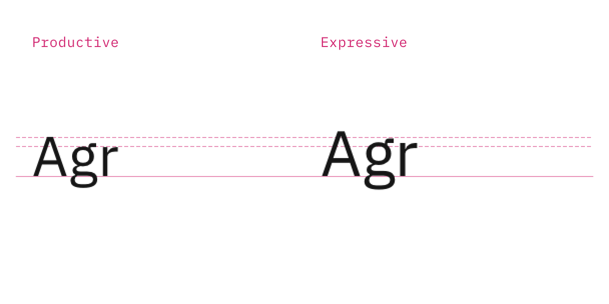
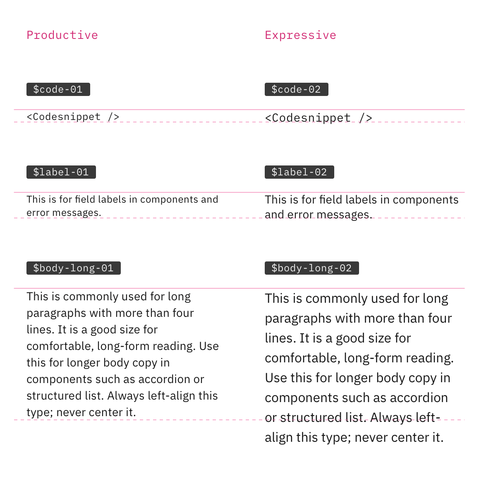
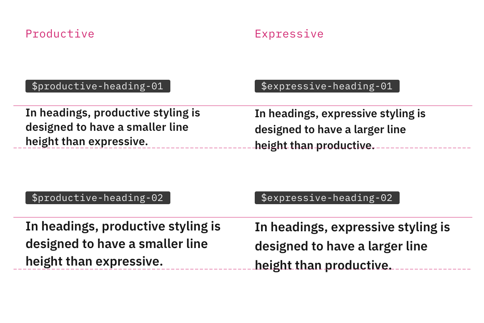
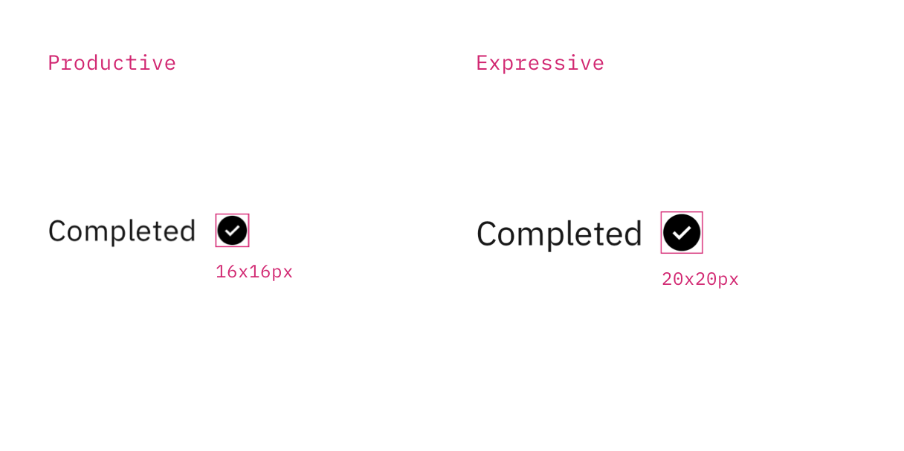
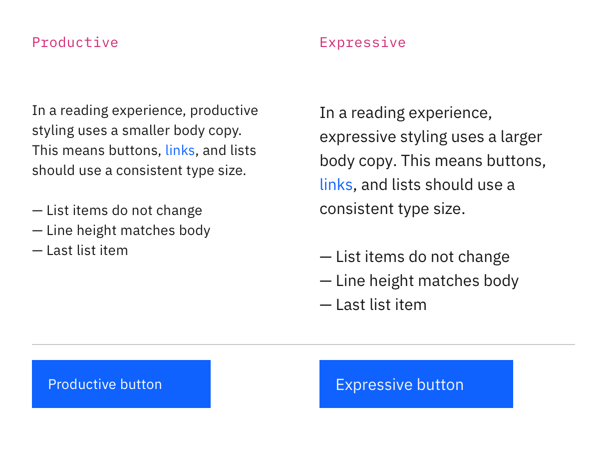

<PageDescription>

These pages explain everything you need to know about expressive styling for IBM.com pages.

</PageDescription>

<AnchorLinks>

<AnchorLink>Recent updates for expressive</AnchorLink>
<AnchorLink>What is expressive styling?</AnchorLink>
<AnchorLink>Type sizes and styles</AnchorLink>
<AnchorLink>Icon sizes</AnchorLink>
<AnchorLink>Component sizes</AnchorLink>

</AnchorLinks>

## Recent updates for expressive

#### Asset consolidation

The Carbon for IBM.com and Carbon teams have been working to consolidate foundational assets, including expressive and productive type sizes, into Carbon Design System’s core library. As the final step in this work, we removed the expressive wrapper in v1.25.0 (27 Sep 2021). [Learn more](../../whats-happening/expressive-update).

#### New design kits

We have been working on new design kits, in both Figma and Sketch. We’re releasing the kits iteratively and the [first versions](../../whats-happening/expressive-update#what-does-this-mean-for-designers) are available now. They include color tokens, and expressive and productive type styles. We’ll be adding key components from the Carbon for IBM.com library over time.

#### Expressive variants in the Carbon core library

The Button, Link, and List core components have been available as expressive variants in the Carbon repo since Carbon v10.35 and will be available in the Carbon Sketch kit from v11 forward. We will also be adding these components to the new Carbon for IBM.com design kits.

## What is expressive styling?

Expressive styling has been carefully designed and curated to serve people visiting IBM.com. It features larger type sizes and a more editorial approach to allows users to scan, read, and navigate multiple pages with comfort and ease. Specifically, expressive styling supports the following needs:

- Users are trying to learn and explore, and are primarily scanning and reading.
- Interactions are more passive through impactful imagery, layout, and long form reading.
- Users typically traverse a series of pages during one session.
- Key performance indicators consider success in terms of click-through rates and final purchases.

Given these needs and interaction behaviors, the expressive styles are optimized to improve content hierarchy, visual engagement, and set clear expectations as user goes from page to page.

Expressive styling is used primarily for web pages and productive styling is used primarily for products. It's important to understand the differences between the two stylistic expressions so that you can make informed choices when you encounter the different styles. See the [Styling strategies](../expressive-styling/styling-strategies) tab to learn how to choose a style.

## Type sizes and styles

#### Type sizes

The expressive type styles are primarily used for web pages and the larger sizes allow for a more dramatic, graphic use of type in editorial and marketing design. These type styles are excellent for long form reading and scanning, but would be distracting for use in product.

The productive type set is primarily used within product spaces, where users benefit from a more condensed treatment of content to maintain focus on tasks.

<Row>
<Column colMd={8} colLg={8}>

<Caption>
  The productive base type size is 14px and the expressive base type size is
  16px.
</Caption>

</Column>
</Row>

 

#### Smaller styles

Within **Body styles** and **Supporting styles**, the same set of styles are offered. Productive styles are named with a suffix of `-01` and expressive style names have a suffix of `-02`.

| Usage             | Productive       | Expressive       |
| ----------------- | ---------------- | ---------------- |
| Code              | `$code-01`       | `$code-02`       |
| Label             | `$label-01`      | `$label-02`      |
| Body copy         | `$body-long-01`  | `$body-long-02`  |
| Compact body copy | `$body-short-01` | `$body-short-02` |

As you can see in the following image, the line heights increase to accommodate the larger expressive type sizes.

<Row>
<Column colMd={8} colLg={8}>

<Caption>
  Comparison of different line heights for expressive and productive styles
</Caption>

</Column>
</Row>

 

#### Heading styles

The expressive heading styles have a larger line height than productive. The pixel size is the same between each but the line height increases.

<Row>
<Column colMd={8} colLg={8}>

<Caption>Comparison of productive and expressive heading styles</Caption>

</Column>
</Row>

The smaller expressive headings are fixed but from `$expressive-heading-03` upward the headings are responsive, or fluid. This means they change size at different breakpoints. By comparison, all of the headings in the productive type set are fixed.

For a complete list of type styles, see the <a href="https://www.carbondesignsystem.com/guidelines/typography/overview/" target="_blank" rel="noopener noreferrer"> Typography guidelines</a> on the Carbon Design System site.

## Icon sizes

The icon sizes between expressive and productive have been designed to match the type size and line height of each type style.

In expressive situations, use 20px by 20px icons to match the larger type sizes. In productive situations, the icon sizes are generally 16px by 16px, with some exceptions where the icons may be 20px by 20px.

<Row>
<Column colMd={8} colLg={8}>

<Caption>Comparison of productive and expressive icon sizes</Caption>

</Column>
</Row>

## Component sizes

Component sizes also increase to accommodate the larger expressive type styles, as shown below with the link, list, and button components.

<Row>
<Column colMd={8} colLg={8}>

<Caption>
  Comparison of link, list, and button in productive and expressive stylings
</Caption>

</Column>
</Row>

 

#### Exceptions for highly interactive components

Where components are highly interactive in nature, we recommend always using productive styling. Components that require higher focus and more active interactions from users are best presented with an efficiency of space. The components include Accordion, Filter panel, Mega menu, and Tabs.

There are some situations where you can blend both stylings and we’ve created detailed usage guidance for working with the productive and expressive type sets on the [Styling strategies](../expressive-styling/styling-strategies) tab.
