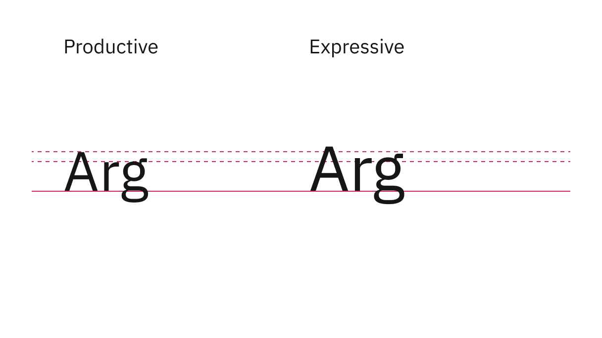
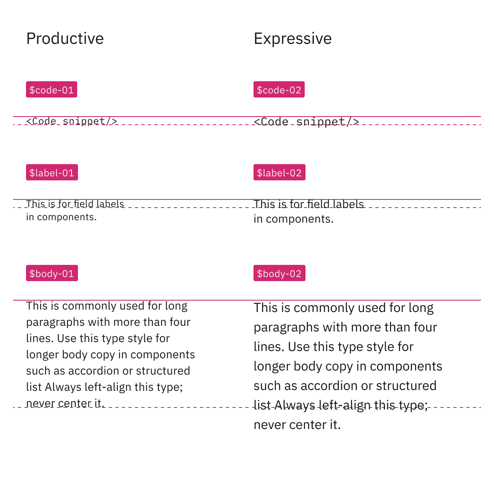
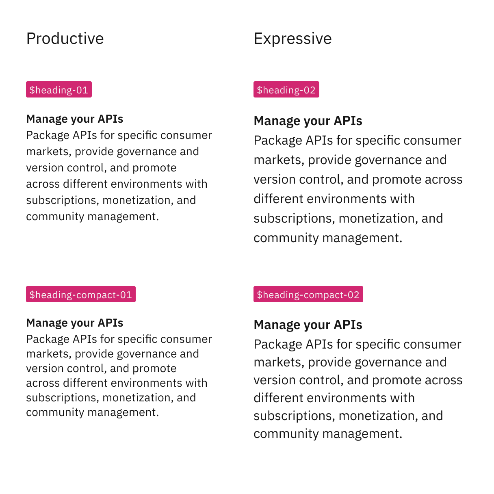
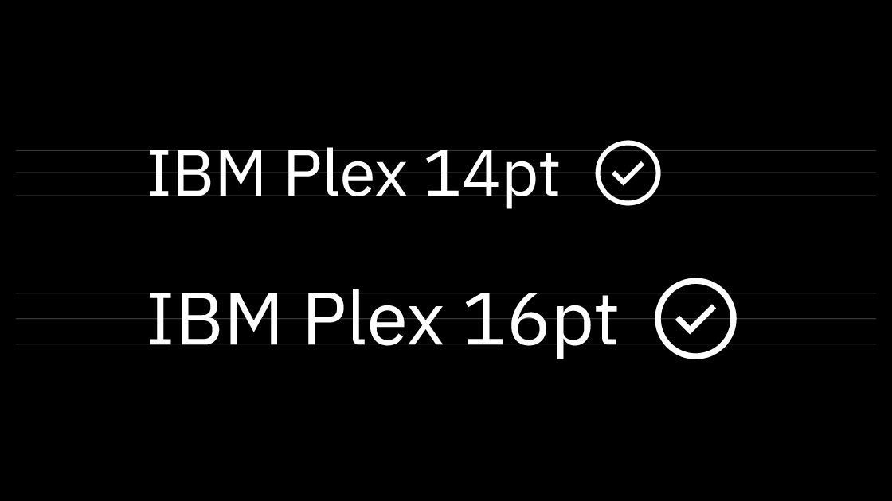
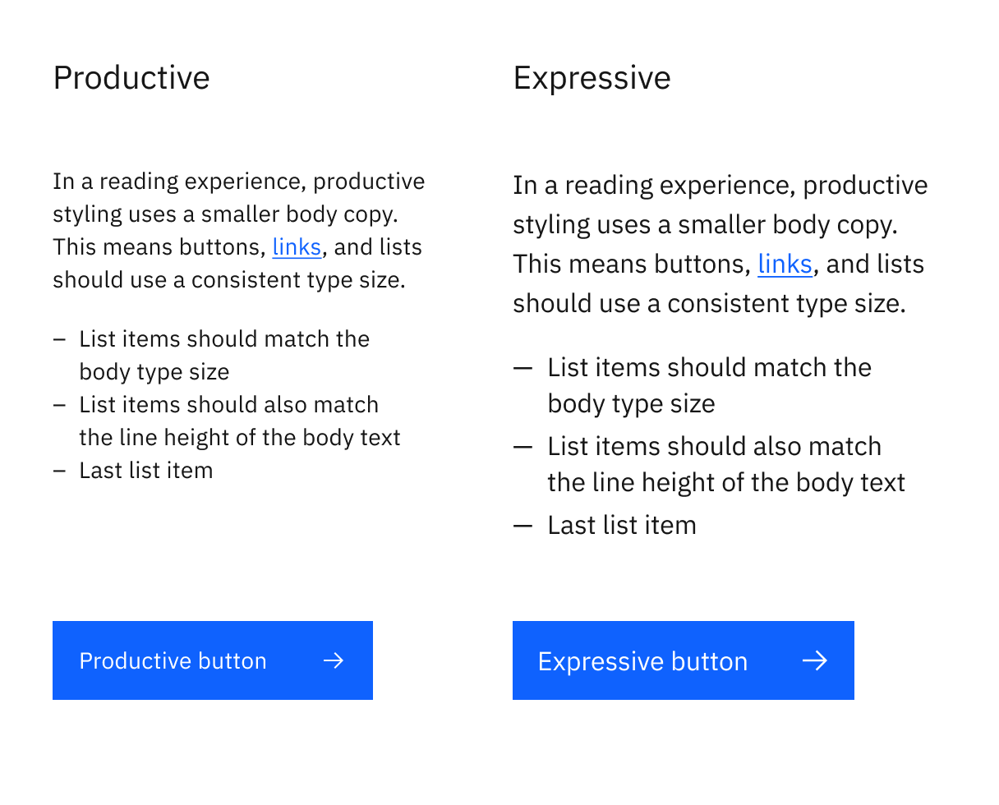

<PageDescription>

These pages explain everything you need to know about expressive styling for IBM.com pages.

</PageDescription>

<AnchorLinks>

<AnchorLink>What is expressive styling?</AnchorLink>
<AnchorLink>Type sizes and styles</AnchorLink>
<AnchorLink>Icon sizes</AnchorLink>
<AnchorLink>Component sizes</AnchorLink>

</AnchorLinks>

## What is expressive styling?

Expressive styling has been carefully designed and curated to serve people visiting IBM.com. It features larger type sizes and a more editorial approach to allow users to scan, read, and navigate multiple pages with comfort and ease. Specifically, expressive styling supports the following needs:

- Users are trying to learn and explore, and are primarily scanning and reading.
- Interactions are more passive through impactful imagery, layout, and long form reading.
- Users typically traverse a series of pages during one session.
- Key performance indicators consider success in terms of click-through rates and final purchases.

Given these user needs and interaction behaviors, the expressive styles are optimized to improve content hierarchy, visual engagement, and set clear expectations as the user navigates from page to page.

Expressive styling is used primarily for web pages and productive styling is used primarily for products. It's important to understand the differences between the two stylistic expressions so that you can make informed choices when you are creating your experience. See the [Styling strategies](../expressive-styling/styling-strategies) tab to learn how to choose a style.

## Type sizes and styles

### Type sizes

The expressive type set is primarily used for web pages and the larger sizes allow for a more dramatic, graphic use of type in editorial and marketing design. These fluid type styles are excellent for long form reading and scanning, but could be distracting for use in product.

The productive type set is primarily used within product spaces, where users benefit from a more condensed treatment of content to maintain focus on tasks.

<Row>
<Column colMd={8} colLg={8}>

<Caption>
  The productive base type size is 14px and the expressive base type size is
  16px.
</Caption>

</Column>
</Row>

### Smaller styles

Within **Body styles** and **Utility styles**, the same set of styles are offered. Productive styles are named with a suffix of `-01` and expressive style names have a suffix of `-02`.

| Usage             | Productive         | Expressive       |
| ----------------- | ------------------ | ---------------- |
| Code              | `$code-01`         | `$code-02`       |
| Label             | `$label-01`        | `$label-02`      |
| Body copy         | `$body-01`         | `$body-02`  |
| Compact body copy | `$body-compact-01` | `$body-compact-02` |

As you can see in the following image, the line heights increase to accommodate the larger expressive type sizes.

<Row>
<Column colMd={8} colLg={8}>

<Caption>
  Comparison of different line heights for expressive and productive styles
</Caption>

</Column>
</Row>

### Heading styles

Each of the productive and expressive body styles have a matching heading style that has the same type size and line height to maintain type hiearchy. The smaller heading styles in the expressive type set are fixed, meaning they are not responsive, the type size remains contstant reguardless of breakpoint. 

Most heading styles used within the expressive type set are fluid, meaning they are responsive and the type styles change size at different breakpoints. By comparison, all of the headings in the productive type set are fixed.

| Productive            | Expressive       |
| --------------------- | ---------------- |
| `$heading-compact-01` | `$heading-compact-02` |
| `$heading-01`         | `$heading-02`         |
| `$heading-03`         | `$fluid-heading-03`   |
| `$heading-04`         | `$fluid-heading-04`   |

<Row>
<Column colMd={8} colLg={8}>

<Caption>Comparison of productive and expressive heading styles</Caption>

</Column>
</Row>

For a complete list of type styles, see the <a href="https://v10.carbondesignsystem.com/guidelines/typography/overview/" target="_blank" rel="noopener noreferrer"> Typography guidelines</a> on the Carbon Design System site.

## Icon sizes

The icon sizes between expressive and productive have been designed to match the type size and line height of each type style.

In expressive situations, use 20px by 20px icons to match the larger type sizes. In productive situations, the icon sizes are generally 16px by 16px, with some exceptions where the icons may be 20px by 20px.

<Caption>16px and 20px icons are optimized to feel balanced when paired with 14pt and 16pt IBM Plex. Use 24px and 32px when larger icons are needed.</Caption>

<DoDontRow>
  <DoDont
    type="do"
    caption="Do use the correct icon size with IBM Plex.">

  </DoDont>
  <DoDont type="dont" caption="Don’t alter the icon-text size ratio.">

  </DoDont>
</DoDontRow>

## Component sizes

The button, link and list componentens are often paired with the larger expressive body copy used in IBM.com experiences, and expressive variants of these three key components have been made available in the Carbon repo since Carbon v10.35. The expressive variants increase the type size to 16px and the icon size to 20 by 20px to match the body copy size throughout the page and maintain the same level of hierarchy.

<Row>
<Column colMd={8} colLg={8}>

<Caption>
  Comparison of link, list, and button in productive and expressive stylings
</Caption>

</Column>
</Row>

### Exceptions for highly interactive components

Where components are highly interactive in nature, we recommend always using productive styling. Components that require higher focus and more active interactions from users are best presented with an efficiency of space. The components include Accordion, Filter panel, Mega menu, and Tabs.

There are some situations where you can blend both stylings and we’ve created detailed usage guidance for working with the productive and expressive type sets on the [Styling strategies](../expressive-styling/styling-strategies) tab.
