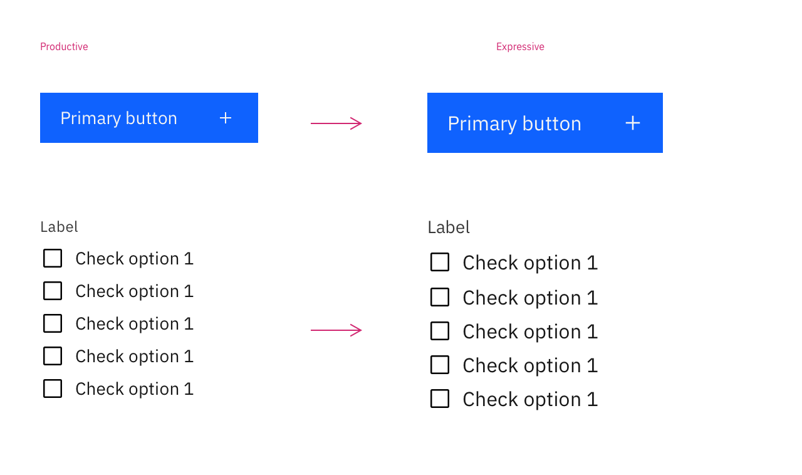

<PageDescription>

These pages explain everything you need to know about expressive styling for IBM.com pages. 

</PageDescription>

<InlineNotification>

**Note:** The Carbon for IBM.com and Carbon teams have been working to consolidate foundational assets, including expressive and productive type sizes, into Carbon Design System’s core library. As the final step in this work, we removed the expressive wrapper in v1.25.0 (27 Sep 2021) and the Expressive theme will no longer be maintained. [Read more about this change](../../whats-happening/expressive-update).

</InlineNotification>

<AnchorLinks>

<AnchorLink>Recent updates for expressive</AnchorLink>
<AnchorLink>What is expressive styling?</AnchorLink>
<AnchorLink>Type tokens and sets</AnchorLink>
<AnchorLink>Expressive variants</AnchorLink>
<AnchorLink>Preferred productive components</AnchorLink>

</AnchorLinks>

## Recent updates for expressive

#### Asset consolidation

The Carbon for IBM.com and Carbon teams have been working to consolidate foundational assets, including expressive and productive type sizes, into Carbon Design System’s core library. As the final step in this work, we removed the expressive wrapper in v1.25.0 (27 Sep 2021). [Learn more](../../whats-happening/expressive-update).

#### New design kits

We have been working on new design kits, in both Figma and Sketch. We’re releasing the kits iteratively and the [first versions](http:../../whats-happening/expressive-update#what-does-this-mean-for-designers) are available now. They include color tokens, and expressive and productive type styles. We’ll be adding key components from the Carbon for IBM.com library over time. 

#### Expressive variants in the Carbon core library
The Button, Link, and List core components have been available as expressive variants in the Carbon repo since Carbon v10.35 and will be available in the Carbon Sketch kit from v11 forward. We will also be adding these components to the new Carbon for IBM.com design kits.

## What is expressive styling?

Expressive styling has been carefully designed and curated to serve people visiting IBM.com. It features larger type sizes and a more editorial approach to allows users to scan, read, and navigate multiple pages with comfort and ease. Specifically, expressive styling supports the following needs:

- Users are trying to learn and explore, and are primarily scanning and reading. 
- Interactions are more passive through impactful imagery, layout, and long form reading.
- Users typically traverse a series of pages during one session. 
- Key performance indicators consider success in terms of click-through rates and final purchases. 

Given these needs and interaction behaviors, the expressive styles are optimized to improve content hierarchy, visual engagement, and set clear expectations as user goes from page to page.

We've created detailed usage guidance for working with the productive and expressive type sets, explaining and illustrating where blending of the type sets can enhance experiences. Learn more on the [Styling strategies](../expressive-styling/styling-strategies) tab. 

## Type tokens and sets

Carbon uses type tokens across two type sets to manage typography. Type tokens
are pre-set configurations of typographic elements such as font size, weight, or
leading (line height) that are specifically calibrated for use alongside
[IBM Plex](http://ibm.com/plex) in product. Selecting the appropriate type style
is determined by layout or template structure. Layouts may have several levels
of architecture or areas that require varying typographic hierarchies.

### Expressive and productive type sets

The larger expressive type styles are primarily used for web pages and allow for a more dramatic, graphic use of type in editorial and marketing design. These type styles are excellent for long form reading and scanning, but
would be distracting for use in product. The productive type set is primarily used within product spaces, where users
benefit from a more condensed treatment of content to maintain focus on tasks.
The productive styles work together to support the hierarchy of information and
set user expectations. 

Within **Body styles** and **Supporting styles**, the same set of styles are
offered. Expressive style names have a suffix of `-02` and productive styles are named with a suffix of `-01`.

There are two heading sets and the major difference between them is in how they
are implemented in code. Expressive headings are responsive and the type styles change size at different
breakpoints. The productive type set uses fixed headings. 

For more detail, see [Styling strategies](../expressive-styling/styling-strategies/).

## Expressive variants

** Not sure how we want to shape the next two sections. Want to talk about the benefits. 

Button, Link, List 

These three core components have been available as expressive variants in the Carbon repo since Carbon v10.35 and will be available in the Carbon Sketch kit from v11 forward. 

Also, these components along with other key components from the library, will be available this quarter in the new Carbon for IBM.com design kits. 

## Preferred productive components

Section to talk about Accordion, Filter panel... which other components to mention. 

**REMOVE EVERYTHING FROM HERE DOWN

## Expressive theme availability

<InlineNotification kind="warning">

**Note:** The Expressive theme is being integrated into Carbon Design System’s core library, and so expressive and productive styling will be available from one library source. After this change, the Expressive theme will no longer be maintained. <a href="../../help/expressive-update">Learn more about this change</a>.

</InlineNotification>

The Expressive theme is our initial attempt at achieving expressive styling. It works as a wrapper on top of Carbon's core library, and is enabled in in Carbon for IBM.com (starting in v1.10.0) by default, to guarantee consistency across all IBM.com experiences. 

The Expressive theme is also available as its own offering within the Carbon for IBM.com styles package (available in `v1.9.0`). Read more about how to implement the expressive theme [within any non-IBM.com applications](https://carbon-expressive.mybluemix.net).

As mentioned above, this current approach is changing soon. We will provide more details to ensure your transition is seamless.

## How the Expressive theme works

### Type scale

The Expressive theme increases Carbon Design System’s base type size of 14px to 16px and systematically increased the other type sizes within the system.

<Row>
<Column colMd={8} colLg={8}>

</Column>
</Row>

#### Type token differences

The following table shows the differences between the default Carbon tokens and the tokens used by the expressive theme.

| Type token | Carbon default scale (size/line-height) | Carbon Expressive scale (size/line-height) |
|:---|:---|:---|
|`$code-01`|12px / 16px|14px / 20px|
|`$code-02`|14px / 20px|16px / 24px|
|`$caption-01`|12px / 16px|14px / 18px|
|`$label-01`|12px / 16px|14px / 18px|
|`$helper-text-01`|12px / 16px|14px / 18px|
|`$body-short-01`|14px / 18px|16px / 22px|
|`$body-long-01`|14px / 20px|16px / 24px|
|`productive-heading-01`|14px / 18px|16px / 22px|

### Icons

To match the increased type size, the standard 16px by 16px icon size for Carbon's 14px base type has increased to 20px by 20px for the 16px base type in the Expressive theme.

<Row>
<Column colMd={8} colLg={8}>

</Column>
</Row>

#### Icon token differences

| Icon token | Productive scale | Expressive scale |
|:---|:---|:---|
|`$icon-01`|16px|20px|
|`$icon-02`|20px|20px|

### Containers

Container sizes were increased systematically to accommodate the larger type sizes. The default container size for most components increased from 40px to 48px.

<Row>
<Column colMd={8} colLg={8}>

</Column>
</Row>

<Row>
<Column colMd={8} colLg={8}>

</Column>
</Row>

#### Container token differences

| Container token | Productive scale | Expressive scale |
|:---|:---|:---|
|`$container-01`|24px|32px|
|`$container-02`|32px|40px|
|`$container-03`|40px|48px|
|`$container-04`|48px|48px|
|`$container-05`|64px|72px|

## Resources

<Row className="resource-card-group">
<Column colMd={4} colLg={4} noGutterSm>
    <ResourceCard
      subTitle="Carbon Design System with the Expressive theme"
      aspectRatio="2:1"
      actionIcon="arrowRight"
      href="https://carbon-expressive.mybluemix.net"
      >

</ResourceCard>
</Column>
</Row>

The table below highlights some of the key changes that are happening as a result of this work. 

| Asset                           | What's changing                       |
| ------------------------------- | ------------------------------------- |
| _Carbon for IBM.com design kits_ | We have been working on new design kits, in both Figma and Sketch. We’re releasing the kits iteratively and the [first versions](http:../../whats-happening/expressive-update#what-does-this-mean-for-designers) are available now. They include color tokens, and expressive and productive type styles. We’ll be adding key components from the Carbon for IBM.com library over time.       |
| _Button, Link, List_            | These three core components have been available as expressive variants in the Carbon repo since Carbon v10.35 and will be available in the Carbon Sketch kit from v11 forward. We will also be adding these components to the new Carbon for IBM.com design kits.        |
| _Type token names_              | The type token names are currently being updated to aid understanding and use. They will be updated in the Carbon v11 release, and we will provide updates when they're available in Carbon for IBM.com kits.      |