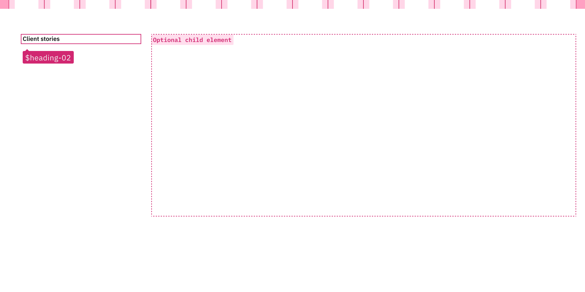
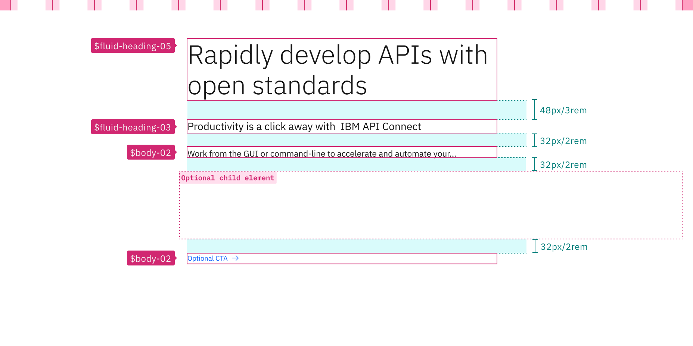
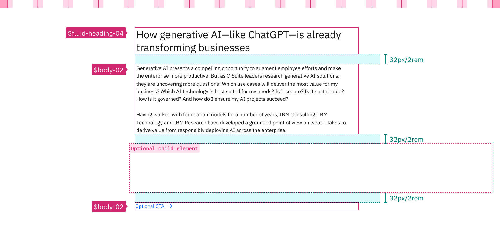

<PageDescription>

Typography can help create clear hierarchies, organize information, and guide users through a product or experience. Together with spacing, type pairings support different levels of architecture or areas that require varying typographic hierarchies.

</PageDescription>

<AnchorLinks>

<AnchorLink>Overview</AnchorLink>
<AnchorLink>Common type pairings</AnchorLink>
<AnchorLink>Support</AnchorLink>

</AnchorLinks>

## Overview

Within Carbon, there are two [type sets](https://carbondesignsystem.com/guidelines/typography/type-sets) available for use with productive and expressive experiences, and each type set includes styles that have been designed with content hierarchy expectations in mind. People unconsciously use type size as a signal of hierarchy, and so it's important to follow the correct type styles (or tokens) when choosing which styles to use on your page.

Beyond just using the correct type styles for your experience—i.e. fluid heading tokens are far more commonly found in Carbon for IBM.com experiences than they are in product—the pairing of these tokens is also crucially important. 

## Common type pairings 

### IBM.com layout components 

With the layout components, the Carbon for IBM.com library has actually codified key type pairings for designers, thereby eliminating some of the guesswork.

Below are some common type pairings used within Carbon for IBM.com layout components, and the spacing between the type pairs, that provide clear visual cues for hierarchy and information organization.

It’s important to note that although type pairings are not codified in the Carbon React library, some these pairings are still encouraged and widely used in IBM products as well.

### Content section

[Content section](../components/content-section) is one of the main layout components that can be used to build web experiences on IBM.com. It includes a singular type heading and can accept many child components to enable maximum customization and flexibility. It utilizes the full 16 columns in the layout.

<Caption>
  For full details on the specifications of the type tokens, see the [type guidance](https://carbondesignsystem.com/guidelines/typography/type-sets) on the Carbon Design System site.
</Caption>

### Content block

[Content block](../components/content-block) is also a key layout component in IBM.com experiences. It includes a large heading, subheading, body copy and CTA, and can accept many child components to enable customization and flexibility. It sits on 12 columns and it often used in conjunction with the table of contents component.

<Caption>
  For full details on the specifications of the type tokens, see the [type guidance](https://carbondesignsystem.com/guidelines/typography/type-sets) on the Carbon Design System site.
</Caption>

### Content group

[Content group](../components/content-group) acts as a content unit, and is used inside a content section or a content block. It can contain basic content components (one or multiple content items of the same kind), bringing them together into highly-customized solutions for the user.

Although IBM products rarely use fluid tokens, these size pairings are often used in IBM product as well. 

<Caption>
  For full details on the specifications of the type tokens, see the [type guidance](https://carbondesignsystem.com/guidelines/typography/type-sets) on the Carbon Design System site.
</Caption>

### Content item

[Content item](../components/content-item) is a basic-level content component that acts as a primary content unit, and it is used inside a content section, block or group to build web experiences on IBM.com pages. It can encapsulate basic content (a heading, a description, a media element – image or video – and a CTA) and brings them all together into a content component which solves a specific problem for the user.

These token pairings are also commonly used in IBM products.

<Caption>
  For full details on the specifications of the type tokens, see the [type guidance](https://carbondesignsystem.com/guidelines/typography/type-sets) on the Carbon Design System site.
</Caption>

## Support

If you have any questions about type pairings, feel free to reach out to team on the [#carbon-for-ibm-dotcom](https://cognitive-app.slack.com/archives/C2PLX8GQ6) slack channel.
