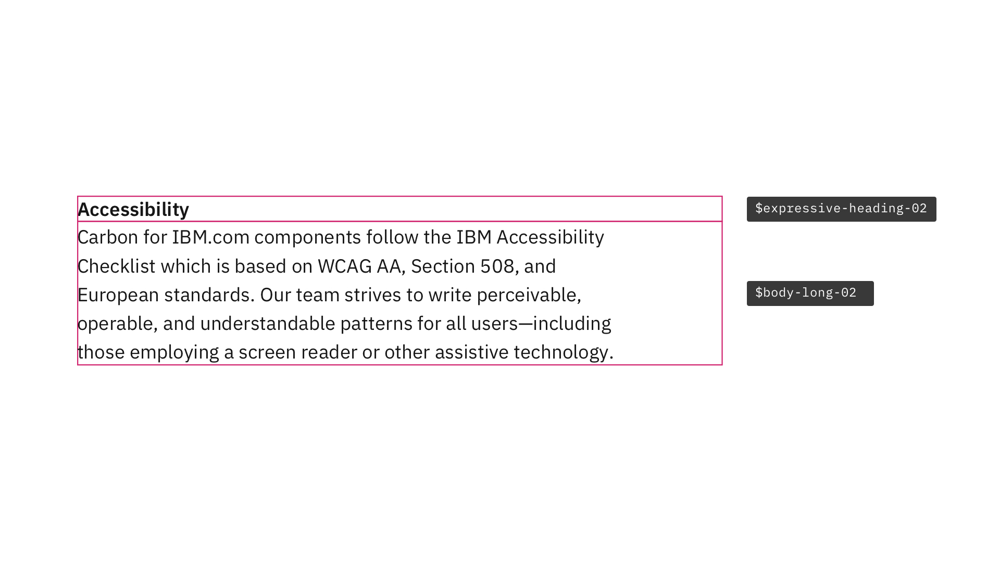
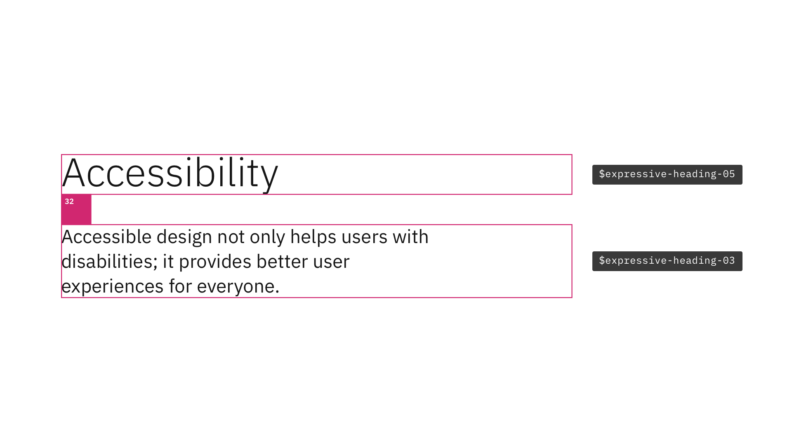
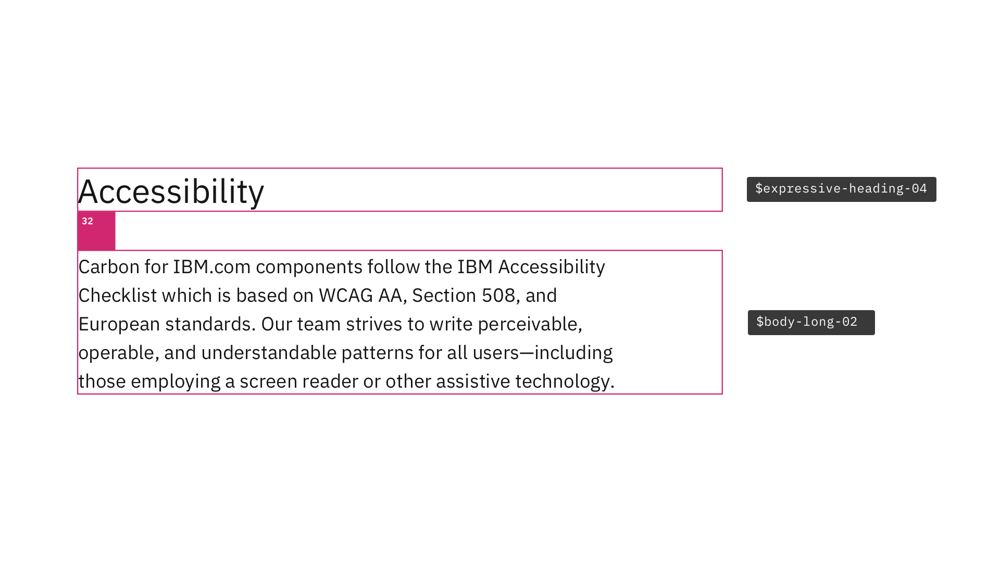

<PageDescription>

Typography can help create clear hierarchies, organize information, and guide users through a product or experience. Together with spacing, type pairings support different levels of architecture or areas that require varying typographic hierarchies.

</PageDescription>

<AnchorLinks>

<AnchorLink>Overview</AnchorLink>
<AnchorLink>Content section</AnchorLink>
<AnchorLink>Content block</AnchorLink>
<AnchorLink>Content group</AnchorLink>
<AnchorLink>Content item</AnchorLink>
<AnchorLink>Support</AnchorLink>

</AnchorLinks>

## Overview

Within Carbon, there are two type sets available for use with productive and expressive experiences, and each type set includes styles that have been designed with content hierarchy expectations in mind. People unconsciously use type size as a signal of hierarchy, and so it's important to follow the correct type pairings when choosing which styles to use on your page.

Below are some common type pairings used within Carbon for IBM.com components, and the spacing between the type pairs, that provide clear visual cues for hierarchy and information organization.

## Content section

[Content section](https://www.ibm.com/standards/carbon/components/content-section) pairs `$expressive-heading-02` and `$body-long-02` with no space between the two type styles. For details about top and bottom spacing, see the [Spacing guidlines](../spacing#spacing-for-content-section).

<Row>
<Column colMd={8} colLg={8}>

<Caption>
  Example of $expressive-heading-02 and $body-long-02 pairing, shown at the
  large breakpoint
</Caption>

</Column>
</Row>

### Tokens for Content section

| `Type token`             | `Breakpoint` | `Info`                                                                                                                          |
| ------------------------ | ------------ | ------------------------------------------------------------------------------------------------------------------------------- |
| `$expressive-heading-02` | Large        | Type: IBM Plex Sans  Size: 16px / 1rem  Line-height: 24px / 1.5em  Weight: 600 / Semi-Bold  Letter-spacing: 0px |
| `$body-long-02`          | Large        | Type: IBM Plex Sans  Size: 16px / 1rem  Line-height: 24px / 1.5em  Weight: 400 / Regular  Letter-spacing: 0px   |

 

## Content block

[Content block](https://www.ibm.com/standards/carbon/components/content-block) pairs `$expressive-heading-05` and `$expressive-heading-03` with 32px of space between the two type styles. For details about top and bottom spacing, see the [Spacing guidelines](../spacing#spacing-for-content-block).

<Row>
<Column colMd={8} colLg={8}>

<Caption>
  Example of $expressive-heading-05 and $expressive-heading-03 pairing, shown at
  the large breakpoint
</Caption>

</Column>
</Row>

### Tokens for Content block

| `Type token`             | `Breakpoint` | `Info`                                                                                                                            |
| ------------------------ | ------------ | --------------------------------------------------------------------------------------------------------------------------------- |
| `$expressive-heading-05` | Large        | Type: IBM Plex Sans  Size: 42px / 2.625rem  Line-height: 50px / 3.125em  Weight: 300 / Light  Letter-spacing: 0px |
| `$expressive-heading-03` | Large        | Type: IBM Plex Sans  Size: 20px / 1.25rem  Line-height: 28px / 1.75em  Weight: 400 / Regular  Letter-spacing: 0px |

 

## Content group

[Content group](https://www.ibm.com/standards/carbon/components/content-group) pairs `$expressive-heading-04` and `$body-long-02` with 32px of space between the two type styles. For details about top and bottom spacing, see the [Spacing guidelines](../spacing#spacing-for-content-group).

<Row>
<Column colMd={8} colLg={8}>

<Caption>
  Example of $expressive-heading-04 and $body-long-02 pairing, shown at the
  large breakpoint
</Caption>

</Column>
</Row>

### Tokens for Content group

| `Type token`             | `Breakpoint` | `Info`                                                                                                                            |
| ------------------------ | ------------ | --------------------------------------------------------------------------------------------------------------------------------- |
| `$expressive-heading-04` | Large        | Type: IBM Plex Sans  Size: 28px / 1.75rem  Line-height: 36px / 2.25em  Weight: 400 / Regular  Letter-spacing: 0px |
| `$body-long-02`          | Large        | Type: IBM Plex Sans  Size: 16px / 1rem  Line-height: 24px / 1.375em  Weight: 400 / Regular  Letter-spacing: 0px   |

## Content item

[Content item](https://www.ibm.com/standards/carbon/components/content-item) pairs `$expressive-heading-02` and `$body-long-02` with no space between the two type styles. For details about top and bottom spacing, see the [Spacing guidelines](../spacing#spacing-for-content-item).

<Row>
<Column colMd={8} colLg={8}>

<Caption>
  Example of $expressive-heading-02 and $body-long-02 pairing, shown at the
  large breakpoint
</Caption>

</Column>
</Row>

### Tokens for Content item

| `Type token`             | `Breakpoint` | `Info`                                                                                                                          |
| ------------------------ | ------------ | ------------------------------------------------------------------------------------------------------------------------------- |
| `$expressive-heading-02` | Large        | Type: IBM Plex Sans  Size: 16px / 1rem  Line-height: 24px / 1.5em  Weight: 600 / Semi-Bold  Letter-spacing: 0px |
| `$body-long-02`          | Large        | Type: IBM Plex Sans  Size: 16px / 1rem  Line-height: 24px / 1.375em  Weight: 400 / Regular  Letter-spacing: 0px |

 

## Support

If you have any questions about type pairings, feel free to reach out to team on the [#carbon-for-ibm-dotcom](https://cognitive-app.slack.com/archives/C2PLX8GQ6) slack channel.
