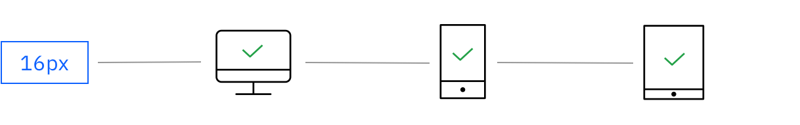
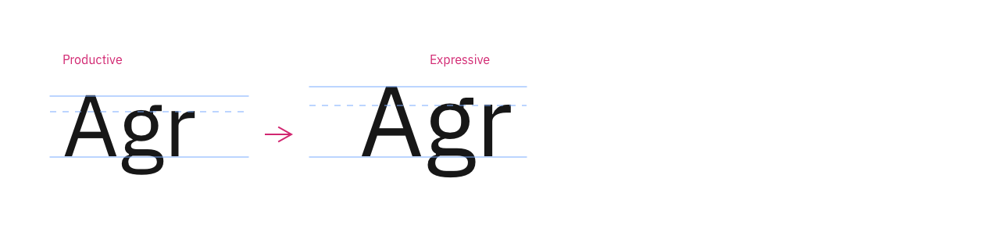
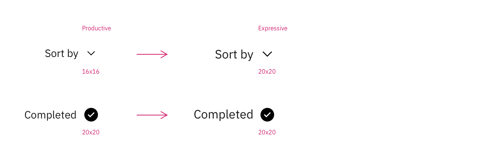
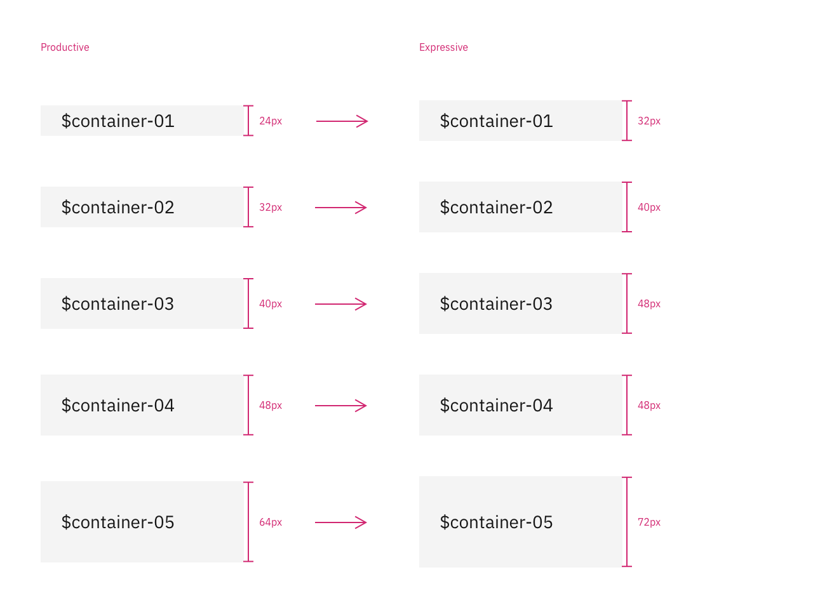
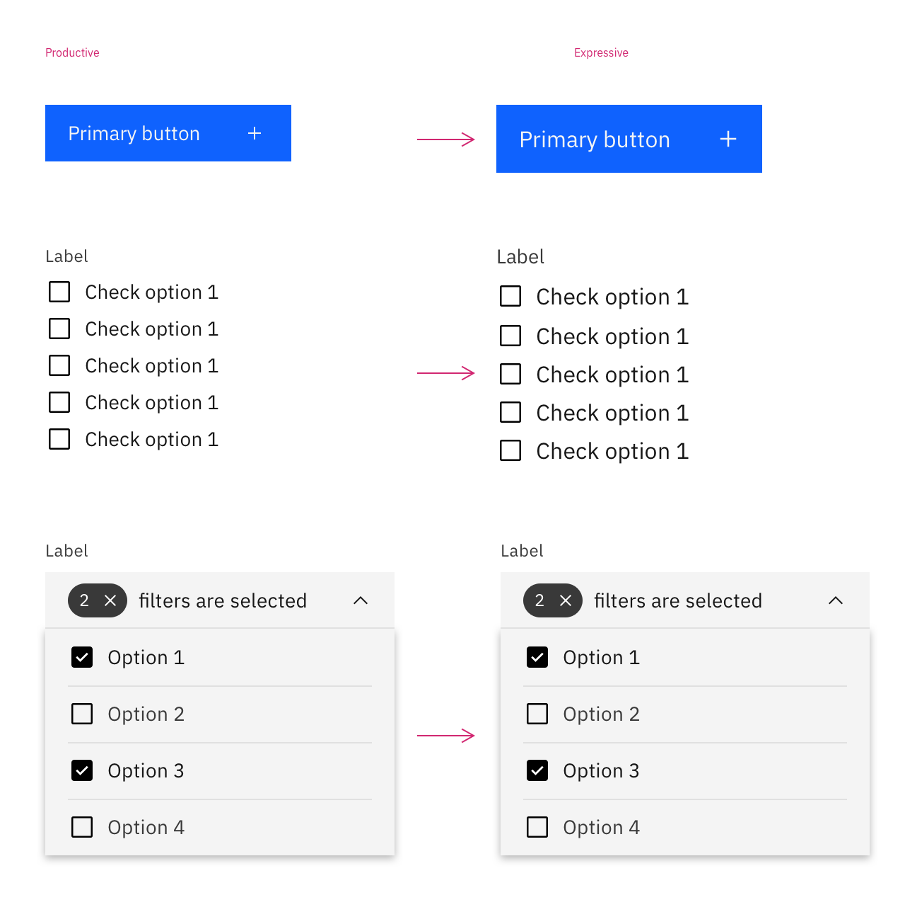

<PageDescription>

The Expressive Theme is a flavor of Carbon for IBM.com and web experiences, optimized for the reading and learning experiences, among the most common in web experiences. 

</PageDescription>

<AnchorLinks>

<AnchorLink>Expressive Theme fundamentals</AnchorLink>
<AnchorLink>Expressive Theme and the IBM.com Library</AnchorLink>
<AnchorLink>Resources</AnchorLink>

</AnchorLinks>

## Expressive Theme fundamentalss
Carbon was originally designed and developed for product centric experiences where the ability to display dense information and content types, which led to a type scale and components that are smaller than industry average. Based on research, the Expressive Theme was designed and built with the optimal type scale for reading experiences on IBM.com with the base type size of 16 pixels (12 points), and larger components to accommodate the larger type scale.

Based on various research reports regarding users and cognitive science, 16px (12 points) was chosen as the common base type size for all device form factors for the web and IBM.com experiences with a focus on readability and accessibility.

<Row>
<Column colMd={8} colLg={8}>

</Column>
</Row>

### Type scale

As opposed to Carbon Design System's original base type size of 14px, the Expressive Theme uses 16px as the base size and built the scale around it.

<Row>
<Column colMd={8} colLg={8}>

</Column>
</Row>

<Title>Type token changes</Title>

The base type size is increasing from 14px to 16px. Details on the token updates are coming soon.

<!--
| Type token | Productive scale | Expressive scale |
|:---|:---|:---|
|`$code-01`|12px / 16px|14px / 20px|
|`$code-02`|14px / 20px|16px / 24px|
|`$label-01`|12px / 16px|14px / 18px|
|`$caption-01`|12px / 16px|14px / 18px|
|`$helper-text-01`|12px / 16px|14px / 18px|
|`$body-short-01`|14px / 18px|16px / 22px|
|`$body-short-02`|14px / 20px|16px / 24px|
-->

### Icons

To accommodate the increased type size, the standard 16px by 16px icon size for Carbon's 14px base type is increased to 20px by 20px for the 16px base type in the Expressive Theme.

<Row>
<Column colMd={8} colLg={8}>

</Column>
</Row>

<Title>Icon token changes</Title>

| Icon token | Productive scale | Expressive scale |
|:---|:---|:---|
|`$icon-01`|16px|20px|
|`$icon-02`|20px|20px|

### Containers

Container sizes were increased systematically to accommodate the larger type sizes. The default container size for most components increased from 40px to 48px.

<Row>
<Column colMd={8} colLg={8}>

</Column>
</Row>

<Row>
<Column colMd={8} colLg={8}>

</Column>
</Row>

<Title>Container token changes</Title>

| Container token | Productive scale | Expressive scale |
|:---|:---|:---|
|`$container-01`|24px|32px|
|`$container-02`|32px|40px|
|`$container-03`|40px|48px|
|`$container-04`|48px|48px|
|`$container-05`|64px|72px|

## Expressive Theme and the IBM.com Library

By default, the Expressive Theme is enabled in the IBM.com Library (starting in `v1.10.0`). This is to guarantee consistency across
all IBM.com experiences. However, the expressive theme is also available as its own offering within the IBM.com Library
styles package (available in `v1.9.0`). Read more about how to implement within any non-IBM.com applications at 
https://carbon-expressive.mybluemix.net.

## Resources

<Row className="resource-card-group">
<Column colMd={4} colLg={4} noGutterSm>
    <ResourceCard
      subTitle="Carbon Design System with Expressive"
      aspectRatio="2:1"
      actionIcon="arrowRight"
      href="https://carbon-expressive.mybluemix.net"
      >

 
</ResourceCard>
</Column>
<Column colMd={4} colLg={4} noGutterSm>
    <ResourceCard
      disabled
      subTitle="Design kit (coming soon)"
      actionIcon="arrowRight"
      href="#"
    >

</ResourceCard>
</Column>
</Row>
