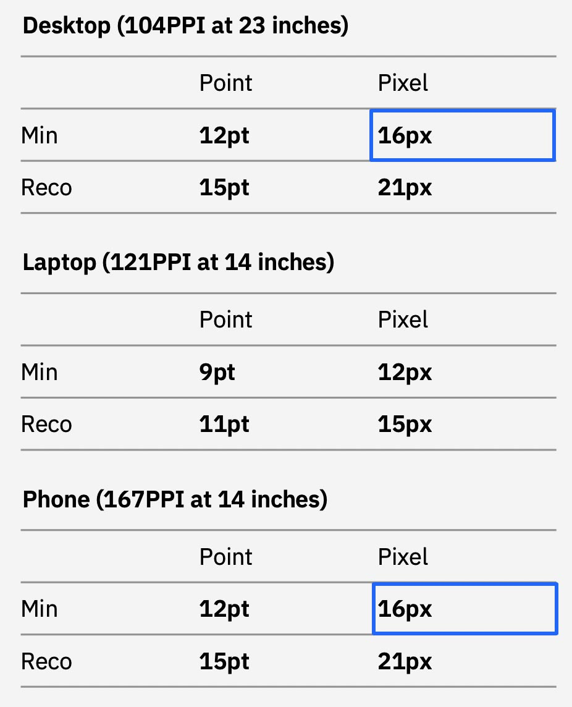
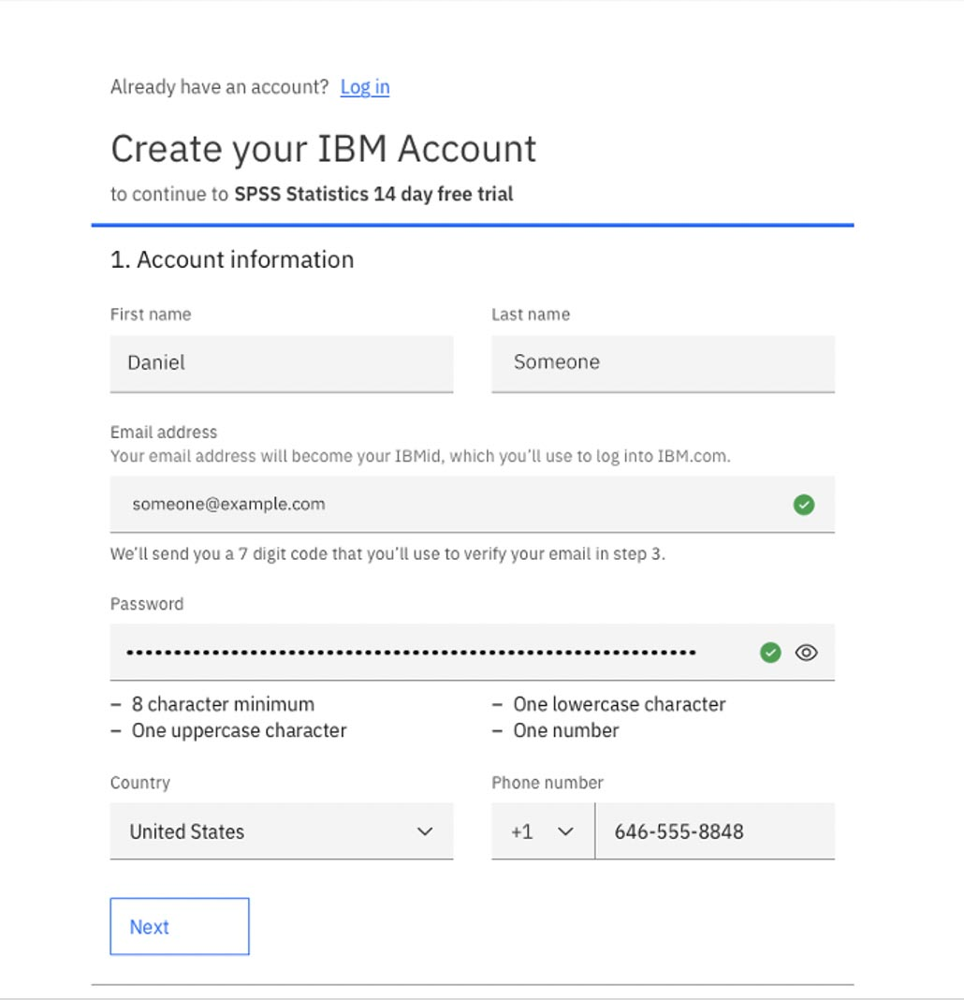

<PageDescription>

Carbon was originally built to handle dense information in product experiences. 

The Expressive Theme is designed for experiences geared towards reading, watching, and learning.

</PageDescription>

<AnchorLinks>

<AnchorLink>Resources</AnchorLink>
<AnchorLink>IBM.com Journey</AnchorLink>
<AnchorLink>Productive vs. Expressive moments</AnchorLink>
<AnchorLink>Expressive Theme and the IBM.com Library</AnchorLink>

</AnchorLinks>

## Resources

<Row className="resource-card-group">
<Column colMd={4} colLg={4} noGutterSm>
    <ResourceCard
      subTitle="Carbon Design System with Expressive"
      aspectRatio="2:1"
      actionIcon="arrowRight"
      href="https://carbon-expressive.mybluemix.net"
      >

 
</ResourceCard>
</Column>
<Column colMd={4} colLg={4} noGutterSm>
    <ResourceCard
      subTitle="Designing: Get Started"
      actionIcon="arrowRight"
      href="/get-started/designing"
    >
    </ResourceCard>
</Column>
</Row>

## IBM.com Journey
Throughout a user's journey through IBM.com, there are moments of productivity, as well as marketing and editorial. 
These moments tend to blend back and forth across various touch points.

 

Carbon is equipped to provide a productive experience. The Expressive Theme overlays existing Carbon, and bridges the
gap in order to provide those expressive moments.

## Research

<Row>
<Column colMd={6} colLg={6}>
Based on research, the minimum type size for reading is 16px. Especially for heavy reading, any size less could cause 
eye strain. In addition to reading, considerations should be made for accessibility. Accessibility is not just about 
color contrast and color blindness. It's also about age, vision, cognitive abilities.

### Further Reading

- <a href="https://www.imarc.com/blog/best-font-size-for-any-device" target="_blank">What’s the best font size for the web?</a>
- <a href="https://www.smashingmagazine.com/2011/10/16-pixels-body-copy-anything-less-costly-mistake/" target="_blank">16 Pixels Font Size: For Body Copy. Anything Less Is A Costly Mistake</a>
- <a href="https://learnui.design/blog/mobile-desktop-website-font-size-guidelines.html" target="_blank">The Responsive Website Font Size Guidelines</a>
- <a href="https://health.gov/healthliteracyonline/display/section-3-3/" target="_blank">Health.gov: Use a readable font that’s at least 16 pixels</a>
- <a href="https://www.fonts.com/content/learning/fyti/situational-typography/designing-for-seniors" target="_blank">Designing for seniors</a>
- <a href="https://www.bdadyslexia.org.uk/advice/employers/creating-a-dyslexia-friendly-workplace/dyslexia-friendly-style-guide" target="_blank">Dyslexia friendly style guide</a>    
     
</Column>
<Column colMd={6} colLg={6}>

</Column>
</Row>

## Productive vs. Expressive moments

### Reading / Learning
<Row>
<Column colMd={6} colLg={6}>

**Productive theme (original Carbon)**

</Column>
<Column colMd={6} colLg={6}>

**Expressive Theme**

</Column>
</Row>

### Forms

<Row>
<Column colMd={6} colLg={6}>

**Productive theme (original Carbon)**

</Column>
<Column colMd={6} colLg={6}>

**Expressive Theme**

</Column>
</Row>

## Expressive Theme and the IBM.com Library

By default, the Expressive Theme is enabled in the IBM.com Library (starting in `v1.10.0`). This is to guarantee consistency across
all IBM.com experiences. However, the expressive theme is also available as its own offering within the IBM.com Library
styles package (available in `v1.9.0`). Read more about how to implement within any non-IBM.com applications at 
https://carbon-expressive.mybluemix.net.
