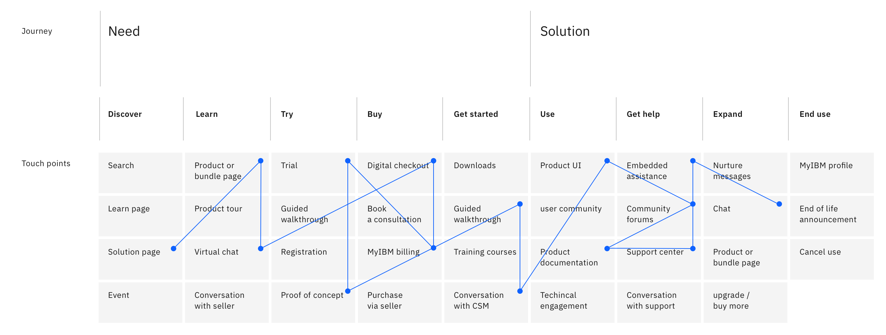
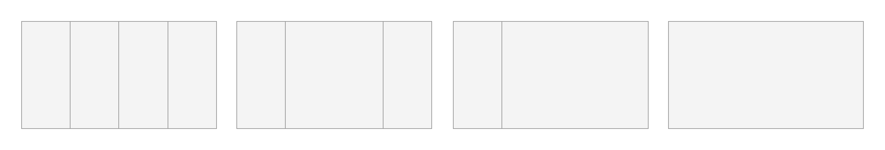
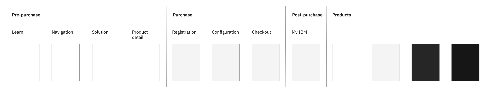
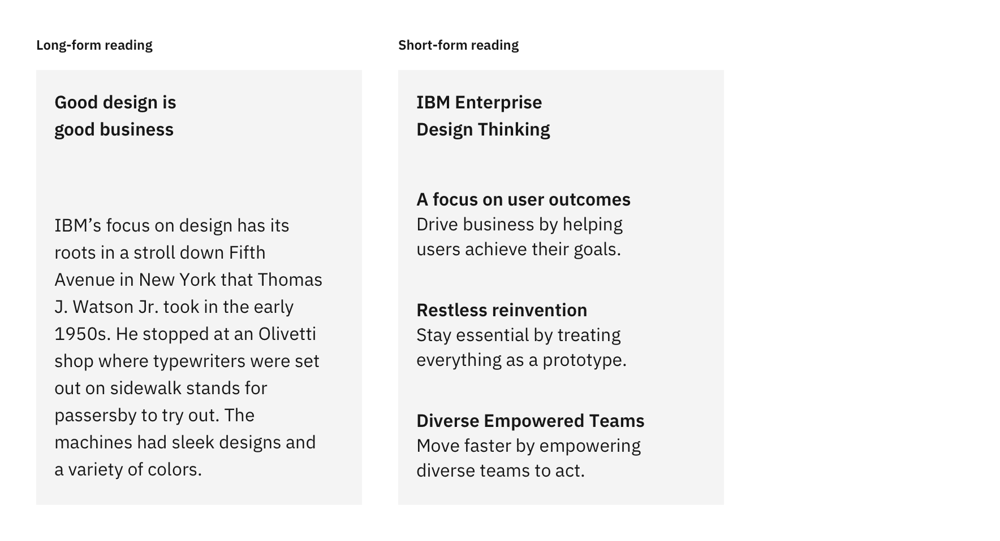
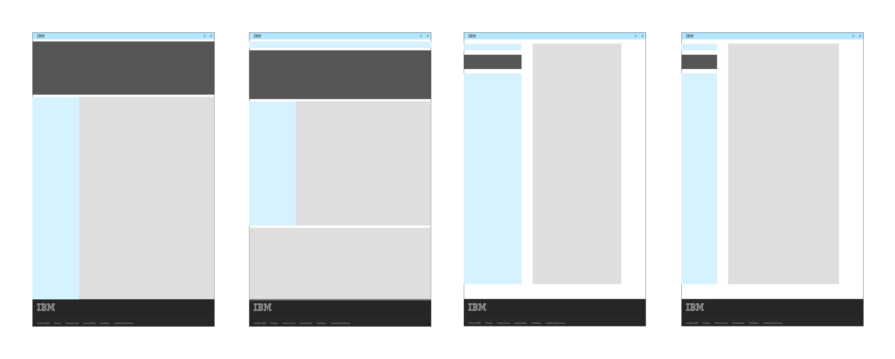

<PageDescription>

IBM.com Style Models provide a design framework that defines the foundational and structural elements of IBM.com pages in order to establish consistency and coherency across users' journeys in a scalable way.

</PageDescription>

<AnchorLinks>

<AnchorLink>Our vision</AnchorLink>
<AnchorLink>Style Model</AnchorLink>
<AnchorLink>Using Style Models</AnchorLink>

</AnchorLinks>

## Our vision

Our vision is that every visitor to IBM.com has a productive, efficient and delightful experience.

IBM.com is a collection of highly functional, versatile, and diverse contents and experiences. It serves different audience groups and their needs, in different industries and geographic regions, and covers crucial portion of our users' journeys.

Here are the three principles that we set up to reach our vision of helping our users in the best way possible.

<Title>The experience is the product</Title>

The user's experience along the journey—spanning from the user's initial research through decision making, purchase, management, and all the way to the actual use of the given product—is becoming a core aspect of any product. 

<Row>
<Column colMd={12} colLg={12}>

</Column>
</Row>

<Title>Drive consistency around user intents</Title>

As more products are offered as services or components of larger ecosystems and platforms, users are increasingly traversing journey touch points in non-linear ways, which demands a even higher level of consistency and coherency across.

We drive consistency without sacrificing usability by basing the design of a page on the given user intent. For the same user intent, whether it's learning, trying, or buying, the solution should be consistent in order to accommodate the user's non-linear journey.

This does not mean that everything should be the same—IBM.com style models define foundational and structural elements, while leaving the details to you, the maker.

The ultimate end result is that the user should be instantly familiar with pages that solve similar problems.

For the list of known user intents and their associated style models, see [Style Models].

<Title>Reflect users&rsquo; journeys</Title>

As more products are offered as services or components of larger ecosystems and platforms, users are increasingly traversing journey touch points in non-linear ways, which demands a even higher level of consistency and coherency across.

<Row>
<Column colMd={12} colLg={12}>

</Column>
</Row>

## Style Model
A style model defines the foundational structure and elements of a given page to best serve the primary user intent of the page.

Each style model is based on the user intent for the given page and defines the most optimal use of the foundational design elements—grid, color theme, type scale, spacing, layout, and screen regions—to ensure that the user is successful in achieving the goals (user intent).

<Title>Primary user intent</Title>

For any given page, there is a overarching user intent—we call this the primary user intent of a page. For an example, learn is the primary user intent for the early learn search capture page. For the list of known user intents, see [Style Models].

<Title>Grid usage</Title>

The grid system creates the fundamental structure of a page. There are many different ways to use the IBM 2X Grid, and the style models narrow down the available options to a few optimized.

<Row>
<Column colMd={12} colLg={12}>

</Column>
</Row>

<Title>Primary color theme</Title>

In IBM.com Style Models, the color theme is a major way to create the sense of progression over the user's journey. In general, the white theme is used for pre-purchase pages, the Gray 10 theme for the purchase and the post-purchase experience (My IBM). For the products, color themes are not specified in order to accomodate each product's needs the best as the user intents for the product experience can vary vastly. 

<Row>
<Column colMd={12} colLg={12}>

</Column>
</Row>

<Title>Text sizes and spacing</Title>

Different user intent requires different type scale and spacing. For an example, for the early learn page, which requires heavy reading of long-form contents, benefits from larger text sizes and more open spaces. On the other hand, the checkout experiences are etter served with smaller text sizes and tighter spaces.

<Row>
<Column colMd={8} colLg={8}>

</Column>
</Row>

<Title>Layout and screen regions</Title>

Layout theme lays out the overall layout for any given user intent by defining the regions for navigational elements, main contents, supporting contents, and key visual anchors placements. By using these layouts, the the user will not have to learn how to use each page as they land on it.

<Row>
<Column colMd={8} colLg={8}>

</Column>
</Row>

## Using the style models

There are currently 9 user intents identified so far, each with an associated style model. As a new page is designed, this should be the starting point.

1. Find the matching user intent of the page you are designing.
2. Use the associated style model to design your page.

<Title>Contribution</Title>

These user intents and style models are not locked in stone—these are intended to evolve over time. If for any reason, the existing user intents or style models do not meet the needs, please contact the Digital Design System team via the #ibm-digital-design slack channel.