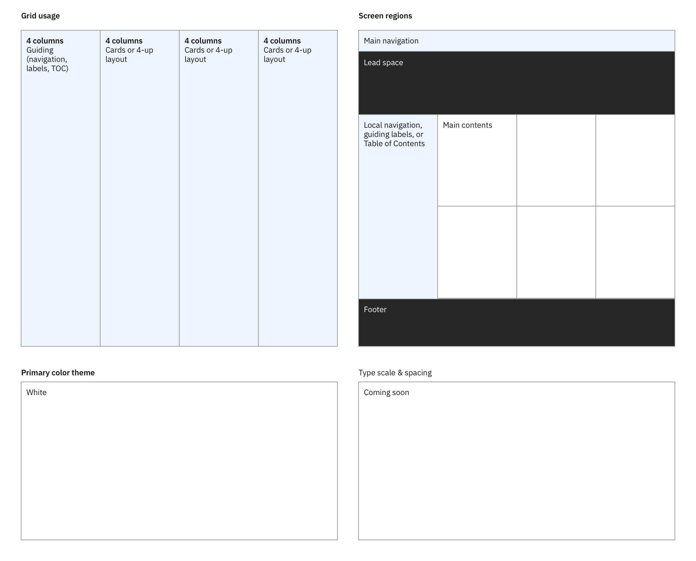

<PageDescription>

The primary user intent should drive the foundational structure of any given page. This ensures consistency. These are the known user intents and associated style models for IBM.com pages.

</PageDescription>

<AnchorLinks>

<AnchorLink>Using style models</AnchorLink>
<AnchorLink>User intents and style models</AnchorLink>

</AnchorLinks>

## Using Style Models

1. Identify the design intent that matches that of the page to be designed.
2. Use the associated style model as the starting point for design.
3. Contact the Digital Design System squad for updates via `#ibm-digital-design` Slack channel.

## User intents and style models

| User intent | Description |
| :---| :--- |
| [&#x21b3;&nbsp;Editorial&nbsp;navigation](#editorial-navigation) | The user wants to see available options along with relevant content, identify the right destination and navigate to it. |
| [&#x21b3;&nbsp;Index&nbsp;navigation](#index-navigation) | The user wants to narrow down the available options and find the right destination. |
| [&#x21b3;&nbsp;Listing](#listing) | The user wants to find the destination by quickly scanning a list of available options. |
| [&#x21b3;&nbsp;Learn](#learn) | The user needs to read long-form content in order to gain in-depth understanding of a subject. |
| [&#x21b3;&nbsp;Information&nbsp;gathering](#information-gathering) | The user needs to gather and understand concise pieces of information towards making a decision on purchase or subscription. |
| [&#x21b3;&nbsp;Dashboard](#dashboard) | The user wants to have an overview of a given context or system and identify action items or priority items. |
| [&#x21b3;&nbsp;Simple&nbsp;transaction](#simple-transaction) | The user needs to submit a small set of information such as user ID and password to the system.  |
| [&#x21b3;&nbsp;Transaction](#transaction) | The user needs to interact with the system and exchange complex information through multiple steps. |
| [&#x21b3;&nbsp;Conversantional Help](#conversational-help) | The user needs a way to connect with IBM reps to get support or start a conversation. |

### Editorial Navigation

<Title>User intent</Title>

The user is able to see available options along with relevant content, identify the right destination and navigate to it.

<Row>
<Column colMd={8} colLg={8}>

</Column>
</Row>

<Title>Examples</Title>

Home page, topic landing page

### Index navigation

<Title>User intent</Title>

The user wants to narrow down the available options and find the right destination.

<Row>
<Column colMd={8} colLg={8}>

</Column>
</Row>

<Title>Examples</Title>

Category listing page, product listing page

### Listing

<Title>User intent</Title>

Simple listing style, such as the search result page.

<Row>
<Column colMd={8} colLg={8}>

</Column>
</Row>

<Title>Examples</Title>

Search results

### Dashboard

<Title>User intent</Title>

The user is able to have an overview of a given context or system and identify action items or priority items.

<Row>
<Column colMd={8} colLg={8}>

</Column>
</Row>

<Title>Examples</Title>

My IBM home, Cloud Dashboard

### Learn

<Title>User intent</Title>

The user needs to read long-form content in order to gain in-depth understanding of a subject.

<Row>
<Column colMd={8} colLg={8}>

</Column>
</Row>

<Title>Examples</Title>

Learn, blog post, news article

### Information gathering

<Title>User intent</Title>

The user needs to gather and understand concise pieces of information towards making a decision on purchase or subscription.

<Row>
<Column colMd={8} colLg={8}>

</Column>
</Row>

<Title>Examples</Title>

Product detail page, solution

### Simple transaction

<Title>User intent</Title>

The user needs to submit a small set of information such as user ID and password to the system. 

<Row>
<Column colMd={8} colLg={8}>

</Column>
</Row>

<Title>Examples</Title>

Login, simple modal based form interactions

### Transaction

<Title>User intent</Title>

The user needs to interact with the system and exchange complex information through multiple steps.

<Row>
<Column colMd={8} colLg={8}>

</Column>
</Row>

<Title>Examples</Title>

Configuration, checkout

### Conversational help

<Title>User intent</Title>

The user needs a way to connect with IBM to get support or start a conversation.

- Coming soon

<Title>Examples</Title>

Unified Messaging Experience, Onboarding experience
