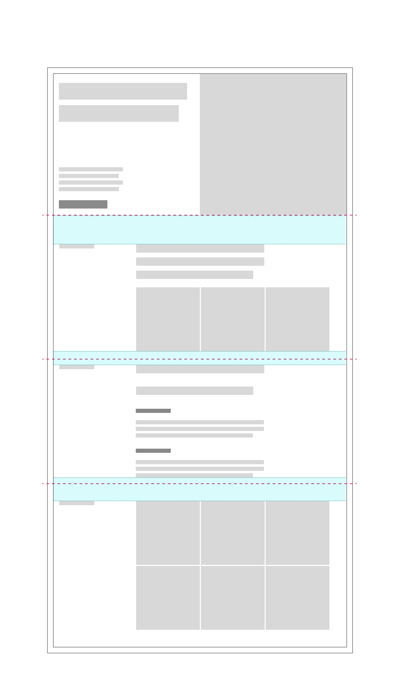

<PageDescription>

A good layout helps users navigate complex information, understand the content presented, and complete their goals. This is achieved by organizing and arranging various elements using tools such as the 2x grid, visual anchors, typography and motion, among others.

</PageDescription>

<AnchorLinks>

<AnchorLink>Designing and adopting a layout</AnchorLink>
<AnchorLink>Creating pages with layout components</AnchorLink>
<AnchorLink>Final considerations</AnchorLink>

</AnchorLinks>

## Designing and adopting a layout

On every page there is a story that ends with a desired action – one that enables a user to achieve a goal or reach an outcome. Layout is just one building block that allows a user to form a mental model of the story, identify relevant content, and pursue their objective.

### Fit for purpose

Always start with the content and user goals. Consider the purpose of the content and the best type of experience to help the user reach their objective. Is it a long reading experience? Or a collection of short content pieces that will drive the users to the next step? Each type of experience and purpose may require a different layout.

### 2x Grid

Always follow the 2x grid to establish zones and structure. A clean layout that is reinforced by steady rhythm and unity of elements lowers the cognitive burden for users. Always consider the holistic experience (or page type) before deciding what layout is appropriate. Components that utilize a different grid system may not work together. Therefore, try to minimize layout variations and choices within a single experience.

 

<Row>
<Column colMd={4} colLg={4} >
  <DoDontExample type="do" caption="Use the 2x grid to divide your artboard into equal parts and align content effectively.">

  </DoDontExample>
</Column>
<Column colMd={4} colLg={4}>
  <DoDontExample caption="Arbitrary placement of content results in an unbalanced layout.">

  </DoDontExample>
</Column>
</Row>

<Row>
<Column colMd={4} colLg={4} >
  <DoDontExample type="do" caption="Different components can use the same 2x grid. When stacked, the result is a consistent rhythm and visual alignment between each component.">

  </DoDontExample>
</Column>
<Column colMd={4} colLg={4}>
  <DoDontExample caption="Without proper grid usage, the result is a disjointed layout and lack of structure.">

  </DoDontExample>
</Column>
</Row>

### Content hierarchy

Hierarchy helps users (viewer, reader, audience) to navigate complex concepts and narrative structures without getting confused or lost, and ultimately find what they are looking for. Thoughtful application of type styles, components, and media will allow content to be communicated and prioritized in different ways. Pay attention to the size and proximity of content pieces within a component and between components.

This <i>Content block </i> component shows how various elements can be designed and organized based on their priority and relevance. In this example, type scale, image size, negative space, and UI component usage all play an important role in defining the content hierarchy.

1. Large type is used to highlight the topic headline and main description. The generous use of space above and below makes this content even more prominent.
2. Medium type, in combination with a large image, suggests that this area is key to the preceding and subsequent information.
3. Paragraphs are set at the smallest type size and can accommodate details to support the overall narrative.
4. A card placed at the bottom of this content block signifies that there is additional information to be discovered and is used to drive users to that destination.

Learn more about the content hiearchy of the Carbon for IBM.com components in the [Type pairing guidance](../expressive-styling/type-pairing).

<!--

### Grouping and spacing

Express relationships between content pieces by grouping and spacing them properly. The density of information should also influence how closely or tightly elements are grouped and spaced.

 

<Row>
<Column colMd={4} colLg={4} >
  <DoDontExample type="do" caption="Combine related information and content types then space appropriately to highlight dependencies or similarities.">

  </DoDontExample>
</Column>

<Column colMd={4} colLg={4}>
  <DoDontExample caption="Without proper organization of content and use of space to separate elements, it is difficult to perceive how one content piece relates to another.">

  </DoDontExample>
</Column>
</Row>

<Caption>
  In this component, groups of related content and spacial affordances improves
  the scannability and ease of navigation across the layout.
</Caption>

-->

### Typographic structure

The visual hierarchy of a design can be made clear by using the right typography. Understand the content model and relationships between different elements to establish the right type scale and weight for your design. Ensure that type is flush left, line length is carefully considered and adjustments are made based on the content. If it's a reading-centric experience, use 16px as the base type size. Text-based components, such as links or buttons, can be used strategically to further emphasize important information.

This <i>content section</i> component demonstrates how typography of different scales, weight and color can be used to create visual hierarchy.

1. `Fluid-heading-05` is used here to give the headline copy highest priority.
2. `Fluid-heading-03` takes second level hierarchy as it is the second largest type scale.
3. `Link + icon` UI component is placed at the bottom of the text block as it is the final action for the user. Although set at the smallest type size and weight, the use of color highlights the importance of this content.
4. `Heading-02` acts as an indicator to support the main headline and orient the user but does not take utmost priority in the overall layout.

Learn about IBM's typeface Plex and type basics [here](https://www.ibm.com/design/language/typography/typeface) and Carbon for IBM.com's typography strategy under the [Expressive styling guidance](../expressive-styling/overview).

### Contrast

Contrast is an effective way to distinguish content pieces, engage users, highlight important information, and express IBM's brand elements. Juxtaposing text with image, pairing UI components and elements of different sizes, strategic use of the grid, negative space and asymmetry are some of the ways in which you can introduce contrast to a layout.

 

<Row>
<Column colMd={4} colLg={4} >
  <DoDontExample type="do" caption="Arranging elements of different sizes and types side-by-side elicits a sense of drama through contrast.">

  </DoDontExample>
</Column>

<Column colMd={4} colLg={4}>
  <DoDontExample caption="When all content is designed and organized in the same way the layout becomes tiresome and indistinct.">

  </DoDontExample>
</Column>
</Row>

## Creating pages with layout components

Layout components, when combined together in a particular way, can be used to form many different page types across ibm.com. Some of the most common page types include editorial, navigational, and transactional. When designing or adopting a layout component, it is important to consider the purpose of both the content and the purpose of the page where the component will be displayed.

### Key moments

Thoughtful implementation of the above devices including hierarchy, contrast, and rhythm helps to create key moments within a layout. Key moments such as primary call-to-actions are critical for engaging users and driving them toward their desired destination.

### Repetition, continuity and consistency

No component exists on its own. Pay attention to how individual layout components fit into the larger context of both the page type and the broader user journey across IBM.com. Although components and patterns are reusable, try to avoid repeating the same in sequence, unless it is necessary. This can result in a monotonous experience for users. At the same time, there should be a consistent visual flow and placement of elements as the user moves across each touch-point.

**Repetition**

<Row>
<Column colMd={4} colLg={4} >
  <DoDontExample type="do" caption="When stacked, components with a consistent grid structure but diverse layout and content types can create a dynamic and engaging page-level experience.">

  </DoDontExample>
</Column>
<Column colMd={4} colLg={4}>
  <DoDontExample caption="When the same component is repeated multiple times, the user experience becomes restricted and the layout visually uninteresting.">

  </DoDontExample>
</Column>
</Row>

**Continuity**

<Row>
<Column colLg={8}>

<Caption>
  Using the same layout component for similar touch-points across multiple pages
  can provide a sense of continuity and familiarity for the user. 
</Caption>

</Column>
</Row>

**Consistency**

<Row>
<Column colMd={4} colLg={4} >
  <DoDontExample type="do" caption="Do ensure consistent use of space and placement of content at a high level such as content sections or blocks, and at smaller levels such as headings and paragraphs.">

  </DoDontExample>
</Column>
<Column colMd={4} colLg={4}>
  <DoDontExample caption="When there is no consistent use of space, visual flow, or alignment of content from component to component and from page to page, the overall experience becomes fragmented and disconnected.">

  </DoDontExample>
</Column>
</Row>

## Final considerations

Reflect on the following statements as you start to design and adopt layout components. Use these to guide your understanding, decision making and application of layout best practices.

#### Guided by user intent

Pay attention to the behaviors, goals and actions of end-users when identifying, creating and adopting the right layout.

#### Expressions of IBM's brand

Successful execution of layout is essential to achieving the IBM look across all visual touch-points.

#### Tried and tested

Test components and patterns with real users to ensure the design meets their needs.

#### Prescriptive, not dogmatic

Specifications and usage guidance must be detailed and clear but, when applicable, should not limit creativity or innovation.

#### Inclusive and scalable

To improve efficiency, consistency and scalability, components and patterns should be available for other teams to adopt.

<Row className="resource-card-group">
   <Column colMd={4} colLg={4} noGutterSm>
    <ResourceCard
      subTitle="IBM Design Language layout principles"
      href="https://www.ibm.com/design/language/layout/overview"
    >

</ResourceCard>
  </Column>

</Row>
