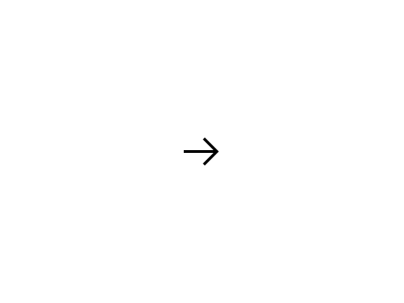
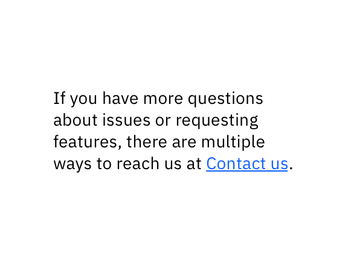
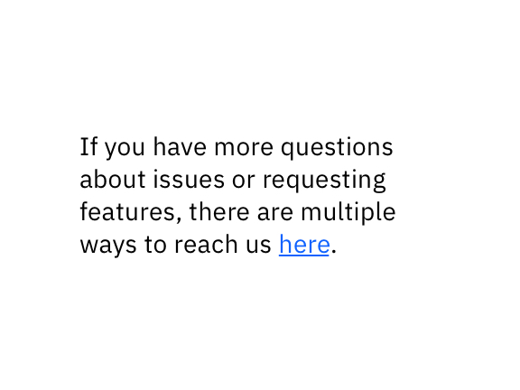

<PageDescription>

Opening link in new browser windows and tabs can help users with the browsing experience, especially when they need to compare content or go from one website page to the other back and forth. 

However, it cannot be an enjoyable experience to click a link and suddenly have a new window appear out of nowhere. Understand the users' goal, the task at hand, and what devices they might be using to decide whether to open links to documents and external sites in the same or a new browser tab.

</PageDescription>

<AnchorLinks>

<AnchorLink>When to open links in a new window?</AnchorLink>
<AnchorLink>When not to open links in a new window?</AnchorLink>
<AnchorLink>Best practices</AnchorLink>
<AnchorLink>Additional resource</AnchorLink>

</AnchorLinks>

## When to open links in a new window?

In general, users expect the new page to load in the current window, so only open links in a new window when there's a good reason to do so. The best reason to open links in a new window is to refer to the content to complete a task in another window. 

Below is a scenario where it might be a good idea to open links in a new window:

- **When users need to reference or compare content.** For example, an IBM.com page maker might edit a web page in a content management system in one tab or window and view a page's preview in another. Or to follow a step-by-step document to fill in the correct information. In order to work and see the preview easily, two separate windows can help users accomplish the task efficiently.

## When not to open links in a new window?

In general, users expect the new page to load in the current window, so only open links in a new window when there's a good reason to do so. The best reason to open links in a new window is to refer to the content to complete a task in another window. 

Below are a few scenarios where it might not be a good idea to open links in a new window:

- **When users rely on the back button for browsing.** The back button is the second most used navigation function (after hyperlinks, source: useit.com). Opening a new browser window resets the back button in that window, so the user will not be able to use the back button to get back to the past pages, and it can cause frustration.
- **When users need to complete a task with focus.** To open a new browser window can disorient very novice users and the visually impaired. They might not realize that a new window has opened and might struggle to switch between windows. The cluttered taskbar is even more challenging to use, especially for Less-technical users. 
- **When users relaying on the mobile device to brows the information.** New windows on the mobile often cause disorientation, with users not realizing that a new window or tab has opened. This problem is exacerbated on mobile, where the old window is never visible.
- **When users relaying on the tablet device to brows the information.** New Windows devices will require users to have multiple windows and tabs for the browser, so the browsing experience is not easy to manage.
- **When accessibility is a concern.** New windows or tabs are not inclusive for blind or low-vision users — especially when they open outside of the magnified area. At IBM, we take accessibility into what we develop for the users. Therefore, try not to open links in a new window is recommended unless users need to refer to the content to complete a task in another window to complete their task. See the best practice below to learn more about setting up the links to meet the accessibility standard.

## Best practices

When you need to open links in a new window, make sure you use text and a launch icon to indicate that a new browser window will open.

<Row>
 <Column colMd={4} colLg={4} >
   <DoDontExample type="do" >

 

   </DoDontExample>
 </Column>  
 <Column colMd={4} colLg={4}>
   <DoDontExample >

 

   </DoDontExample>
 </Column>
 </Row>
 
  

When you need to open links in a new window, warn the users with a sentence, so they know to expect a new window.
Always keep accessibility in mind and make sure the screen reader can tell the users exactly what the link is for.

<Row>
 <Column colMd={4} colLg={4} >
   <DoDontExample type="do" >

 

   </DoDontExample>
 </Column>  
 <Column colMd={4} colLg={4}>
   <DoDontExample >

 

   </DoDontExample>
 </Column>
 </Row>
 
  

## Additional resource

[Techniques for WCAG 2.0 guideline](https://www.w3.org/TR/WCAG20-TECHS/G200.html)