<PageDescription>

It is crucial that we design and build online experiences for all. The need for right-to-left (RTL) web experiences
continues to grow. Arabic, a right-to-left language, is the fourth most used language globally.

</PageDescription>

<AnchorLinks>

<AnchorLink>Left-to-right and right-to-left</AnchorLink>
<AnchorLink>Mirroring content</AnchorLink>
<AnchorLink>Typography</AnchorLink>
<AnchorLink>Icons</AnchorLink>
<AnchorLink>Other elements</AnchorLink>
<AnchorLink>Development guidelines</AnchorLink>

</AnchorLinks>

## Left-to-right and right-to-left

The difference between left-to-right (LTR) and right-to-left (RTL) language script is the direction the content is
displayed.

- Right-to-left (RTL) languages display and read text from right to left. This includes Arabic, Hebrew, and Persian.
- Left-to-right (LTR) languages display and read text from left to right. This includes German, French, and English.

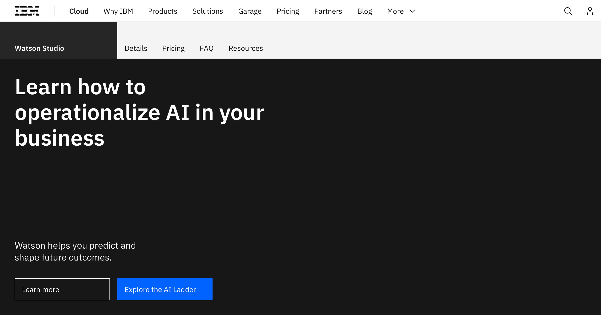

<Caption>Left-to-right page on IBM.com</Caption>

 

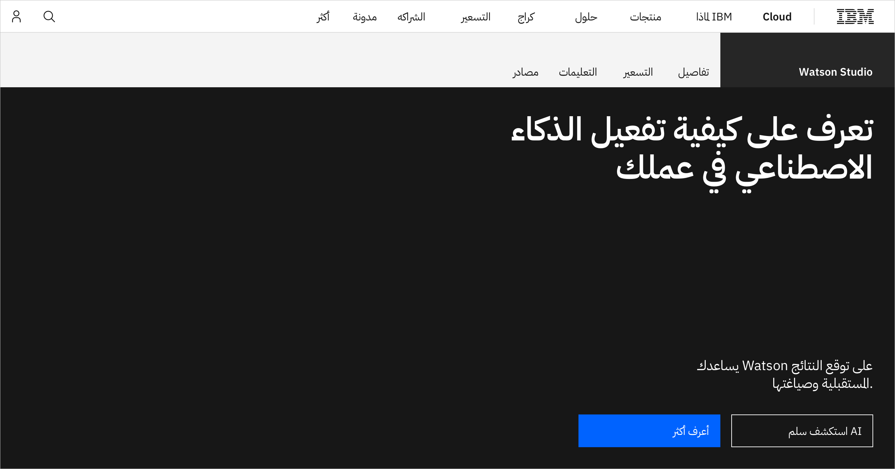

<Caption>Right-to-left page on IBM.com</Caption>

 

## Mirroring content

To begin designing a RTL webpage, you can start by flipping the navigation, page layout, graphics from the LTR
interface. This method is often referred to as mirroring. The UI can be mirrored from left-to-right to right-to-left,
but not all elements are one to one.

**Elements that change when mirroring UI:**

- Directional icons are mirrored, for example, back and forward arrows
- Text field icons are mirrored on the opposite side of a field
- Form fields are right aligned
- Navigation buttons are reverse ordered
- RTL text is right aligned
- Elements displaying the sequence of time are mirrored, for example, timelines or progress indicators

**Elements not changed when mirroring UI:**

- Untranslated text in LTR languages
- Product logos
- Video/audio player controls
- Data visualization, for example, charts, graphs
- Numerical digits, for example, phone numbers, addresses, and international dialing codes
- URL links

## Typography 

With right-to-left languages, typography is read from right to left, and all text is right aligned. Right-to-left
languages, such as Arabic, require attention to detail when designing.

**Keep in mind the following:**

- In Arabic and other RTL languages, most words are shorter in length than words in English.
- Left-to-right languages don't change their direction when displayed on RTL webpages.

<Row>
<Column colMd={8} colLg={8}>

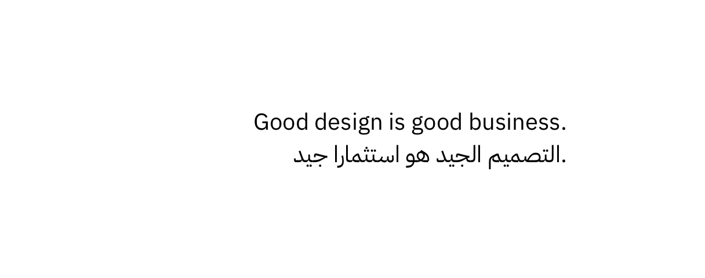

</Column>
</Row>

<Caption>Arabic translation is shorter than in English.</Caption>

 

**Things to avoid:**

- Common abbreviations such as days of the week and months, such as Mon, Tues, Jan, and Dec, in English are not
  appropriate in Arabic and other right-to-left languages.
- Numerical digits such as phone numbers, addresses and international dialing codes are not mirrored.
- Avoid bold typefaces.

## Icons

Icon use in RTL needs to be carefully considered. Some icons need to be mirrored and others do not. In addition, some
icons may be considered disrespectful to those of different nationalities with right-to-left languages. Make sure the
icons you are using make sense and are culturally appropriate.

### When to mirror 

Forward and backward buttons are mirrored in right-to-left, as these icons represent direction to the user. Other icons
that require mirroring are icons that signify movement or represent text direction.

#### Directional icons

Direction specific icons are mirrored, as we see with forward and backward arrows.

<Row>
 <Column colMd={4} colLg={4} >
   <DoDontExample type="do" caption="Forward arrow in LTR">

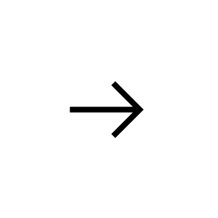

   </DoDontExample>
 </Column>  
 <Column colMd={4} colLg={4}>
   <DoDontExample type="do" caption="Backward arrow in LTR">

   </DoDontExample>
 </Column>
 </Row>
 
  
 
 <Row>
 <Column colMd={4} colLg={4} >
   <DoDontExample type="do" caption="Forward arrow in RTL">

   </DoDontExample>
 </Column>  
 <Column colMd={4} colLg={4}>
   <DoDontExample type="do" caption="Backward arrow in RTL">

   </DoDontExample>
 </Column>
 </Row>
 
  

#### Text icons

Icons that represent the direction of text are mirrored, for example, text alignment icons, bullet point icons, and so
on.

<Row>
 <Column colMd={4} colLg={4} >
   <DoDontExample type="do" caption="Icon text direction in LTR">

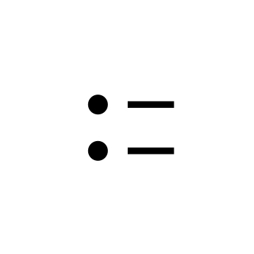

   </DoDontExample>
 </Column>  
 <Column colMd={4} colLg={4}>
   <DoDontExample type="do" caption="Icon text direction in RTL">

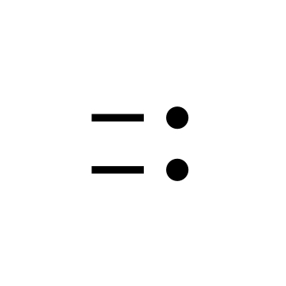

   </DoDontExample>
 </Column>
 </Row>
 
  

#### Movement icons

Icons that signify movement or forward motion are mirrored, for example, airplane, bike, and car icons.

<Row>
 <Column colMd={4} colLg={4} >
   <DoDontExample type="do" caption="Movement icon in LTR">

   </DoDontExample>
 </Column>  
 <Column colMd={4} colLg={4}>
   <DoDontExample type="do" caption="Movement icon in RTL">

   </DoDontExample>
 </Column>
 </Row>
 
  
 
 <Row>
 <Column colMd={4} colLg={4} >
   <DoDontExample type="do" caption="Movement icon in LTR">

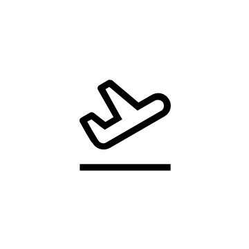

   </DoDontExample>
 </Column>  
 <Column colMd={4} colLg={4}>
   <DoDontExample type="do" caption="Movement icon in RTL">

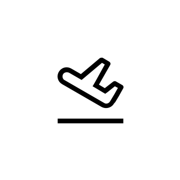

   </DoDontExample>
 </Column>
 </Row>
 
  

### When not to mirror

Mirroring icons in a right-to-left interface should be done carefully because some icons do not require mirroring. Here
are some examples of icons that do not require mirroring.

#### Logo and brand

Do not mirror any icons that are a logo or brand representation, for example, Carbon, Watson, Security.

<Row>
 <Column colMd={4} colLg={4} >
   <DoDontExample type="do" >

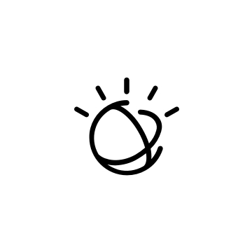

   </DoDontExample>
 </Column>  
 <Column colMd={4} colLg={4}>
   <DoDontExample >

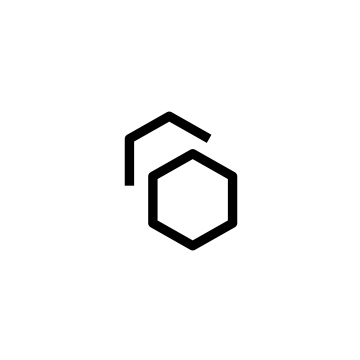

   </DoDontExample>
 </Column>
 </Row>
 
  

#### Symmetrical icons

Do not mirror symmetrical or non-direction specific icons, for example, camera, download, or export icons.

 

#### Clock icons

Although elements displaying the sequence of time should be mirrored, icons representing a clock should not be mirrored.
In RTL languages, clocks still turn clockwise just as LTR.

<Row>
 <Column colMd={4} colLg={4} >
   <DoDontExample type="do" >

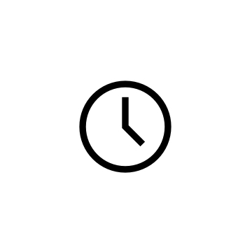

   </DoDontExample>
 </Column>  
 <Column colMd={4} colLg={4}>
   <DoDontExample >

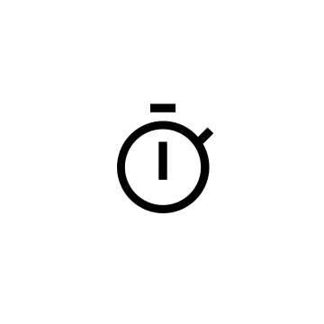

   </DoDontExample>
 </Column>
 </Row>
 
  

#### Right-handed object icons

Any icon that represents an object that would be held in the right hand should not be mirrored, for example, paint
brush, scissors, or search icons. Right-handedness is most common worldwide. It is estimated around 90% of the world's
population is right-handed.

<Row>
 <Column colMd={4} colLg={4} >
   <DoDontExample type="do" >

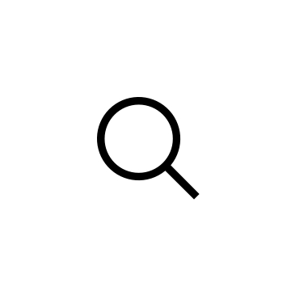

   </DoDontExample>
 </Column>  
 <Column colMd={4} colLg={4}>
   <DoDontExample >

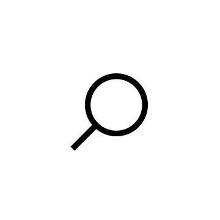

   </DoDontExample>
 </Column>
 </Row>
 
 <Row>
 <Column colMd={4} colLg={4} >
   <DoDontExample type="do" >

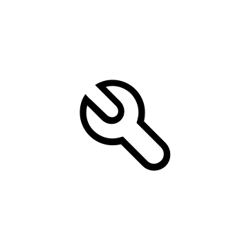

   </DoDontExample>
 </Column>  
 <Column colMd={4} colLg={4}>
   <DoDontExample >

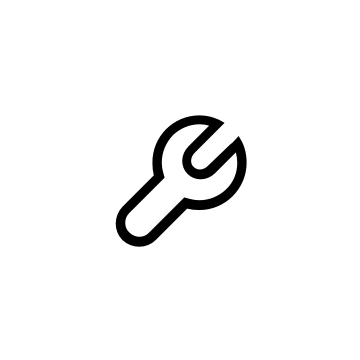

   </DoDontExample>
 </Column>
 </Row>
 
  

#### Icons with words

Do not mirror icons with LTR language, rather localize the icon by adding the correct RTL language into the icon, for
example, PDF in English should be localized.

<Row>
 <Column colMd={4} colLg={4} >
   <DoDontExample type="do" >

   </DoDontExample>
 </Column>  
 <Column colMd={4} colLg={4}>
   <DoDontExample >

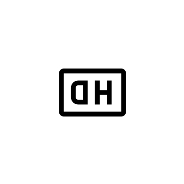

   </DoDontExample>
 </Column>
 </Row>
 
 

#### Icons with slashes

Icons that include a slash should not be mirrored. Slash icons are usually commonly grouped with toggle icons, for
example, microphone-off or notification-off icons.

<Row>
 <Column colMd={4} colLg={4} >
   <DoDontExample type="do" >

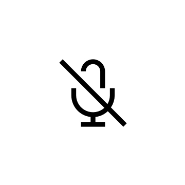

   </DoDontExample>
 </Column>  
 <Column colMd={4} colLg={4}>
   <DoDontExample >

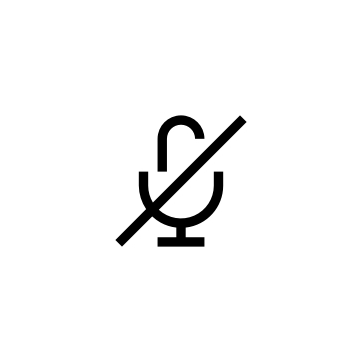

   </DoDontExample>
 </Column>
 </Row>

### Culturally appropriate

Icons that may be problematic in RTL but appropriate in LTR, are a wine glass to represent a restaurant or a piggy bank
to symbolize frugality. Double check that the meaning of the icons being used are consistent within RTL languages. To
clarify icon meaning, reach out to a native speaker for cultural perspective.

## Other elements 

With many elements and components on a webpage it can be hard to know which should be mirrored in RTL. The following
lists out what elements and components to mirror and not mirror on a RTL webpage.

- **Breadcrumbs**: Breadcrumbs should be right aligned on the page and mirrored.
- **Calendars**: Calendars should be mirrored. Sunday will be displayed on the far left while Monday will been the right
  side.
- **Tables**: Columns of tables should be mirrored.
- **Form fields**: Icons and headings that reference a field in a form should be mirrored on RTL websites.
- **Dates**: With dates, some RTL languages have their own specific calendar. Most RTL users are familiar with
  conventional international date format.
- **Video and audio players**: Video and audio players should not be mirrored because they refer to playback progress,
  not the sequence of time.

## Development guidelines

For React, see the
[Enable Right-to-Left (RTL) page](http://www.ibm.com/standards/carbon/react/?path=/docs/overview-enable-right-to-left-rtl--page)
on Storybook for detail.

For Web Components, see the
[Using RTL version of CSS page](https://www.ibm.com/standards/carbon/web-components/?path=/docs/overview-enable-right-to-left-rtl--page)
on Storybook for detail.
