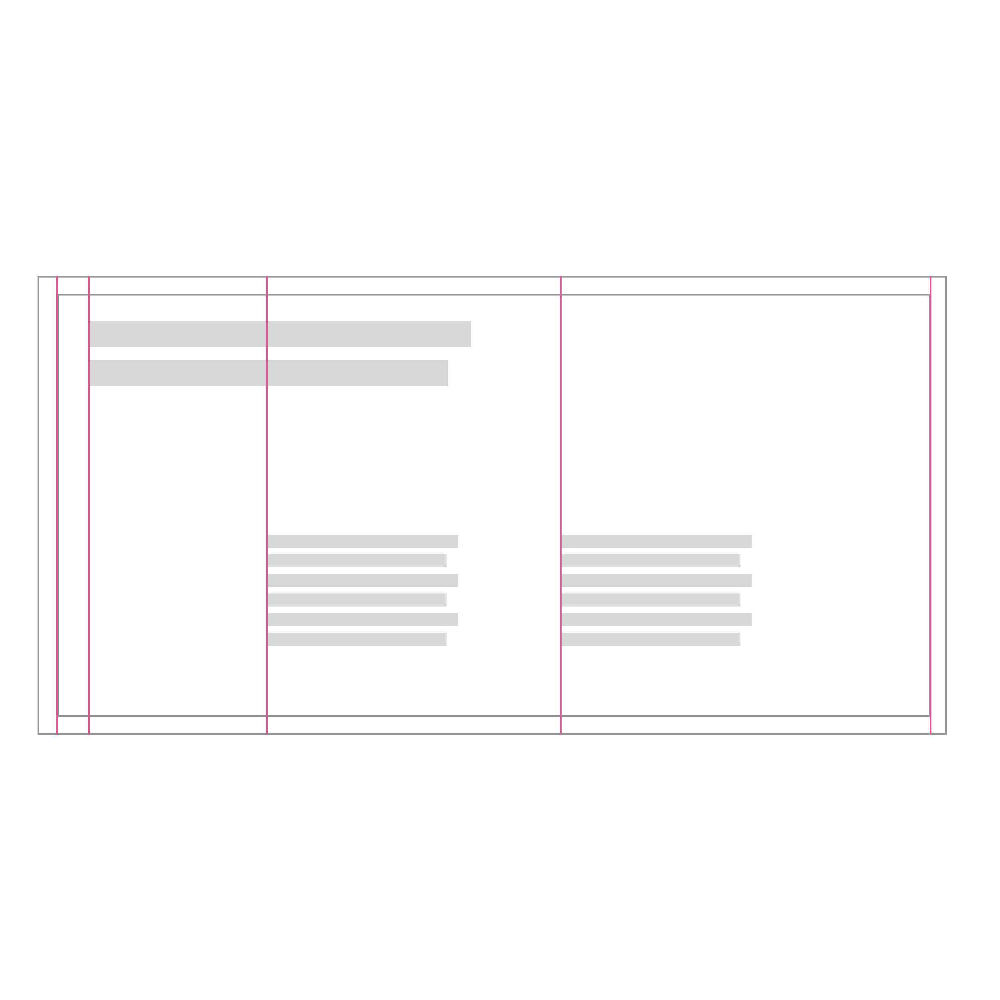

<PageDescription>

A CTA, or call-to-action, is used to present the user with next steps, typically by clicking on a button, link or card. A well designed and placed CTA can impact the user's experience and business results significantly. Follow the best practices presented on this page for optimal performance and consistency across IBM.com.

</PageDescription>

## Icons
Icon use in RTL can be challenging. Some icons may need to be mirrored and others not mirror. Some icons may be considered disrespectful to those of different nationalities with RTL languages. Make sure the icons you are using make sense and are culturally appropriate. 

### When to mirror 
Forward and backward buttons are the icons that require mirroring in RTL, as these icons represent direction to the user. Other icons that require mirroring are icons signify movement or represent text direction. 

**Directional icons**
Direction specific icons are mirrored (e.g., forward and backward arrows).

<Row>
  <Column colMd={4} colLg={4}>

  </Column>
  <Column colMd={4} colLg={4}>

  </Column>
</Row>

<Row>
<Column colMd={4} colLg={4} >
  <DoDontExample type="do" caption="Use the 2x grid to divide your artboard into equal parts and align content effectively.">

  </DoDontExample>
</Column>  
<Column colMd={4} colLg={4}>
  <DoDontExample caption="Arbitrary placement of content results in an unbalanced layout.">

  </DoDontExample>
</Column>
</Row>
