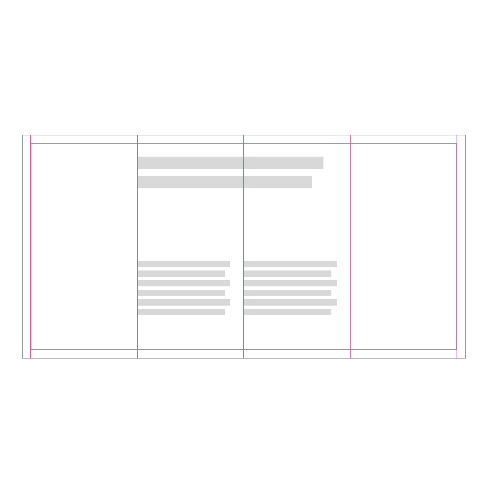

<PageDescription>

As an inclusive IBM, it is crucial that we design and build online experiences for all. The need for right-to-left (RTL) web experiences continues to grow. Arabic, a RTL language, is the 4th most popular language globally. 

</PageDescription>

## LTR and RTL
The differentiation between left-to-right (LTR) and right-to-left (RTL) language script is the content is display in opposite directions.

## Mirroring content
To begin designing a right-to- left RTL webpage, you start by flipping the navigation, page layout, graphics from the left-to-right LTR interface. This method is often referred to as mirroring. UI can be mirrored vice versa, from RTL to LTR, but not all elements are one to one. 

| Elements changed when mirroring UI:      | Elements not changed when mirroring UI:        | 
| ------------- | -----------   | 
| Directional icons are mirrored (e.g., back and forward arrows)         | Untranslated text in LTR languages        | 
| Text field icons are mirrored on the opposite side of a field       | Product logos  | 
| Form fields are right aligned          | Video/audio player controls        | 
| Navigation buttons are reserve ordered       | Data visualization (e.g., charts, graphs)  | 
| RTL text are right aligned         | Numerical digits (e.g., phone numbers, addresses and international dialing codes)        | 
| Elements displaying the sequence of time are mirrored (e.g., timelines or progress indictors)       | URL links  | 

<Row>
<Column colSm={4} colMd={4} colLg={4}>

</Column>
<Column colSm={4} colMd={4} colLg={4}>

</Column>
<Column colSm={4} colMd={4} colLg={4}>
<Row>

</Row>
<Row>

## Icons
Icon use in RTL can be challenging. Some icons may need to be mirrored and others not mirror. Some icons may be considered disrespectful to those of different nationalities with RTL languages. Make sure the icons you are using make sense and are culturally appropriate. 

### When to mirror 
Forward and backward buttons are the icons that require mirroring in RTL, as these icons represent direction to the user. Other icons that require mirroring are icons signify movement or represent text direction. 

**Directional icons**
Direction specific icons are mirrored (e.g., forward and backward arrows).

<Row>
  <Column colMd={4} colLg={4}>

  </Column>
  <Column colMd={4} colLg={4}>

  </Column>
</Row>

<Row>
<Column colMd={4} colLg={4} >
  <DoDontExample type="do" caption="Use the 2x grid to divide your artboard into equal parts and align content effectively.">

  </DoDontExample>
</Column>  
<Column colMd={4} colLg={4}>
  <DoDontExample caption="Arbitrary placement of content results in an unbalanced layout.">

  </DoDontExample>
</Column>
</Row>
