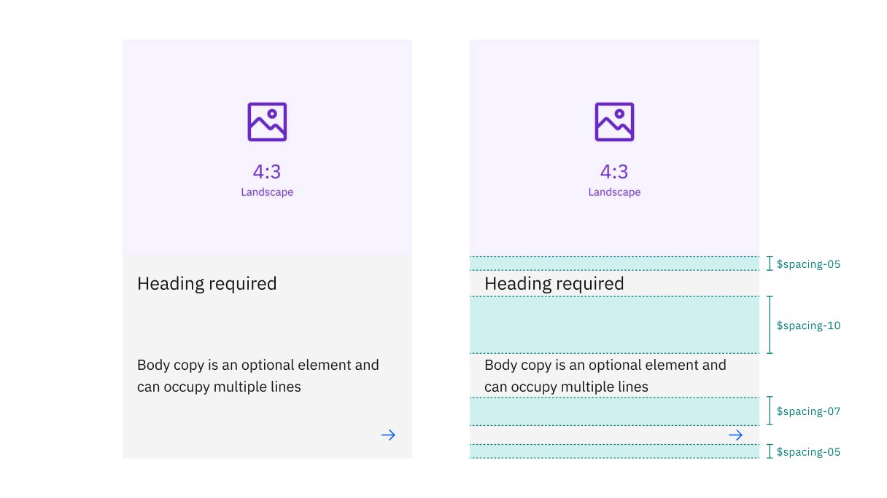
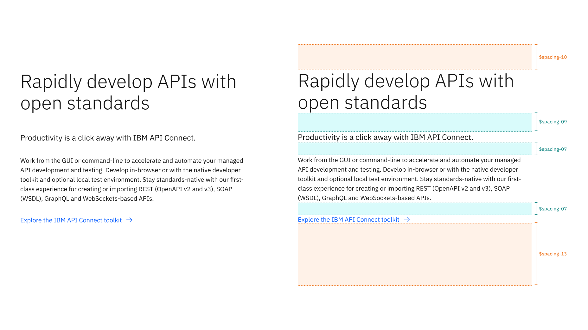
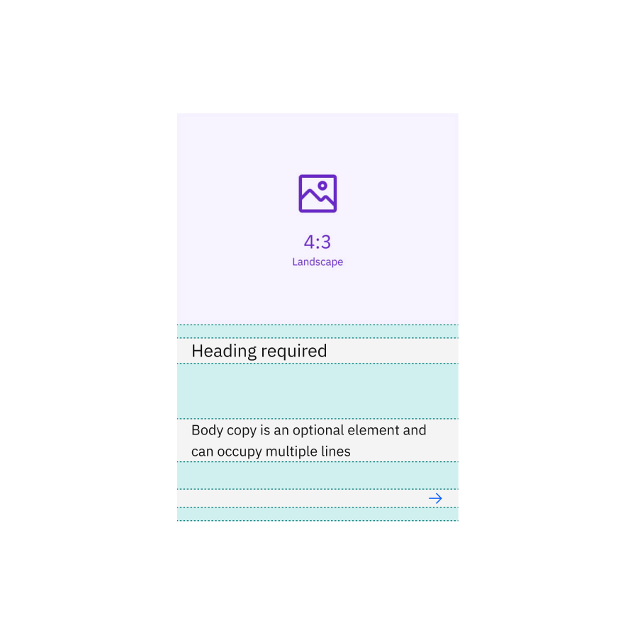
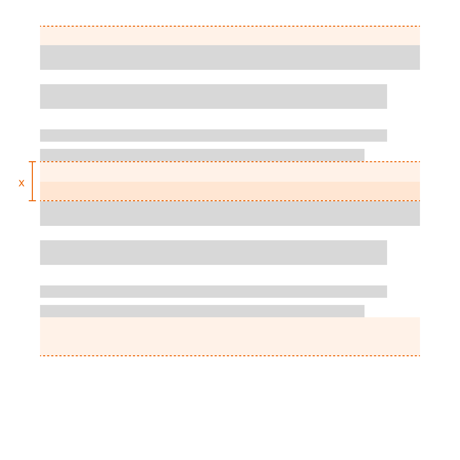
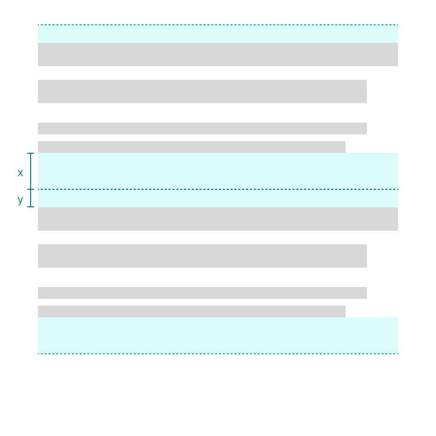
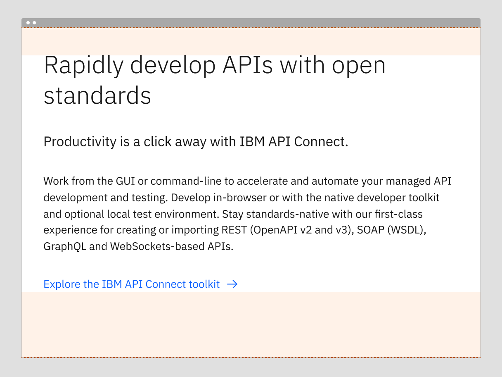
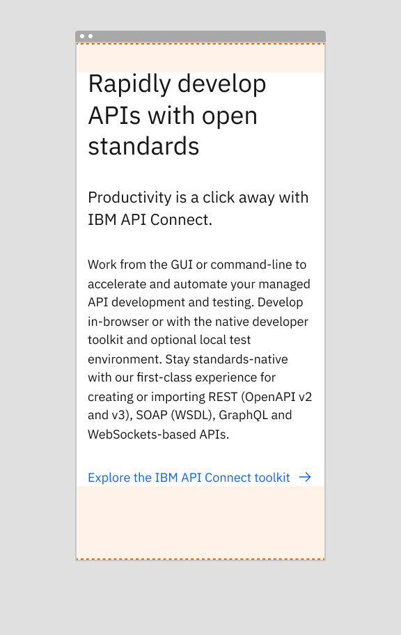
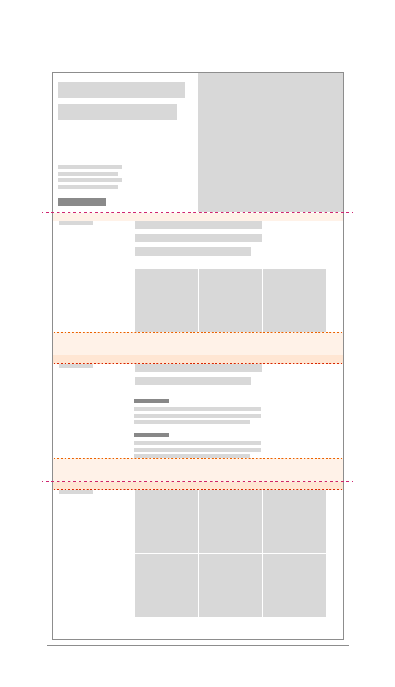

<PageDescription>

Carbon for IBM.com uses uniform components, elements, and spacing to encourage consistency when designing for IBM.com experiences.

</PageDescription>

<AnchorLinks>

<AnchorLink>Overview</AnchorLink>
<AnchorLink>Spacing tokens and scale</AnchorLink>
<AnchorLink>Spacing concepts</AnchorLink>
<AnchorLink>Constructing a page with content components</AnchorLink>
<AnchorLink>FAQ</AnchorLink>
<AnchorLink>Feedback</AnchorLink>

</AnchorLinks>

## Overview

Every part of a UI should be intentional, including the empty space, also known as white space, between elements. The amount of space between items creates relationships and hierarchy. You can learn more about white space and how space can help you create relationships and hierarchy with the [Carbon spacing guidelines](https://www.carbondesignsystem.com/guidelines/spacing/overview/#designing-with-space).

When designing for IBM.com, the spacing scale and type tokens are used to ensure the information is well organized and consistent. See the [Type pairings guidance](../expressive-styling/type-pairing) to learn more about the type hierarchy of the Carbon for IBM.com components.

## Spacing token and scale

### Spacing token

To ensure that spacing is consistent and best fits within the IBM brand, spacing tokens are pulled directly from [Carbon's spacing guidelines](https://www.carbondesignsystem.com/guidelines/spacing/overview/#designing-with-space). The spacing tokens can be applied to [margin](#margin-vs-padding) or [padding](#margin-vs-padding) properties for a given component. They can also be applied to vertical and horizontal edges, as well as internal and external spacing. The tokens take the place of the values normally assigned to margin and padding. The following are all approved ways to apply Carbon for IBM.com spacing tokens in code:

```css
margin: $spacing-03;
margin: $spacing-03 $spacing-01;
margin: $spacing-07 0 $spacing-04 0;
margin-right: $spacing-05;
padding: $spacing-04;
padding: $spacing-05 $spacing-03;
padding: $spacing-07 $spacing-04 0 $spacing-04;
```

<br />

### Examples

Below is the example of a regular image card on the left and how the spacing tokens are applied to it on the right.

<Row>
<Column colLg={8}>



</Column>
</Row>

<br />

Below is an example of a content block on the left and how the spacing tokens are applied to it on the right. Note that some spacing is identified as padding in teal, and margin in orange. Both types of spacing use the same spacing scale.

<Row>
<Column colLg={12}>



</Column>
</Row>

<br />

### Spacing scale

Use the spacing scale when building individual components. It includes small increments needed to create appropriate spatial relationships for detail-level designs. This scale is applied and used within all Carbon components.

<div className="spacing-table">

| Token         | rem   | px  | Example                                                                      |
| ------------- | ----- | --- | ---------------------------------------------------------------------------- |
| `$spacing-01` | 0.125 | 2   | <div style={{width: '2px', height: '2px', background: '#A56EFF'}}></div>     |
| `$spacing-02` | 0.25  | 4   | <div style={{width: '4px', height: '4px', background: '#A56EFF'}}></div>     |
| `$spacing-03` | 0.5   | 8   | <div style={{width: '8px', height: '8px', background: '#A56EFF'}}></div>     |
| `$spacing-04` | 0.75  | 12  | <div style={{width: '12px', height: '12px', background: '#A56EFF'}}></div>   |
| `$spacing-05` | 1     | 16  | <div style={{width: '16px', height: '16px', background: '#A56EFF'}}></div>   |
| `$spacing-06` | 1.5   | 24  | <div style={{width: '24px', height: '24px', background: '#A56EFF'}}></div>   |
| `$spacing-07` | 2     | 32  | <div style={{width: '32px', height: '32px', background: '#A56EFF'}}></div>   |
| `$spacing-08` | 2.5   | 40  | <div style={{width: '40px', height: '40px', background: '#A56EFF'}}></div>   |
| `$spacing-09` | 3     | 48  | <div style={{width: '48px', height: '48px', background: '#A56EFF'}}></div>   |
| `$spacing-10` | 4     | 64  | <div style={{width: '64px', height: '64px', background: '#A56EFF'}}></div>   |
| `$spacing-11` | 5     | 80  | <div style={{width: '80px', height: '80px', background: '#A56EFF'}}></div>   |
| `$spacing-12` | 6     | 96  | <div style={{width: '96px', height: '96px', background: '#A56EFF'}}></div>   |
| `$spacing-13` | 10    | 160 | <div style={{width: '160px', height: '160px', background: '#A56EFF'}}></div> |

</div>

<br />

## Spacing concepts

### Internal vs external spacing

Components containing multiple elements may have internal spacing to help guide how those elements display as the component resizes across breakpoints.

#### Internal spacing

The internal spacing for card determines how the various elements are spaced within the container, including when some elements are visible or hidden.

<Row>
<Column colLg={8}>



</Column>
</Row>

#### External spacing

The external spacing for a content component like content block determines how the component will merge spacing with other content components. Because lead space and footer do not have margin external spacing, the content components will provide the proper spacing to start and end the page.

<Row>
<Column colLg={8}>


</Column>
</Row>

External spacing defines the area outside the component (usually vertically). This spacing can be important when thinking about how the component will nest inside other components, or what happens when it appears directly on top of another component. It is important to consider the spacing value as well as the type ([margin or padding](#margin-vs-padding)). If you are contributing a new component to Carbon for IBM.com, consider how your component will fit with others when it appears on the page.

### Margin vs padding

Beyond spacing values, it is is important to understand spacing types. Margin and padding are used purposefully to ensure components fit together seamlessly. When a component is viewed on its own, its external spacing may appear the same whether margin or padding is used. However, a component will behave very differently if it is nested within another component or when it is placed after other components. This is because padding will preserve space and stack one component on top of the other, while margin wil allow spacing to merge together while keeping the largest spacing value.

In general, Carbon for IBM.com components use external margin to allow components to nest or stack more flexibly, while padding is used to allow for stacking. If you are contributing a new component, keep these considerations in mind.

<Row>

<Column colMd={6} colLg={6}>



<Caption>
  The external margin space merges the spacing for the two content blocks,
  keeping the largest value. This keeps the spacing consistent when structuring
  a page.
</Caption>

</Column>

<Column colMd={6} colLg={6}>



<Caption>
  The external padding space would stack in this case, increasing the spacing
  more than intended. This causes the spacing to become inconsistent throughout
  the page.
</Caption>

</Column>

</Row>

### Responsive spacing

As screen width decreases, available space between components can change to better display and connect content. For content components, the spacing values generally reduce on mobile screens to better fit the smaller screen size and save the user time scrolling. Check content component design specs to see how spacing changes across breakpoints.

<Row>

<Column colMd={8} colLg={8}>



</Column>

<Column colMd={8} colLg={4}>



</Column>

</Row>

## Constructing a page with content components

The content components are the basis for creating full page layouts in Carbon for IBM.com. A page usually begins with a lead space, followed by content blocks or sections which make up the primary reading format for the page. Each content block or section can also nest content group or content item components as children.

### Stacking content sections and/or content blocks

Each content component uses margin as its external spacing, enabling these components to merge their spacing values and appear consistent across IBM.com pages.

When content section or content blocks are stacked with one another, the vertical spacing between them is set based on the largest value. This enables content components to stack together easily and nest other components without creating inconsistent layouts from page to page.

<Row>
<Column colLg={12}>



</Column>
</Row>

### Spacing logic with borders

Content section and block have the option to include a border at the bottom to help visually separate one section from another in certain cases. The actual spacing values differ depending on whether the border is enabled or not, but the spacing will appear optically equal regardless of whether a border is used or not.

## Content component spacing patterns

Component vertical spacing is determined by the component type. Actual vertical spacing may differ by component - check the component’s design specs.

| Content component                                | Spacing information                                                                                                                                                                                                                  |
| ------------------------------------------------ | ------------------------------------------------------------------------------------------------------------------------------------------------------------------------------------------------------------------------------------ |
| [Content section](../components/content-section) | Uses different spacing values depending on whether a border is included or not, although the spacing is optically the same. Margin is used for external spacing to allow multiple content sections or blocks to fit together easily. |
| [Content block](../components/content-block)     | Uses the same spacing values as content section, but note that these do not stack with one another. When content block is nested inside content section, the section’s spacing values replace the block. Like content section        |
| [Content group](../components/content-group)     | A content component that is often nested inside a content block. Content group can be nested once or multiple times inside a content block, and the margin enables more flexibility when placed together.                            |
| [Content item](../components/content-item)       | The smallest content component, which uses margin external spacing. When nested in other components, the margin allows content items to be presented as a flexible list or in a grid.                                                |

## FAQ

#### Are there any differences when designing with expressive type sets vs. productive type sets?

Yes, please see [Expressive styling](../expressive-styling/overview) to learn more about styling strategies and type pairings.

#### Are there any other spacing options besides the one listed in the Spacing scale and token section?

Yes, a few other non-token methods can be used for spacing elements, and they each have their unique use case.

- **Center** is used to center an element inside a container. This allows the element to remain centered even as the screen width changes.
- **Auto** is used on one side of an element to allow undefined space to grow and shrink according to screen size automatically. Typically used for asymmetrical fluid spacing.
- **Gutter** is used to space items between the grid's 16 columns.

#### Can I still use percentages for spacing?

Percentages like 50% (1/2) or 25%% (1/4) are still acceptable ways to divide a page. Percentages can all still be used to control max and min widths. However, using percentages for padding or margin inside of a component or element should be avoided (ex. padding-right: 10%).

#### Are the spacing tokens responsive?

No, the tokens themselves do not change values based on the screen size.
However, it is acceptable at page breakpoints to jump a step(s) on the spacing
scale to fit spacing needs (i.e., at 1312px `padding-right: $spacing-05` but at
breakpoint 672px `padding-right: $spacing-03`).

#### What is the difference between margin and padding?

Padding represents the amount of inner space an element has, whereas margin represents negative space surrounding the component. When two components are nested together, padding values will stack one on top of the other. Margin values will instead merge with the highest spacing value retained. Learn more about the [CSS Box Model](https://www.w3schools.com/css/css_boxmodel.asp).

<br />

## Feedback

If you need additional guidance, please reach out to the Carbon for IBM.com team via the [#carbon-for-ibm-dotcom](https://cognitive-app.slack.com/archives/C2PLX8GQ6) slack channel or contact us on [Github](https://github.com/carbon-design-system/carbon-for-ibm-dotcom/issues/new?assignees=&labels=question&projects=&template=question.yaml&title=%5BYOUR+TITLE%5D%3A+Brief+description).
