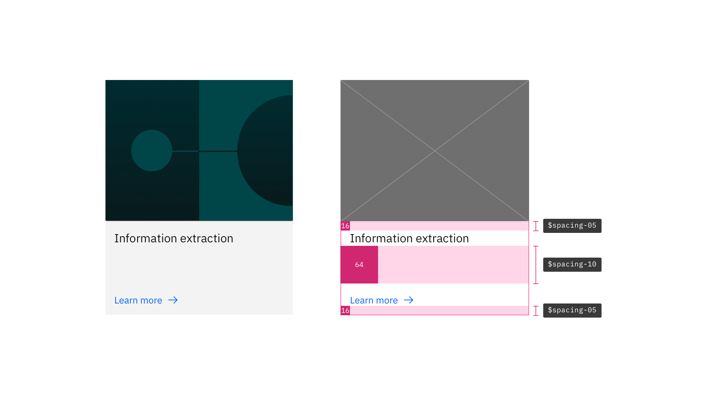

<PageDescription>

Carbon for IBM.com uses uniform components, elements, and spacing to encourage consistency when designing for IBM.com experiences.

</PageDescription>

<AnchorLinks>

<AnchorLink>Designing with space</AnchorLink>
<AnchorLink>Spacing token and scale</AnchorLink>
<AnchorLink>Component spacing patterns</AnchorLink>
<AnchorLink>FAQ</AnchorLink>
<AnchorLink>Support</AnchorLink>

</AnchorLinks>

## Designing with space

Every part of a UI should be intentional, including the empty space, also known as white space, between elements. The amount of space between items creates relationships and hierarchy. You can learn more about white space and how space can help you create relationships and hierarchy on the [Carbon spacing guidelines](https://www.carbondesignsystem.com/guidelines/spacing/overview/#designing-with-space) page.

When designing for IBM.com, the spacing scale and type tokens are used to ensure the information is well organized and consistent. See the [Type pairings guidance](../expressive-styling/type-pairing) to learn more about the type hierarchy of the Carbon for IBM.com components.

<br />

## Spacing token and scale

### Spacing token

The spacing scale can be applied to `margin` or `padding` properties, as well as
to both vertical and horizontal edges. The token takes the place of the values
normally assigned to `margin` and `padding`. The following are all approved ways
to syntactically apply Carbon for IBM.com spacing tokens:

```css
margin: $spacing-03;
margin: $spacing-03 $spacing-01;
margin: $spacing-07 0 $spacing-04 0;
margin-right: $spacing-05;
padding: $spacing-04;
padding: $spacing-05 $spacing-03;
padding: $spacing-07 $spacing-04 0 $spacing-04;
```

<br />

### Examples

Below is the example of a regular image card on the left and how the spacing tokens are applied to it on the right.

<Row>
<Column colLg={8}>



</Column>
</Row>

<br />

Below is the example of a regular Content block simple on the left and how the spacing tokens are applied to it on the right.

<Row>
<Column colLg={12}>


</Column>
</Row>

<br />

### Spacing scale

Use the spacing scale when building individual components. It includes small
increments needed to create appropriate spatial relationships for detail-level
designs. This scale is applied and used within all Carbon components.

<div className="spacing-table">

| Token         | rem   | px  | Example                                                                      |
| ------------- | ----- | --- | ---------------------------------------------------------------------------- |
| `$spacing-01` | 0.125 | 2   | <div style={{width: '2px', height: '2px', background: '#D12771'}}></div>     |
| `$spacing-02` | 0.25  | 4   | <div style={{width: '4px', height: '4px', background: '#D12771'}}></div>     |
| `$spacing-03` | 0.5   | 8   | <div style={{width: '8px', height: '8px', background: '#D12771'}}></div>     |
| `$spacing-04` | 0.75  | 12  | <div style={{width: '12px', height: '12px', background: '#D12771'}}></div>   |
| `$spacing-05` | 1     | 16  | <div style={{width: '16px', height: '16px', background: '#D12771'}}></div>   |
| `$spacing-06` | 1.5   | 24  | <div style={{width: '24px', height: '24px', background: '#D12771'}}></div>   |
| `$spacing-07` | 2     | 32  | <div style={{width: '32px', height: '32px', background: '#D12771'}}></div>   |
| `$spacing-08` | 2.5   | 40  | <div style={{width: '40px', height: '40px', background: '#D12771'}}></div>   |
| `$spacing-09` | 3     | 48  | <div style={{width: '48px', height: '48px', background: '#D12771'}}></div>   |
| `$spacing-10` | 4     | 64  | <div style={{width: '64px', height: '64px', background: '#D12771'}}></div>   |
| `$spacing-11` | 5     | 80  | <div style={{width: '80px', height: '80px', background: '#D12771'}}></div>   |
| `$spacing-12` | 6     | 96  | <div style={{width: '96px', height: '96px', background: '#D12771'}}></div>   |
| `$spacing-13` | 10    | 160 | <div style={{width: '160px', height: '160px', background: '#D12771'}}></div> |

</div>

<br />

## Content component spacing patterns

Component vertical spacing is determined by the component type. Actual vertical spacing may differ by component - check the component's design specs.

### Spacing for Content section

| Breakpoint    | `max`             | `xlg`             | `lg`              | `md`              | `sm`              |
| ------------- | ----------------- | ----------------- | ----------------- | ----------------- | ----------------- |
| Margin top    | `spacing-09` 48px | `spacing-09` 48px | `spacing-09` 48px | `spacing-09` 48px | `spacing-09` 48px |
| Margin bottom | `spacing-10` 64px | `spacing-10` 64px | `spacing-10` 64px | `spacing-10` 64px | `spacing-10` 64px |

### Spacing for Content block

| Breakpoint     | `max`              | `xlg`              | `lg`               | `md`              | `sm`              |
| -------------- | ------------------ | ------------------ | ------------------ | ----------------- | ----------------- |
| Padding top    | `spacing-10` 64px  | `spacing-10` 64px  | `spacing-10` 64px  | `spacing-07` 32px | `spacing-07` 32px |
| Padding bottom | `spacing-13` 160px | `spacing-13` 160px | `spacing-13` 160px | `spacing-12` 96px | `spacing-10` 64px |

### Spacing for Content group

| Breakpoint    | `max`             | `xlg`             | `lg`              | `md`              | `sm`              |
| ------------- | ----------------- | ----------------- | ----------------- | ----------------- | ----------------- |
| Margin top    | `spacing-07` 32px | `spacing-07` 32px | `spacing-07` 32px | `spacing-07` 32px | `spacing-07` 32px |
| Margin bottom | `spacing-09` 48px | `spacing-09` 48px | `spacing-09` 48px | `spacing-09` 48px | `spacing-07` 32px |

### Spacing for Content item

| Breakpoint    | `max`             | `xlg`             | `lg`              | `md`              | `sm`              |
| ------------- | ----------------- | ----------------- | ----------------- | ----------------- | ----------------- |
| Margin top    | `spacing-07` 32px | `spacing-07` 32px | `spacing-07` 32px | `spacing-07` 32px | `spacing-07` 32px |
| Margin bottom | `spacing-07` 32px | `spacing-07` 32px | `spacing-07` 32px | `spacing-07` 32px | `spacing-07` 32px |

## FAQ

#### Are there any differences when designing with expressive type sets vs. productive type sets?

Yes, please see the [Expressive styling](../expressive-styling/overview) to learn more about styling strategies and type pairings.

#### Are there any other spacing options besides the one listed in the Spacing scale and token section?

Yes, a few other non-token methods can be used for spacing elements, and they each have their unique use case.

- **Center** is used to center an element between two edges fluidly.
- **Auto** is used on one side of an element to allow undefined space to grow and shrink according to screen size automatically. Typically used for asymmetrical fluid spacing.
- **Gutter** is used to space items between the grid's 16 columns.

#### Can I still use percentages for spacing?

Percentages like 50% (1/2) or 25%% (1/4) are still acceptable ways to divide a
page. Percentages can all still be used to control max and min widths. However,
using percentages for padding or margin inside of a component or element should
be avoided (ex. `padding-right: 10%`). The exception to this is if you’re
applying it to fit the 5% grid margins.

#### Are the spacing tokens responsive?

No, the tokens themselves do not change values based on the screen size.
However, it is acceptable at page breakpoints to jump a step(s) on the spacing
scale to fit spacing needs (i.e., at 1312px `padding-right: $spacing-05` but at
breakpoint 672px `padding-right: $spacing-03`).

#### What is the difference between margin and padding?

Padding represents the amount of inner space an element has, whereas margin represents negative space surrounding the component. Note that when two components are nested together, padding values will stack one on top of the other. Margin values will instead merge with the highest spacing value retained. Learn more about the CSS Box Model [here](https://www.w3schools.com/css/css_boxmodel.asp).

<br />

## Support

If you need additional guidance on designing with space, please reach out to the Carbon for IBM.com team via the [#carbon-for-ibm-dotcom slack channel](https://cognitive-app.slack.com/archives/C2PLX8GQ6).
