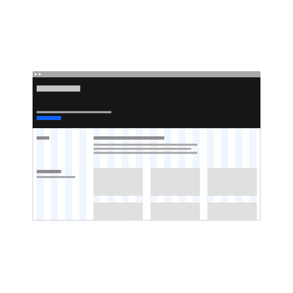
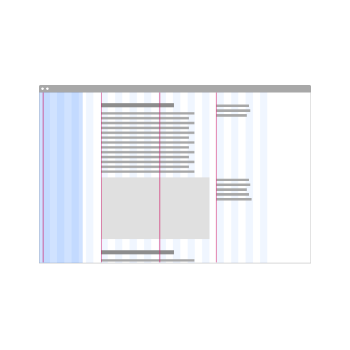
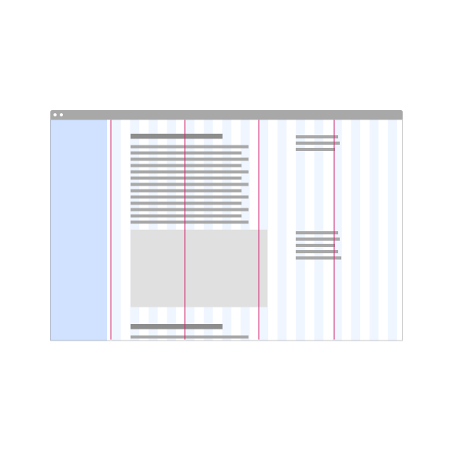
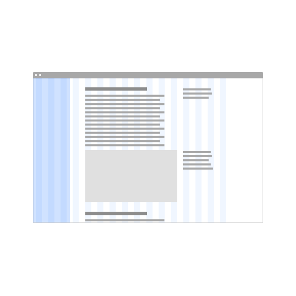
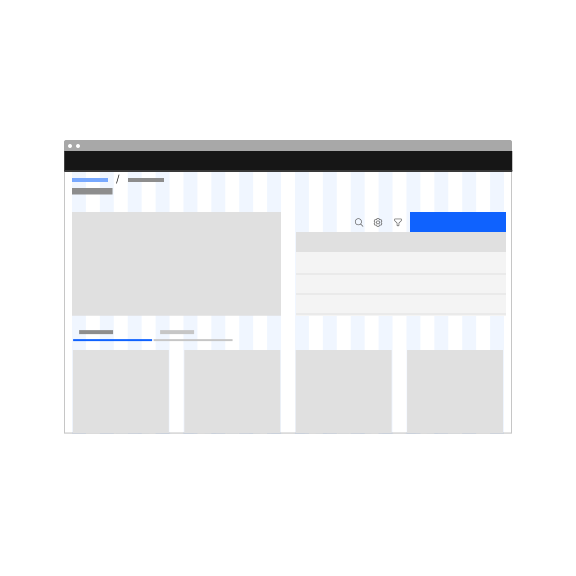
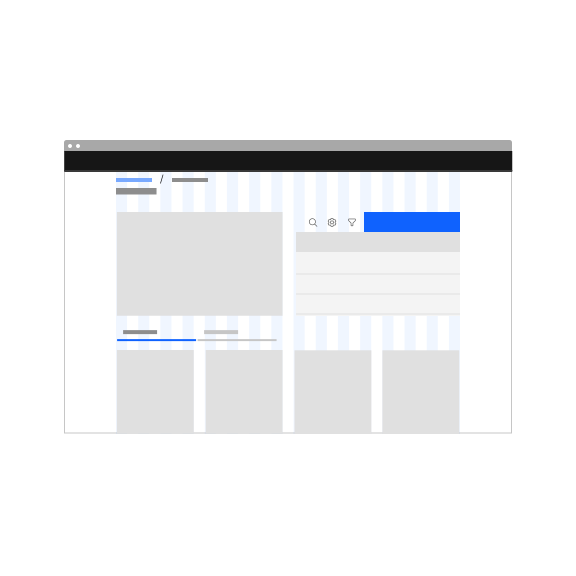

<PageDescription>

Style models refer to specific combinations of design elements that make up a shared foundation for pages on IBM.com. Reuse existing style models can ensure consistency in IBM's approach to content, and coherency in our customers' journey.

</PageDescription>

<AnchorLinks>

<AnchorLink>What are style models?</AnchorLink>
<AnchorLink>Editorial model</AnchorLink>
<AnchorLink>Documentation model</AnchorLink>
<AnchorLink>Dashboard model</AnchorLink>
<AnchorLink>Feedback</AnchorLink>

</AnchorLinks>

## What are style models?

Style model connects a specific usage of design elements (grid, screen region, key components) to the kind of content it best serves. For example, all pages on IBM.com uses the <a href="https://www.carbondesignsystem.com/guidelines/2x-grid/overview/" target="_blank">2x Grid</a>, but the 2x Grid still supports a wide range of behaviors. It can be used with or without max width, left aligned or centered. These design decisions should be made consistently based on content needs.

Here is the list of existing style models identified so far.

| Page content                                | Usage and examples                                                                                                                                                                                                                                                                              |
| ------------------------------------------- | ----------------------------------------------------------------------------------------------------------------------------------------------------------------------------------------------------------------------------------------------------------------------------------------------- |
| [Editorial model](#editorial-model)         | Marketing content falls into this category. Think expressive styling and shorter sessions of visits. This covers models previously known as "Editorial navigation", "Listing", "Reading", "Information gathering", "Transation" and "Simple transaction"                                        |
| [Documentation model](#documentation-model) | Documentation presents a unique combination of needs - controlled line lengths, but also a long duration egnagement. Examples of documentation include IBM Docs, Cloud Docs, and this site documentating the design system guidance. This covers models previously known as "Index navigation". |
| [Dashboard model](#dashboard-model)         | Sometimes every inch of the screen needs be utilized at maximum to display information and controls. Complex product interfaces and data visualization dashboards typically fall into this category. Users egage with these screens for longer periods of time and often actively interacting.  |

#### &#12288;

The biggest differentiation of the models is the grid. Specifically in how grid behaves above max breakpoint. Below is the 2x Grid at max breakpoint (1584px or 99rem).

 

<Row>
<Column colLg={2} colMd={2}>

**2x Grid at max breakpoint** 

</Column>
<Column colLg={10} colMd={6}>

</Column>
</Row>

#### &#12288;

Once the screen is wider than the max breakpoint, the margins (highlighted in the darkest blue below) can expand, or the grid can stretch:

 

<Row>
<Column colLg={2} colMd={2}>

**Editorial**  Max width kept, centered grid

</Column>
<Column colLg={10} colMd={6}>

</Column>
</Row>
<Row>
<Column colLg={2} colMd={2}>

**Documentation**  Max width kept, grid left aligned

</Column>
<Column colLg={10} colMd={6}>

</Column>
</Row>
<Row>
<Column colLg={2} colMd={2}>

**Dashboard**  Full width, grid stetches

</Column>
<Column colLg={10} colMd={6}>

</Column>
</Row>

## Editorial model

### Grid

When used on editorial content, the max width should be applied to ensure texts and Call to actions are not drifting to the peripheral for visitors using a big screen. This ensures a complete first impression of the content. Applying a max width to the page also keeps text line length at a reasonable width, which allows for <a href="https://www.ibm.com/design/language/typography/type-basics/#comfortable-reading" target="_blank">comfortable reading</a>.

<Row>
<Column colMd={4} colLg={4} >
<DoDontExample type="do" caption="Editorial model uses max width to keep content centralized.">

</DoDontExample>
</Column>
<Column colMd={4} colLg={4} >
<DoDontExample type="dont" caption="Without max width content stretches and drifts apart on wide screens.">

</DoDontExample>
</Column>
</Row>

Grid should also be centered when the screen width is larger than max width to present content front and center. Left aligned grid creates a awkward white space on the right that draws unnecessary attention.

<Row>
<Column colMd={4} colLg={4} >
<DoDontExample type="dont" caption="Left aligned grid creates a awkward white space on the right that draws unnecessary attention">

</DoDontExample>
</Column>
</Row>

### Screen regions and layout

### Dotcom shell

Dotcom shell stays within the grid, filling in the margin with background color and horizontal rule.

### Examples

## Documentation model

### Grid

Documentation sites deal with large volumns of text and media content. It benefit from a persistant navigation to help with organization and way finding. This reduces the main content area to 12 columns, but allows for the wholistic design to embrace the 4 <a href="https://carbondesignsystem.com/guidelines/2x-grid/overview/#key-lines" target="_blank">key lines</a>.

Do not use a <a href="https://carbondesignsystem.com/guidelines/2x-grid/overview/#grid-influencers" target="_blank">grid influencer</a> for the navigation panel because it should be present most of the time. Reserve grid influencers for temporary UI elements because when present, the grid influencer breaks a layout where everything is divisible-by-2.

<Row>
<Column colMd={4} colLg={4} >
<DoDontExample type="do" caption="Documentation benefits from a persistant navigation that takes up 4 columns and a controlled max width.">

</DoDontExample>
</Column>
<Column colMd={4} colLg={4} >
<DoDontExample type="dont" caption="Grid influencer breaks a layout where everything is divisible-by-2.">

</DoDontExample>
</Column>
</Row>

Left aligning grid to allow the navigation to anchor to side of the screen, and keep main content at a predictable proximity to the navigation.

<Row>
<Column colMd={4} colLg={4} >
<DoDontExample type="do" caption="Lorem ipsum">

</DoDontExample>
</Column>
<Column colMd={4} colLg={4} >
<DoDontExample type="dont" caption="Lorem ipsum">

</DoDontExample>
</Column>
</Row>

### Screen regions and layout

### Dotcom shell

Dotcom shell breaks out of grid and is full width. This keeps right side of the Masthead elements anchored.

### Examples

## Dashboard model

High information densitity screens, such as product dashboards, should use the grid without max width. This allows for the design to utilize full screen width to present as much information as possible. This is especially important when presetning data visualizations.

### Grid

<Row>
<Column colMd={4} colLg={4} >
<DoDontExample type="do" caption="For dashboards, utilize the full screen width to present as much information as possible.">

</DoDontExample>
</Column>
<Column colMd={4} colLg={4} >
<DoDontExample type="dont" caption="Containing the dashboard interface in a max width creates frustration.">

</DoDontExample>
</Column>
</Row>

### Screen regions and layout

Reference the 2x Grid <a href="https://carbondesignsystem.com/guidelines/2x-grid/overview/#screen-regions" target="_blank">screen regions</a> guidance on Carbon website for details.

### Dotcom shell

This is style model supports high information density moments, and at IBM.com, we have not yet encountered this use case. If you content fits this cateogry, and is not external facing, consider using simply using Carbon Design System, where UI shell is the default header in place of Dotcom shell.

If Dotcom shell is used for some reason, follows the grid and stretches to full width.

### Examples

## Feedback

These user intents and style models are not set in stone—they and are intended to evolve over time. If for any reason, the existing user intents or style models do not meet the user needs, please contact the Digital Design System team via the <a href="https://cognitive-app.slack.com/archives/C2PLX8GQ6" target="_blank">#carbon-for-ibm-dotcom</a> slack channel.
