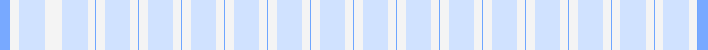
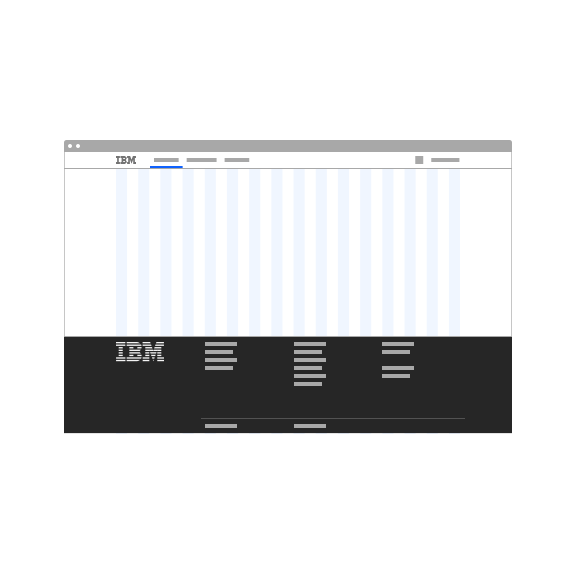
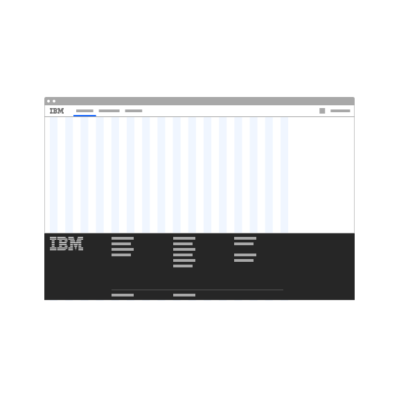
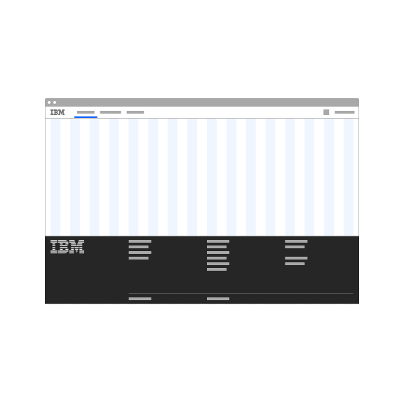
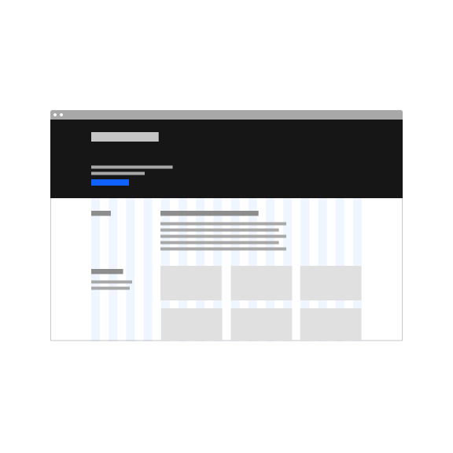
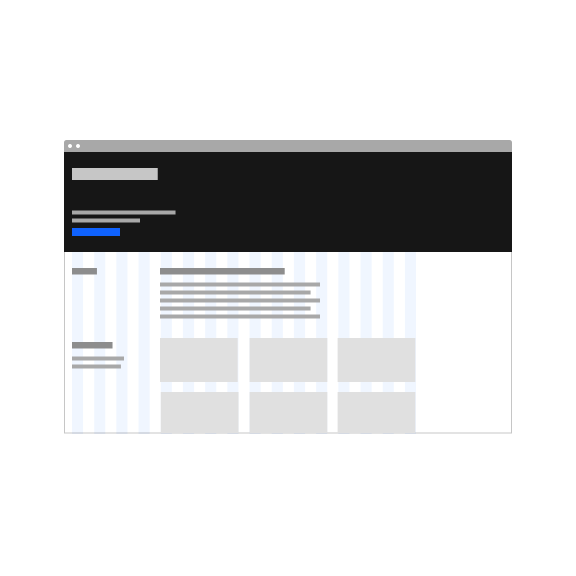
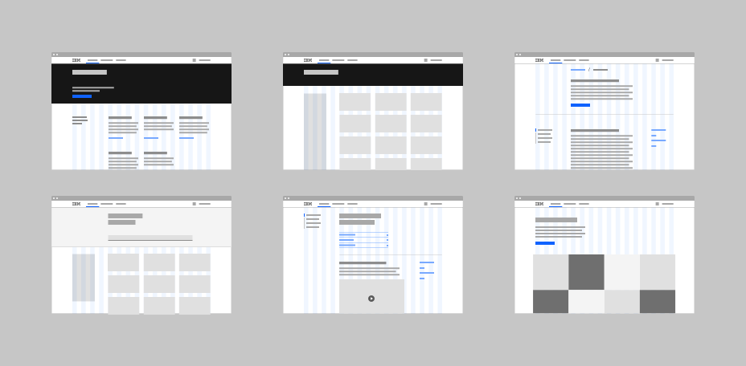
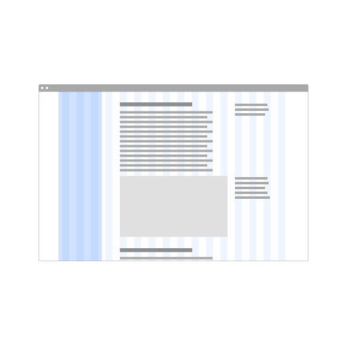
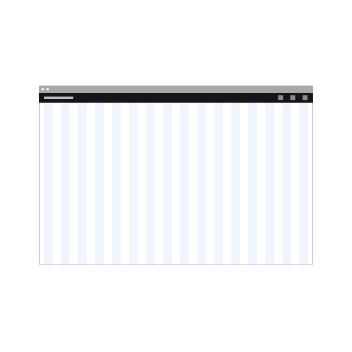

<PageDescription>

A style model refers to a specific combination of design elements that together make up a foundation for pages on IBM.com. Reuse of existing style models ensures a consistent approach to content, and coherency in our customers' journeys.

</PageDescription>

<AnchorLinks>

<AnchorLink>Overview</AnchorLink>
<AnchorLink>Editorial model</AnchorLink>
<AnchorLink>Documentation model</AnchorLink>
<AnchorLink>High density interface model</AnchorLink>
<AnchorLink>Feedback</AnchorLink>

</AnchorLinks>

## Overview

Style models help designers by simplifying decisions around how foundational design elements should be used. For example, all pages on IBM.com uses the <a href="https://www.carbondesignsystem.com/guidelines/2x-grid/overview/" target="_blank">2x Grid</a>, but the 2x Grid supports a wide range of behaviors and usage. It can be used with or without max width, left aligned or centered. These design decisions should be made consistently based on content needs. Style models connect specific usage combinations to the kind of content it best serves. In our models, the design elements included are:

- Grid
- Screen regions
- Key components (Masthead, Footer)

Here is a list of recurring style models we have identified so far.

| Page content                                                    | Usage and examples                                                                                                                                                                                                                                                                                                                           |
| --------------------------------------------------------------- | -------------------------------------------------------------------------------------------------------------------------------------------------------------------------------------------------------------------------------------------------------------------------------------------------------------------------------------------- |
| [_Editorial model_](#editorial-model)                           | This default style model is the bread and butter of marketing pages, which represents the majority of IBM.com. The grid in this model centers content for most comfortable browsing, and allows for a variety of expressive layouts. Some low information density product screens, such as the Checkout application, can use this model too. |
| [_Documentation model_](#documentation-model)                   | For long form content with deep organizational hierarchy, use the Documentation model. It anticipates a left hand navigational panel, and keeps content within a maximum width. Examples of documentation include IBM Docs, Cloud Docs, and this site documenting the design system guidance.                                                |
| [_High density interface model_](#high-density-interface-model) | Sometimes every inch of the screen needs be utilized at maximum to display information and controls. Complex product interfaces and data visualization dashboards typically fall into this category. This model uses the full width grid, so the bigger the screen, the more information the user will see.                                  |

#### &#12288;

The biggest differentiation of the models is the grid. Specifically in how grid behaves above max breakpoint. Below is the 2x Grid at max breakpoint (1584px or 99rem).

 

<Row>
<Column colLg={2} colMd={2}>

**2x Grid at max breakpoint** 

</Column>
<Column colLg={10} colMd={6}>

</Column>
</Row>

#### &#12288;

Once the screen is wider than the max breakpoint, the margins (highlighted in dark blue below) can expand, or the grid can stretch:

 

<Row>
<Column colLg={2} colMd={2}>

**Editorial**  Max width kept, centered grid

</Column>
<Column colLg={10} colMd={6}>

</Column>
</Row>
<Row>
<Column colLg={2} colMd={2}>

**Documentation**  Max width kept, grid left aligned

</Column>
<Column colLg={10} colMd={6}>

</Column>
</Row>
<Row>
<Column colLg={2} colMd={2}>

**High density interface**  Full width, grid stetches

</Column>
<Column colLg={10} colMd={6}>

</Column>
</Row>

 

This grid behavior ripples through everything on page. Here is how the Masthead and Footer will behave above max breakpoints:

<Row>
<Column colMd={4} colLg={4} >

<Caption>

**Editorial** model demonstrates the default behavior. The content within the components are contained in the max width, but background colors and dividers are full width.

</Caption>

</Column>
<Column colMd={4} colLg={4} >

<Caption>

**Documentation** model's footer has content left aligned, background full width. But masthead breaks from the grid, where both content and background are full width.

</Caption>

</Column>
<Column colMd={4} colLg={4} >

<Caption>

**High density interface** model shows both masthead and footer obeying the grid as expected, stretching to full width of screen.

</Caption>

</Column>
</Row>

## Editorial model

This style model is the bread and butter of marketing pages, which represet the majority of IBM.com. The grid in this model centers content for most comfortable browsing, and allows for a varity of expressive layout. Some low information density product screens, such as the Checkout application, can use this model too.

### Grid

When used on editorial content, the max width should be applied to ensure texts and Call to actions are not drifting to the peripheral for visitors using a big screen. This ensures a complete first impression of the content. Applying a max width to the page also keeps text line length at a reasonable width, which allows for <a href="https://www.ibm.com/design/language/typography/type-basics/#comfortable-reading" target="_blank">comfortable reading</a>.

<Row>
<Column colMd={4} colLg={4} >
<DoDontExample type="do" caption="Editorial model uses max width to keep content centralized.">

</DoDontExample>
</Column>
<Column colMd={4} colLg={4} >
<DoDontExample type="dont" caption="Without max width content stretches and drifts apart on wide screens.">

</DoDontExample>
</Column>
</Row>

Grid should also be centered when the screen width is larger than max width to present content front and center. Left aligned grid creates a awkward white space on the right that draws unnecessary attention.

<Row>
<Column colMd={4} colLg={4} >
<DoDontExample type="dont" caption="Left aligned grid creates a awkward white space on the right that draws unnecessary attention">

</DoDontExample>
</Column>
</Row>

### Screen regions and Dotcom shell

Begin designing by parsing through the content for hierarchies, and start with the most essential, overarchiing concepts on the top, and granular details below. Reference Layout page for more guidance on [Content hierarchy](/guidelines/layout#content-hierarchy).

{!! Placeholder for image here }

Masthead and footer together make up the shell of the page, also knowns as [Dotcom shell](/components/dotcom-shell). How they are positioned on the grid helps to define expectation of the rest of the page. In Editorial model, dotcom shell stays on the grid. This means the content are aligned to columns, and background colors and their dividers are full width extending into margins.

<Row>
<Column colMd={4} colLg={4} >

<Caption>
  Dotcom shell stays within the grid, filling in the margin with background
  color and its divider.
</Caption>

</Column>
</Row>

### Examples

<Row>
<Column colMd={8} colLg={12} >

<Caption>Editorial model supports a wide varity of layouts.</Caption>

</Column>
</Row>

## Documentation model

For long form content with deep organizational hierarchy, use the Documentation model. It anticipates a left hand navigational panel, and keep content width under a maximum. Examples of documentation include IBM Docs, Cloud Docs, and this site documentating the design system guidance.

### Grid

Documentation sites deal with large volumns of text and media content. It benefit from a persistant navigation to help with organization and way finding. This reduces the main content area to 12 columns, but allows for the wholistic design to embrace the 4 <a href="https://carbondesignsystem.com/guidelines/2x-grid/overview/#key-lines" target="_blank">key lines</a>.

Do not use a <a href="https://carbondesignsystem.com/guidelines/2x-grid/overview/#grid-influencers" target="_blank">grid influencer</a> for the navigation panel because it should be present most of the time. Reserve grid influencers for temporary UI elements because when present, the grid influencer breaks a layout where everything is divisible-by-2.

<Row>
<Column colMd={4} colLg={4} >
<DoDontExample type="do" caption="Documentation benefits from a persistant navigation that takes up 4 columns and a controlled max width.">

</DoDontExample>
</Column>
<Column colMd={4} colLg={4} >
<DoDontExample type="dont" caption="Grid influencer breaks a layout where everything is divisible-by-2.">

</DoDontExample>
</Column>
</Row>

Left aligning the grid allows the navigation to anchor to side of the screen, and keeps the main content at a predictable proximity to the navigation.

<Row>
<Column colMd={4} colLg={4} >
<DoDontExample type="do" caption="Reserve the first 3 columns on the left for navigation panel, and place main content on the 5th–16th columns. ">

</DoDontExample>
</Column>
<Column colMd={4} colLg={4} >
<DoDontExample type="dont" caption="Grid influencer is not recommended for documentation because grid influencer temporarily breaks the 2x Grid logic, and should not be a persistent element on screen.">

</DoDontExample>
</Column>
</Row>

### Screen regions and Dotcom shell

With the documentation model, the Dotcom shell breaks out of grid and is full width. This keeps the right side of the Masthead elements anchored.

<Row>
<Column colMd={4} colLg={4} >

<Caption>Dotcom shell usage on Documentation model</Caption>

</Column>
</Row>

### Examples

## High density interface model

Sometimes every inch of the screen needs be utilized at maximum to display information and controls. Complex product interfaces and data visualization dashboards typically fall into this category. This model uses the full width grid, so the bigger the screen, the more information user will see.

### Grid

High information density screens, such as product dashboards, should use the grid without max width. This allows for the design to utilize full screen width to present as much information as possible. This is especially important when presenting data visualizations.

<Row>
<Column colMd={4} colLg={4} >
<DoDontExample type="do" caption="For high density interfaces, utilize the full screen width to present as much information as possible.">

</DoDontExample>
</Column>
<Column colMd={4} colLg={4} >
<DoDontExample type="dont" caption="Containing high density interfaces in a max width creates frustration.">

</DoDontExample>
</Column>
</Row>

### Screen regions and Dotcom shell

Reference the 2x Grid <a href="https://carbondesignsystem.com/guidelines/2x-grid/overview/#screen-regions" target="_blank">screen regions</a> guidance on Carbon website for details.

This style model supports high information density moments, and at IBM.com, we have not yet encountered this use case. If your content fits this category, and is not externally facing, consider using the Carbon Design System, where the UI shell is the default header in place of Dotcom shell.

If Dotcom shell is used for some reason, follows the grid and stretches to full width.

<Row>
<Column colMd={4} colLg={4} >

<Caption>
  Carbon shell is typically prefereable on High density interface model
</Caption>

</Column>
<Column colMd={4} colLg={4} >

<Caption>Dotcom shell on High density interface model</Caption>

</Column>
</Row>

### Examples

## Feedback

These user intents and style models are not set in stone—they and are intended to evolve over time. If for any reason, the existing user intents or style models do not meet the user needs, please contact the Digital Design System team via the <a href="https://cognitive-app.slack.com/archives/C2PLX8GQ6" target="_blank">#carbon-for-ibm-dotcom</a> slack channel.
