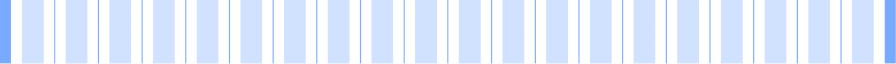
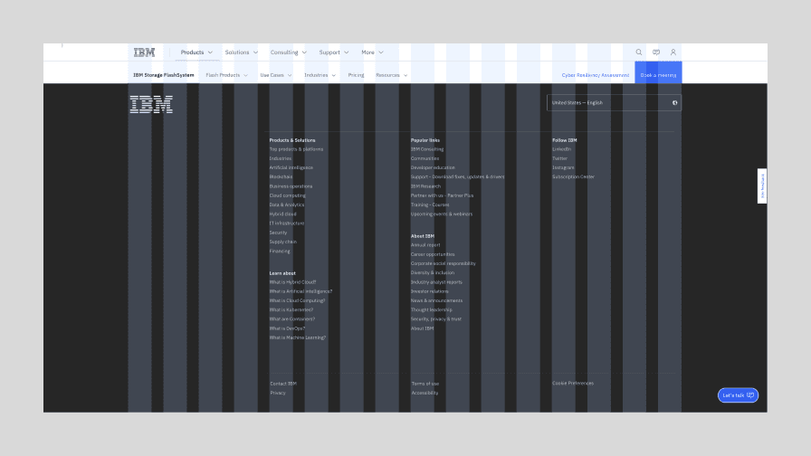
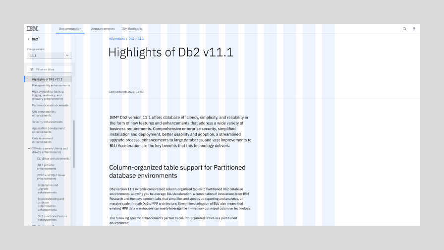
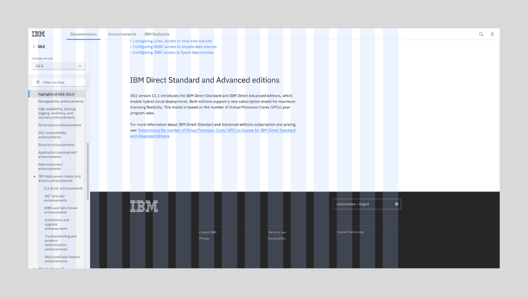
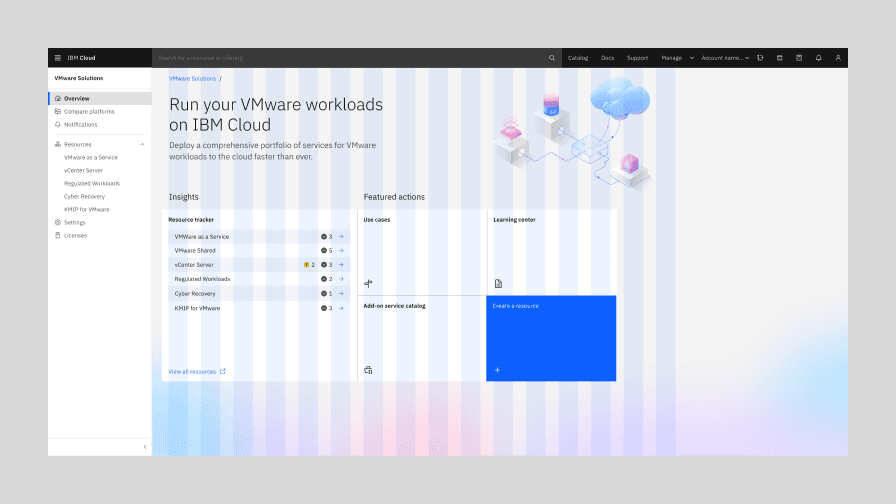
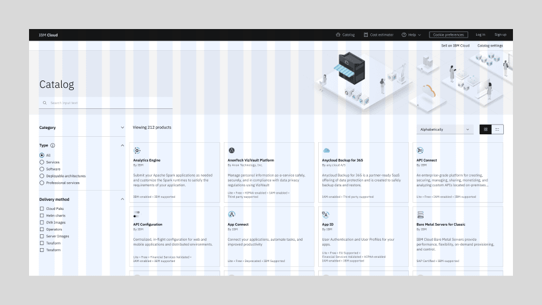

<PageDescription>

A style model refers to the way grided layouts behave within a browser or application window. Reuse of existing style models ensures a consistent approach to content, and coherency in our customers’ journeys.

</PageDescription>

<AnchorLinks>

<AnchorLink>Overview</AnchorLink>
<AnchorLink>Editorial model</AnchorLink>
<AnchorLink>Product model</AnchorLink>
<AnchorLink>High density interface model</AnchorLink>
<AnchorLink>Feedback</AnchorLink>

</AnchorLinks>

## Overview

Style models help designers by simplifying decisions around how foundational design elements should be used. For example, all pages on IBM.com use the [2x Grid](https://www.carbondesignsystem.com/guidelines/2x-grid/overview/), but the 2x Grid supports a wide range of behaviors and usage. The 2x Grid can be left aligned, centered or it can span the maximum width of the browser.

In our models, the design elements included are:

- Grid
- Key components (masthead/UI shell, footer)

Here is a list of recurring style models we have identified so far.

| Style models                                                    | Usage and examples                                                                                                                                                                                                                                                                                                                      |
| --------------------------------------------------------------- | --------------------------------------------------------------------------------------------------------------------------------------------------------------------------------------------------------------------------------------------------------------------------------------------------------------------------------------- |
| [_Editorial model_](#editorial-model)                           | This default style model is the bread and butter of marketing pages, which represents the majority of IBM.com. The grid in this model centers content for comfortable browsing, and allows for a variety of expressive layouts. Some low information density product screens, such as the Checkout application, can use this model too. |
| [_Product model_](#product-model)                               | For long form content with deep organizational hierarchy, use the product model. It anticipates a left hand navigational panel, and keeps content within a maximum width. Examples of product include IBM Docs, Cloud Docs, and this site documenting the design system guidance.                                                       |
| [_High density interface model_](#high-density-interface-model) | Sometimes every inch of the screen needs be utilized to display information and controls. Complex product interfaces and data visualization dashboards typically fall into this category. This model uses the full width grid, so the bigger the screen, the more information the user will see.                                        |

### Max breakpoint

The biggest differentiator between the style models is the grid. Specifically in how the grid behaves above max breakpoint. Below, for reference, is the 2x Grid at max breakpoint (1584px or 99rem).

 

<Row>
<Column colLg={2} colMd={2}>

**2x Grid at max breakpoint** 

</Column>
<Column colLg={10} colMd={6}>

</Column>
</Row>

### Beyond max breakpoint

Once the screen is wider than the max breakpoint, the margins (highlighted in dark blue) can expand, or the grid can stretch.

<Row>
  <Column colLg={2} colMd={2} colSm={4}>

**Editorial model**

</Column>
  <Column colLg={10} colMd={6} colSm={4}>

<Caption>Max width is maintained, grid is centered in the browser</Caption>

  </Column>
</Row>
<Row>
  <Column colLg={2} colMd={2} colSm={4}>

**Product model**

</Column>
  <Column colLg={10} colMd={6} colSm={4}>

<Caption>Max width is maintained, grid is left-aligned in the browser</Caption>

  </Column>
</Row>
<Row>
  <Column colLg={2} colMd={2} colSm={4}>

**High-density interface model**

</Column>
  <Column colLg={10} colMd={6} colSm={4}>

<Caption>
  Grid spans full screen width, add columns as needed in increments of 2 or 4
</Caption>

  </Column>
</Row>

## Editorial model

This difference in grid ripples through everything on page. Below is a visual overview of how the IBM.com masthead and footer will behave above max breakpoints in the Editorial style model.

As you can see, for editorial content, the max width should always be applied. This ensures text and calls to action do not drift to the periphery for visitors using a big screen, and provides a complete first impression of the content. Applying a max width to the page also keeps text line length at a reasonable width, which allows for [comfortable reading](https://www.ibm.com/design/language/typography/type-basics/#comfortable-reading).

<Row>
  <Column colLg={6} colMd={4}>

<Caption>The Editorial model in a marketing page on IBM.com</Caption>

  </Column>
  <Column colLg={6} colMd={4}>

<Caption>The footer for the Editorial model on IBM.com</Caption>

  </Column>
</Row>

## Product model

For long form content with deep organizational hierarchy, use the Product model. It anticipates a left hand navigational panel, and keeps content within a maximum width.

Both IBM.com and IBM product experiences overlap slightly in that they both can use the Product style model. Notice that the marketing content on IBM.com uses the Editorial style model and that support documentation (IBM Docs, Cloud Docs) on IBM.com uses the Product style model.

The vast majority of IBM software products also use this style model because the left rail is appropriate for task based user flows and dashboards. However, only software UI uses the grid influencer variant of the Carbon UI Shell.

<Row>
  <Column colLg={6} colMd={4}>

<Caption>The Product model in context on IBM.com</Caption>

  </Column>
  <Column colLg={6} colMd={4}>

<Caption>The footer for the Product model on IBM.com</Caption>

  </Column>
</Row>
<Row>
  <Column colLg={6} colMd={4}>

<Caption>The Product model in context in an IBM product screen</Caption>

  </Column>
</Row>

## High density interface model

IBM Products also occasionally use the High-density interface model in order to maximize the use of screen space. By far the most prominent example of this to date is the Cloud Catalog. Rather than growing in size, the Cloud catalog cards just keep populating as the browser grows. In this case, columns are added in increments of four.

<Row>
  <Column colLg={6} colMd={4}>

<Caption>
  The High-density interface model in context in the IBM Cloud catalog
</Caption>

  </Column>
</Row>

## Feedback

If you need additional guidance, please reach out to the Carbon for IBM.com team via the [#carbon-for-ibm-dotcom](https://cognitive-app.slack.com/archives/C2PLX8GQ6) slack channel or contact us on [Github](https://github.com/carbon-design-system/carbon-for-ibm-dotcom/issues/new?assignees=&labels=question&projects=&template=question.yaml&title=%5BYOUR+TITLE%5D%3A+Brief+description).
