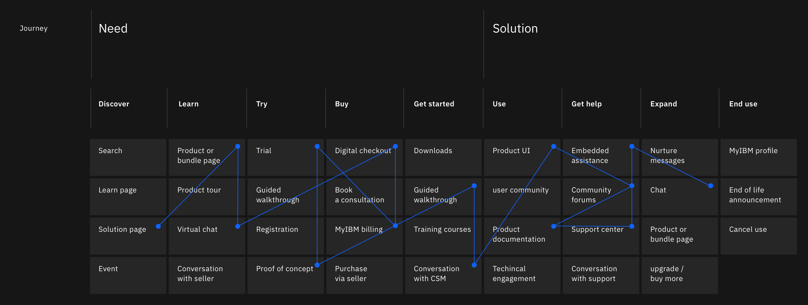
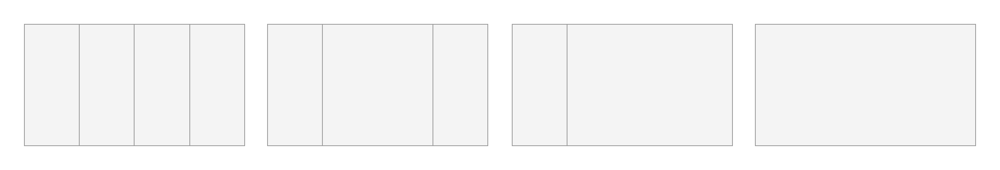
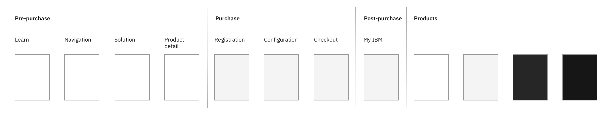
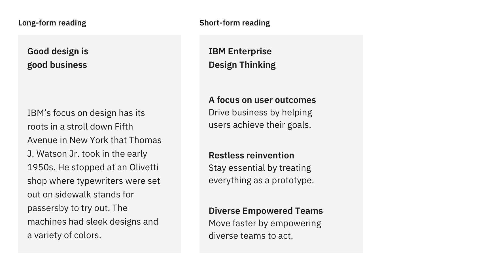
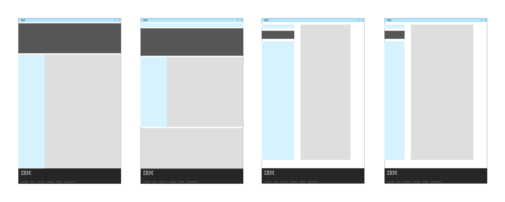

<PageDescription>

The IBM.com style models provide a design framework that defines the foundational structures for IBM.com pages with the goal of creating consistent and coherent experiences across users&rsquo; journeys in a scalable way.

</PageDescription>

<AnchorLinks>

<AnchorLink>Our vision</AnchorLink>
<AnchorLink>What are style models?</AnchorLink>
<AnchorLink>Using style models</AnchorLink>
<AnchorLink>Feedback</AnchorLink>

</AnchorLinks>

## Our vision

Every visitor to IBM.com should have a productive, efficient and delightful experience. IBM.com is a collection of highly functional, versatile, and diverse content and experiences. It serves different audience groups and their needs, in different industries and geographic regions, and covers a crucial portion of our users&rsquo; journeys.

Here are the three principles that guide us in our own journeys to achieve our vision.

<Title>1. The experience is the product</Title>

The user&rsquo;s experience along the journey—spanning from the user&rsquo;s initial research through decision making, purchase, management, and all the way to the actual use of the given product—is becoming a core aspect of any product.

<Row>
<Column colMd={12} colLg={12}>

</Column>
</Row>

<Title>2. Drive consistency around user intents</Title>

As more products are offered as services or as part of larger ecosystems and platforms, users are increasingly traversing journey touch points in non-linear ways, which demands an even higher level of consistency and coherency across journeys.

We drive consistency without sacrificing usability by basing the design of a page on the given user intent. For the same user intent, whether it&rsquo;s learning, trying, or buying, the solution should be consistent in order to accommodate the user&rsquo;s non-linear journey. This does not mean that everything should be the same—the style models for IBM.com define foundational and structural elements, while leaving the details to you, the maker.

The ultimate end result is that the user should be instantly familiar with pages that solve similar problems.

<Title>3. Reflect users&rsquo; journeys</Title>

The design should reflect the progress the user is making towards the end goal of purchasing and using a product to solve their problems and achieve objectives. The style models were designed to show the progress the user is making.

<Row>
<Column colMd={12} colLg={12}>

</Column>
</Row>

## What are style models?

A style model defines the foundational structure and elements of a given page to best serve the primary user intent of that page.

Each style model is based on the user intent for a given page and defines the most optimal use of the foundational design elements—grid, color theme, type scale, spacing, layout, and screen regions—to ensure that the user is successful in achieving their goals (user intent).

<Title>Primary user intent</Title>

For any given page, there is an overarching user intent—we call this the **primary user intent** of a page. For example, learn is the primary user intent for an early learn search capture page even though the page may have other secondary user intents such as navigation.

<Title>Grid usage</Title>

The grid system creates the fundamental structure of a page. There are many different ways to use the IBM 2X Grid, and the style models narrow down the available options to a few optimized structures&mdash;this ensures that the cognitive load from changing page structures is minimized.

<Row>
<Column colMd={12} colLg={12}>

<Caption>
  For details on the actual Grid usage, see the{' '}
  <a href="./style-model-list">Style model list</a> page.
</Caption>

</Column>
</Row>

<Title>Primary color theme</Title>

In IBM.com style models, the color theme is a major way to create a sense of progression over the user&rsquo;s journey. In general, the white theme is used for pre-purchase pages, and the gray 10 theme is used for the purchase and the post-purchase experience (My IBM).

<Row>
<Column colMd={12} colLg={12}>

</Column>
</Row>

Within products, the style model does not specify a color theme because the user intent within each product experience can vary vastly.

<Title>Text sizes and spacing</Title>

Different user intent requires different type scale and spacing. For example, the early learn page, which requires heavy reading of long-form content, benefits from larger text sizes and more open spacing. On the other hand, the checkout experiences are better served with smaller text sizes and tighter spacing.

<Row>
<Column colMd={8} colLg={8}>

</Column>
</Row>

<Title>Layout and screen regions</Title>

Layout themes define the overall layout for any given user intent by defining the regions for navigational elements, main content, supporting content, and key visual anchor placement. By using these layouts consistently the user will be more familiar with the page structure and will not have to learn how to use each page as they complete their journey.

<Row>
<Column colMd={8} colLg={8}>

</Column>
</Row>

## Using style models

There are currently 9 user intents identified so far, each with an associated style model. As a new page is designed, this should be the starting point.

1. Identify the user intent that matches that of the page to be designed.
2. Use the associated style model as the starting point for design.
3. Contact the Digital Design System squad for updates via <a href="https://cognitive-app.slack.com/archives/C2PLX8GQ6" target="_blank">#carbon-for-ibm-dotcom</a> Slack channel.

## Feedback

These user intents and style models are not set in stone—they and are intended to evolve over time. If for any reason, the existing user intents or style models do not meet the user needs, please contact the Digital Design System team via the <a href="https://cognitive-app.slack.com/archives/C2PLX8GQ6" target="_blank">#carbon-for-ibm-dotcom</a> slack channel.
