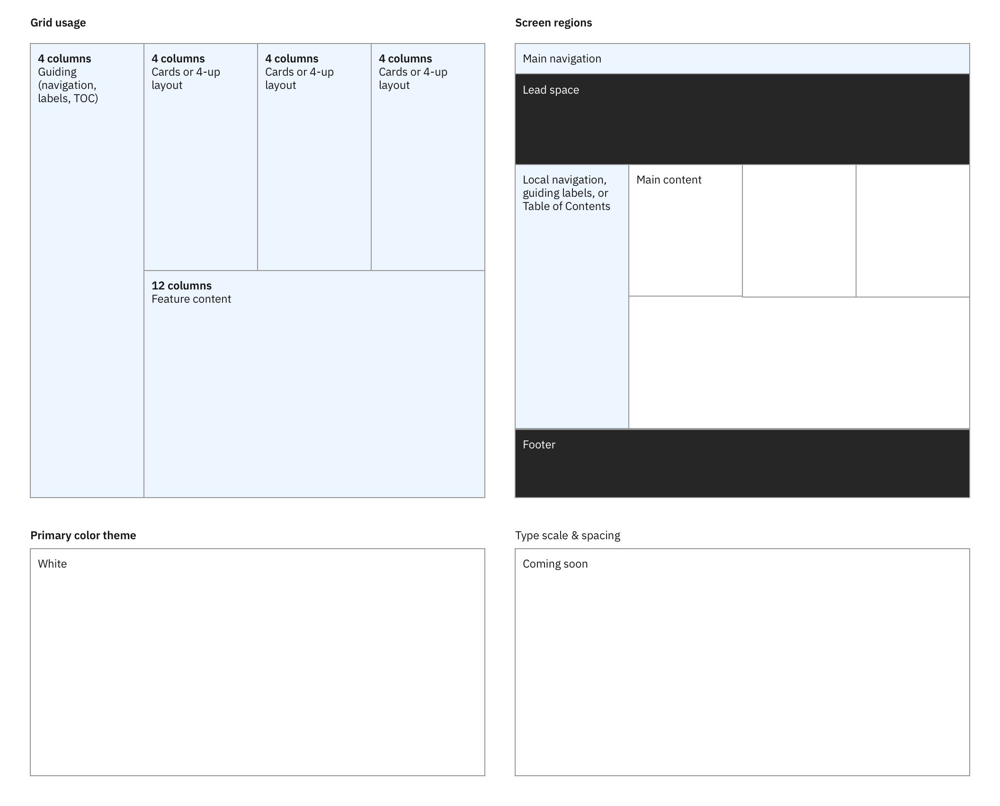
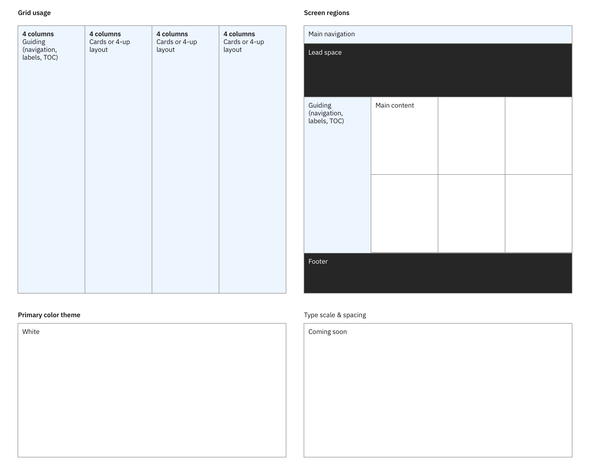
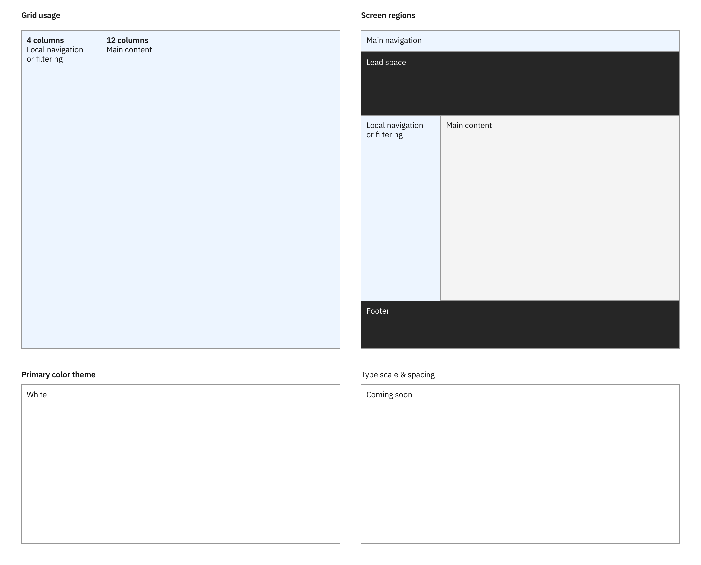
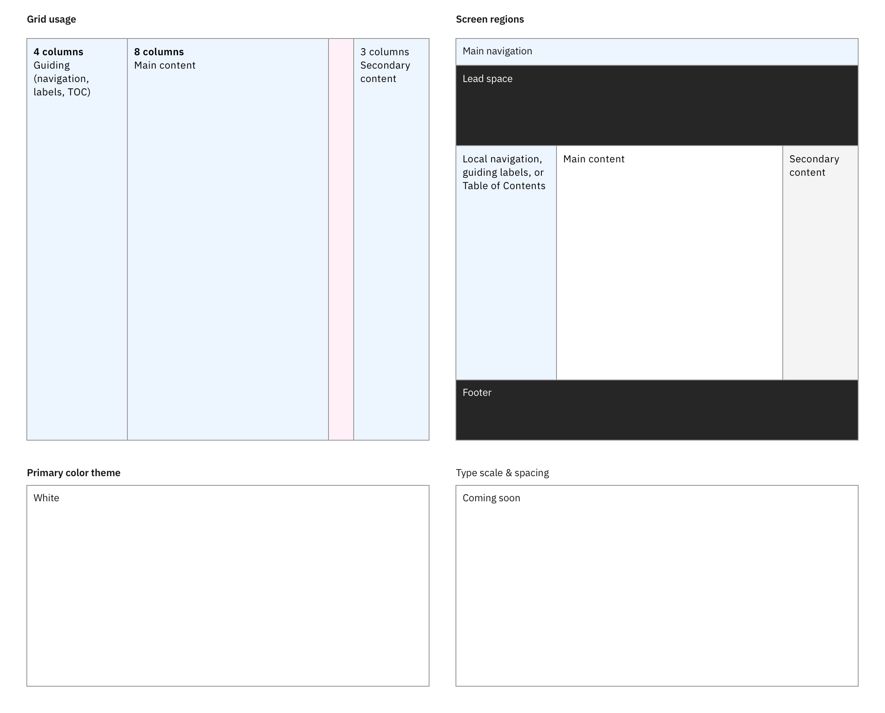
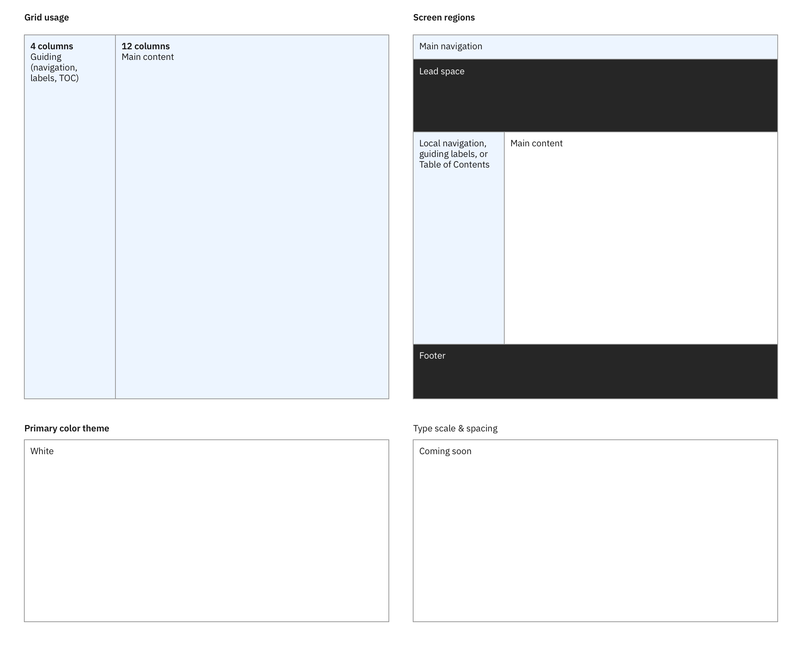
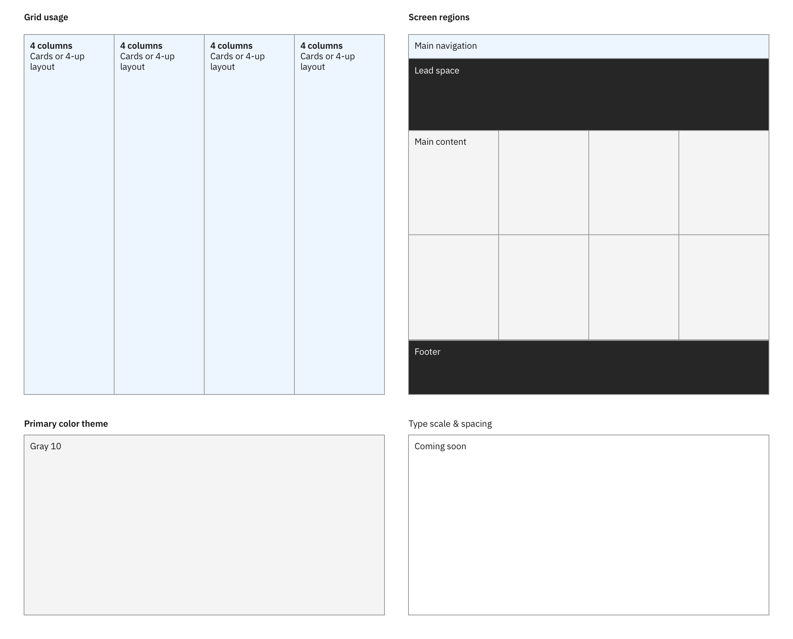
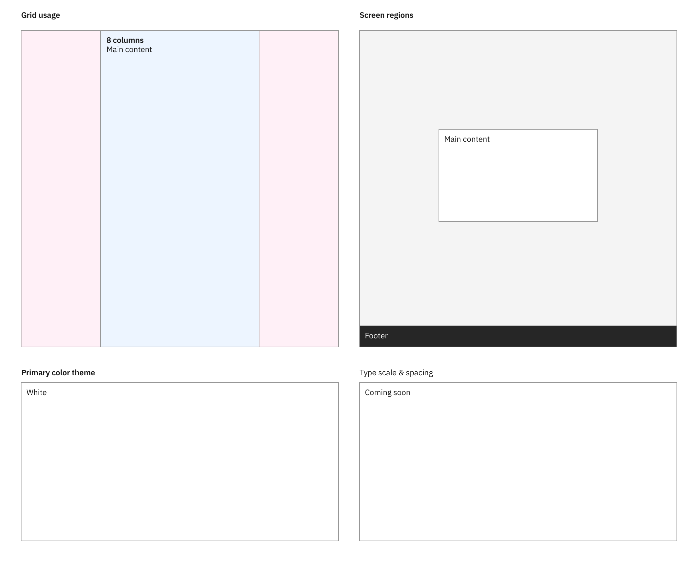
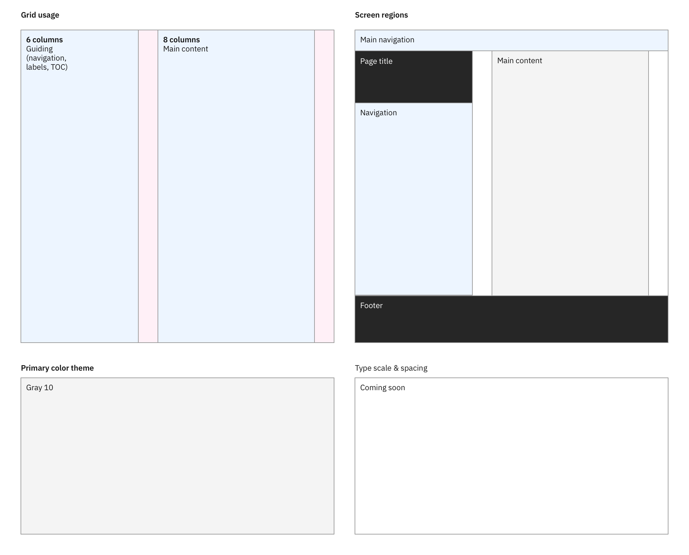

<PageDescription>

The primary user intent drives the foundational structure of any given page defined as part of the associated style model. This ensures consistency. These are the known user intents and associated style models for IBM.com pages.

</PageDescription>

## User intents and style models

These user intents and style models are not set in stone—they and are intended to evolve over time. If for any reason, the existing user intents or style models do not meet the user needs, please contact the Digital Design System team via the <a href="https://cognitive-app.slack.com/archives/C2PLX8GQ6" target="_blank">#carbon-for-ibm-dotcom</a> slack channel.

 

| User intent                                                        | Description                                                                                                                         |
| :----------------------------------------------------------------- | :---------------------------------------------------------------------------------------------------------------------------------- |
| [&#x21b3;&nbsp;Editorial&nbsp;navigation](#editorial-navigation)   | The user needs to scan available navigation options along with relevant content, identify the right destination and navigate to it. |
| [&#x21b3;&nbsp;Index&nbsp;navigation](#index-navigation)           | The user needs to scan available navigation options, identify the right destination and navigate to it.                             |
| [&#x21b3;&nbsp;Listing](#listing)                                  | The user needs to see a list(s) of available options, identify the right destination and navigate to it.                            |
| [&#x21b3;&nbsp;Reading](#reading)                                  | The user needs to read long-form content in order to gain in-depth understanding of a subject.                                      |
| [&#x21b3;&nbsp;Information&nbsp;gathering](#information-gathering) | The user needs to gather and understand concise pieces of information towards making a decision on purchase or subscription.        |
| [&#x21b3;&nbsp;Overview (dashboard)](#overview)                    | The user needs to have an overview of a given context or system and identify action items or priority items.                        |
| [&#x21b3;&nbsp;Simple&nbsp;transaction](#simple-transaction)       | The user needs to submit a small set of information such as user ID and password to the system.                                     |
| [&#x21b3;&nbsp;Transaction](#transaction)                          | The user needs to interact with the system and exchange complex information through multiple steps.                                 |
| [&#x21b3;&nbsp;Conversational help](#conversational-help)          | The user needs a way to connect with IBM reps to get support or start a conversation.                                               |

## Editorial navigation

The **editorial navigation style model** is usually used on navigational pages that have additional content pieces or provide highly curated sections such as featured products.

<Title>User intent</Title>

The user needs to scan available navigation options along with relevant content, identify the right destination and navigate to it.

<Row>
<Column colMd={12} colLg={12}>

</Column>
</Row>

<Title>Examples</Title>

Home page, topic landing page

 

## Index navigation

Compared to the editorial navigation style model, the **index navigation style model** is for navigational pages that mainly focus on helping the user find the right destination without the help of additional content.

<Title>User intent</Title>

The user needs to scan available navigation options, identify the right destination and navigate to it.

<Row>
<Column colMd={12} colLg={12}>

</Column>
</Row>

<Title>Examples</Title>

Category listing page, product listing page

## Listing

Similar to the index navigation style model, the **listing style model** focuses mainly on navigation in a vertical list style.

<Title>User intent</Title>

The user needs to see a list(s) of available options, identify the right destination and navigate to it.

<Row>
<Column colMd={12} colLg={12}>

</Column>
</Row>

<Title>Examples</Title>

Search results

## Reading

The **reading style model** is optimal for long-form-reading pages such as blogs, news articles, and learn pages.

<Title>User intent</Title>

The user needs to read long-form content in order to gain in-depth understanding of a subject.

<Row>
<Column colMd={12} colLg={12}>

</Column>
</Row>

<Title>Examples</Title>

Learn, blog post, news article

## Information gathering

Contrary to the reading style model, the **information gathering style model** is optimized for presenting short and concise pieces of information. It is suitable for pages where the user needs to be more productive with a clear goal.

<Title>User intent</Title>

The user needs to gather and understand concise pieces of information towards making a decision on purchase or subscription.

<Row>
<Column colMd={12} colLg={12}>

</Column>
</Row>

<Title>Examples</Title>

Product detail page, solution

## Overview (dashboard)

The **overview style model** is commonly used in creating dashboard or similar experiences.

<Title>User intent</Title>

The user needs to have an overview of a given context or system and identify action items or priority items.

<Row>
<Column colMd={12} colLg={12}>

</Column>
</Row>

<Title>Examples</Title>

My IBM home, Cloud dashboard

## Simple transaction

This style model represents simple form based pages.

<Title>User intent</Title>

The user needs to read or acknowledge information before continuing; or submit a small amount of information to the system.

<Row>
<Column colMd={12} colLg={12}>

</Column>
</Row>

<Title>Examples</Title>

Login, simple modal based form interactions

## Transaction

This style model is suitable for more complex interactive pages on IBM.com where lots of information pieces need to be exchanged.

<Title>User intent</Title>

The user needs to interact with the system and exchange complex information through multiple steps.

<Row>
<Column colMd={12} colLg={12}>

</Column>
</Row>

<Title>Examples</Title>

Configuration, checkout

## Conversational help

This style model describes how the additional interactive layer such as "Let&rsquo;s talk" or on-boarding experiences should be styled.

<Title>User intent</Title>

The user needs a way to connect with IBM to get support or start a conversation.

- Coming soon

<Title>Examples</Title>

Unified Messaging Experience, Onboarding experience
