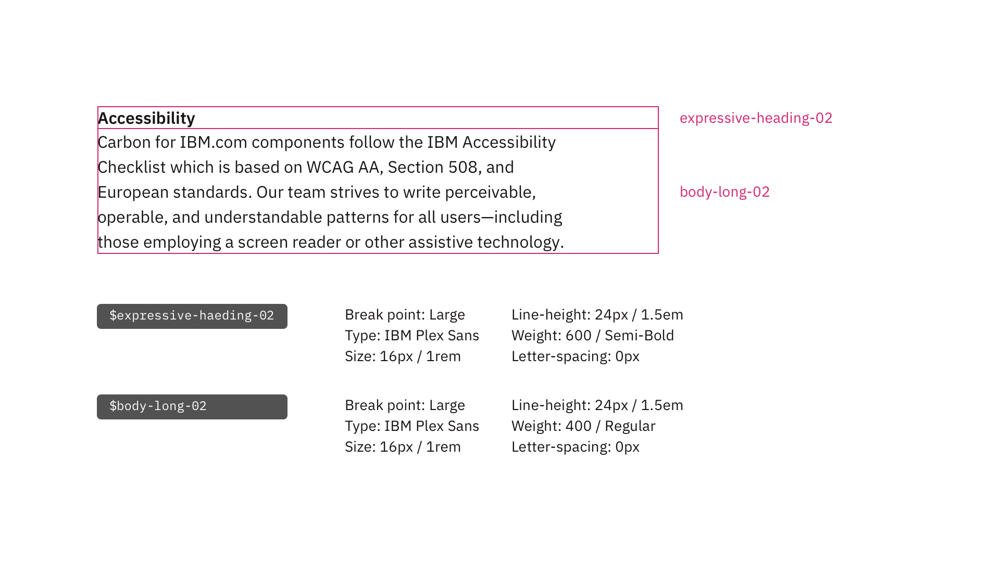
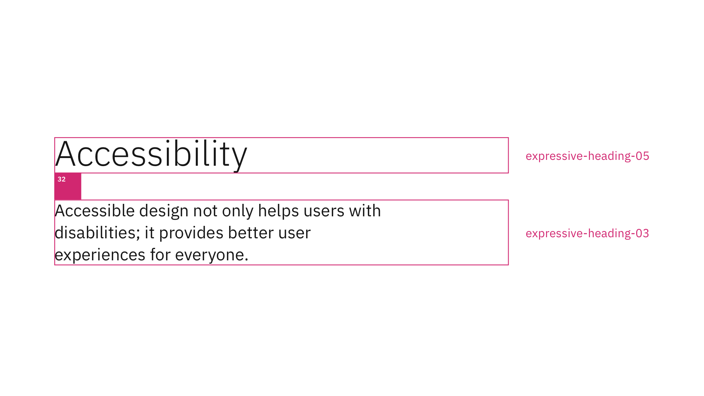
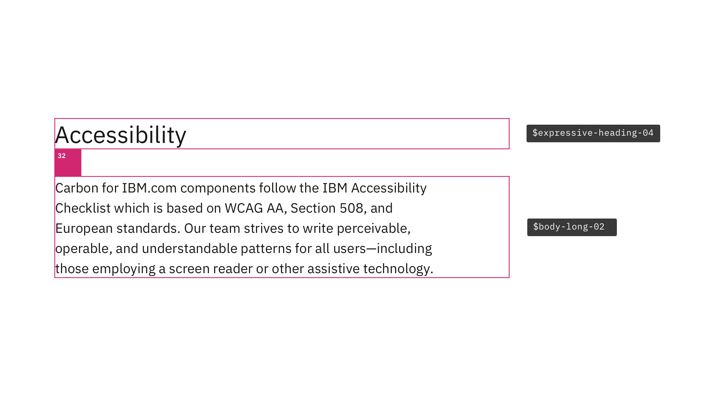

<PageDescription>

Typography can help create clear hierarchies, organize information, and guide users through a product or experience. It's essential to understand the [typeface](https://www.carbondesignsystem.com/guidelines/typography/overview/#typeface:-ibm-plex), [type scale](https://www.carbondesignsystem.com/guidelines/typography/overview/#scale), [type tokens](https://www.carbondesignsystem.com/guidelines/typography/overview/#type-tokens-and-sets), and the [Expressive type sets](https://www.carbondesignsystem.com/guidelines/typography/expressive) before dive into creating an IBM.com website page.

</PageDescription>

<AnchorLinks>

<AnchorLink>Designing with type parings and spacings</AnchorLink>
<AnchorLink>Support</AnchorLink>

</AnchorLinks>

## Designing with type parings and spacings

Type parings and spacings support different levels of architecture or areas that require varying typographic hierarchies and are the keys to making the best IBM.com experiences through typography successfully.

Below are some known type pairings and spacings when designing for IBM.com to ensure you create clear hierarchies, proper information organization, and the best experience to guide users through the IBM.com journey.
 

### Content section

Example of Expressive-heading-02 pair with Body-long-02 at large breakpoints.

<Row>
<Column colMd={8} colLg={8}>

</Column>
</Row>

**Tokens**

| `Type token` | `Breakpoint` | `info` |
| --- | --- | --- |
|`$expressive-heading-02`| Large |Type: IBM Plex Sans  Size: 16px / 1rem  Line-height: 24px / 1.5em  Weight: 600 / Semi-Bold  Letter-spacing: 0px |
|`$body-long-02`| Large |Type: IBM Plex Sans  Size: 16px / 1rem  Line-height: 22px / 1.375em  Weight: 400 / Regular  Letter-spacing: 0px |

**Spacing**

| Breakpoint | `max` | `xlg` | `lg` | `md` | `sm` | 
| --- | --- | --- | --- | --- | --- |
| Padding top | `spacing-09` 48px | `spacing-09` 48px | `spacing-09` 48px | `spacing-09` 48px | `spacing-09` 48px |
| Padding bottom | `spacing-10` 64px | `spacing-10` 64px | `spacing-10` 64px | `spacing-10` 64px | `spacing-10` 64px |

 

### Content block

Example of Expressive-heading-05 pair with Expressive-heading-03 at large breakpoints.

<Row>
<Column colMd={8} colLg={8}>

</Column>
</Row>

**Tokens**

| `Type token` | `Breakpoint` | `info` |
| --- | --- | --- |
|`$expressive-heading-05`| Large |Type: IBM Plex Sans  Size: 42px / 2.625rem  Line-height: 50px / 3.125em  Weight: 300 / Light  Letter-spacing: 0px |
|`$expressive-heading-03`| Large |Type: IBM Plex Sans  Size: 20px / 1.25rem  Line-height: 28px / 1.75em  Weight: 400 / Regular  Letter-spacing: 0px |

**Spacing**

| Breakpoint | `max` | `xlg` | `lg` | `md` | `sm` | 
| --- | --- | --- | --- | --- | --- |
| Margin top | `spacing-10` 64px | `spacing-10` 64px | `spacing-10` 64px | `spacing-07` 32px | `spacing-07` 32px |
| Margin bottom | `spacing-13` 160px | `spacing-13` 160px | `spacing-13` 160px | `spacing-12` 96px | `spacing-10` 64px |

 

### Content group

Example of Expressive-heading-04 pair with Body-long-02 at large breakpoints.

<Row>
<Column colMd={8} colLg={8}>

</Column>
</Row>

**Tokens**

| `Type token` | `Breakpoint` | `info` |
| --- | --- | --- |
|`$expressive-heading-04`| Large |Type: IBM Plex Sans  Size: 28px / 1.75rem  Line-height: 36px / 2.25em  Weight: 400 / Regular  Letter-spacing: 0px |
|`$body-long-02`| Large |Type: IBM Plex Sans  Size: 16px / 1rem  Line-height: 22px / 1.375em  Weight: 400 / Regular  Letter-spacing: 0px |

**Spacing**

| Breakpoint | `max` | `xlg` | `lg` | `md` | `sm` | 
| --- | --- | --- | --- | --- | --- |
| Margin top | `spacing-07` 32px | `spacing-07` 32px | `spacing-07` 32px | `spacing-07` 32px | `spacing-07` 32px |
| Margin bottom | `spacing-09` 48px | `spacing-09` 48px | `spacing-09` 48px | `spacing-09` 48px | `spacing-07` 32px |

 

### Content item

Example of Expressive-heading 02 pair with Body-long-02 at large breakpoints.

<Row>
<Column colMd={8} colLg={8}>

</Column>
</Row>

**Tokens**

| `Type token` | `Breakpoint` | `info` |
| --- | --- | --- |
|`$expressive-heading-02`| Large |Type: IBM Plex Sans  Size: 16px / 1rem  Line-height: 24px / 1.5em  Weight: 600 / Semi-Bold  Letter-spacing: 0px |
|`$body-long-02`| Large |Type: IBM Plex Sans  Size: 16px / 1rem  Line-height: 24px / 1.375em  Weight: 400 / Regular  Letter-spacing: 0px |

**Spacing**

| Breakpoint | `max` | `xlg` | `lg` | `md` | `sm` | 
| --- | --- | --- | --- | --- | --- |
| Padding top | `spacing-07` 32px | `spacing-07` 32px | `spacing-07` 32px | `spacing-07` 32px | `spacing-07` 32px |
| Padding bottom | `spacing-07` 32px | `spacing-07` 32px | `spacing-07` 32px | `spacing-07` 32px | `spacing-07` 32px |

 

## Support

For any reason, if the pairings or spacings listed above do not meet your needs, please contact the Digital Design System team via the [#carbon-for-ibm-dotcom slack channel](https://cognitive-app.slack.com/archives/C2PLX8GQ6). 
