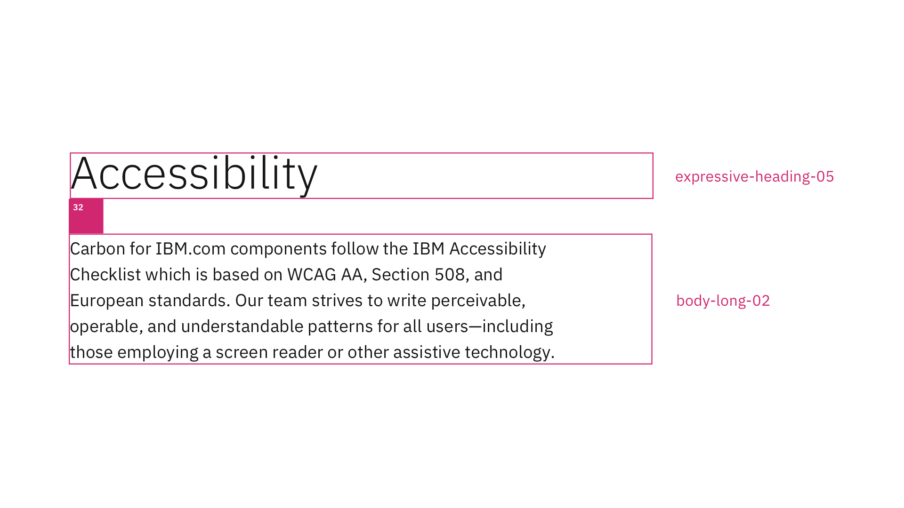

<PageDescription>

Typography can help create clear hierarchies, organize information, and guide users through a product or experience. Type parings and spacings support different levels of architecture or areas that require varying typographic hierarchies and are the keys to making the best IBM.com experiences through typography successfully.
</PageDescription>

<AnchorLinks>

<AnchorLink>Type pairing</AnchorLink>
<AnchorLink>Type spacing</AnchorLink>
<AnchorLink>Support</AnchorLink>

</AnchorLinks>

## Type pairing

It's essential to understand the [typeface](https://www.carbondesignsystem.com/guidelines/typography/overview/#typeface:-ibm-plex), [type scale](https://www.carbondesignsystem.com/guidelines/typography/overview/#scale), [type tokens](https://www.carbondesignsystem.com/guidelines/typography/overview/#type-tokens-and-sets), and the [Expressive type sets](https://www.carbondesignsystem.com/guidelines/typography/expressive) before dive into creating an IBM.com website page.

Below are some known type parings when designing for IBM.com to ensure you create clear hierarchies, proper information organization, and the best experience to guide users through the IBM.com experience.
 

### Expressive heading 05 and heading03

<Row>
<Column colMd={8} colLg={8}>

</Column>
</Row>

<Caption>Example of Expressive Heading 05 pair with Expressive Heading 03 at large breakpoints.</Caption>

 

### Expressive heading 05 and body long 02

<Row>
<Column colMd={8} colLg={8}>

</Column>
</Row>

<Caption>Example of Expressive Heading 05 pair with body long 02 at large breakpoints.</Caption>

 

### Expressive heading 04 and body long 02

<Row>
<Column colMd={8} colLg={8}>

</Column>
</Row>

<Caption>Example of Expressive Heading 04 pair with body long 02 at large breakpoints.</Caption>

 

### Expressive heading 02 and body long 02

<Row>
<Column colMd={8} colLg={8}>

</Column>
</Row>

<Caption>Example of Expressive Heading 02 pair with body long 02 at large breakpoints.</Caption>

 

 

## Type spacing
Spacing can help you deliver clear, functional layouts. Carbon for IBM.com uses the Spacing scale and spacing token, and you can learn more about them with the [Spacing guideline](https://www.carbondesignsystem.com/guidelines/spacing/overview/) on the Carbon website.

Below is some standard Carbon for IBM.com spacing set-ups to help you get started.
 

### Content block 

**Headline type style**  

`expressive-heading-05` 

**Spacing**

| Breakpoint | `max` | `xlg` | `lg` | `md` | `sm` | 
| --- | --- | --- | --- | --- | --- |
| Margin top | `spacing-10` 64px | `spacing-10` 64px | `spacing-10` 64px | `spacing-07` 32px | `spacing-07` 32px |
| Margin bottom | `spacing-13` 160px | `spacing-13` 160px | `spacing-13` 160px | `spacing-12` 96px | `spacing-10` 64px |

 

### Content group 

**Headline type style** 

`expressive-heading-04` 

**Spacing**

| Breakpoint | `max` | `xlg` | `lg` | `md` | `sm` | 
| --- | --- | --- | --- | --- | --- |
| Margin top | `spacing-07` 32px | `spacing-07` 32px | `spacing-07` 32px | `spacing-07` 32px | `spacing-07` 32px |
| Margin bottom | `spacing-09` 48px | `spacing-09` 48px | `spacing-09` 48px | `spacing-09` 48px | `spacing-07` 32px |

 

### Content section 

**Headline type style**  

`expressive-heading-02` 

**Spacing**

| Breakpoint | `max` | `xlg` | `lg` | `md` | `sm` | 
| --- | --- | --- | --- | --- | --- |
| Padding top | ? | ? | ? | ? | ? |
| Padding bottom | ? | ? | ? | ? | ? |

 

### Content item

**Headline type style**  

`expressive-heading-02` 

**Spacing**

| Breakpoint | `max` | `xlg` | `lg` | `md` | `sm` | 
| --- | --- | --- | --- | --- | --- |
| Padding top | ? | ? | ? | ? | ? |
| Padding bottom | ? | ? | ? | ? | ? |

 

## Support

For any reason, if the pairings or spacings listed above do not meet your needs, please contact the Digital Design System team via the [#carbon-for-ibm-dotcom slack channel](https://cognitive-app.slack.com/archives/C2PLX8GQ6). 
