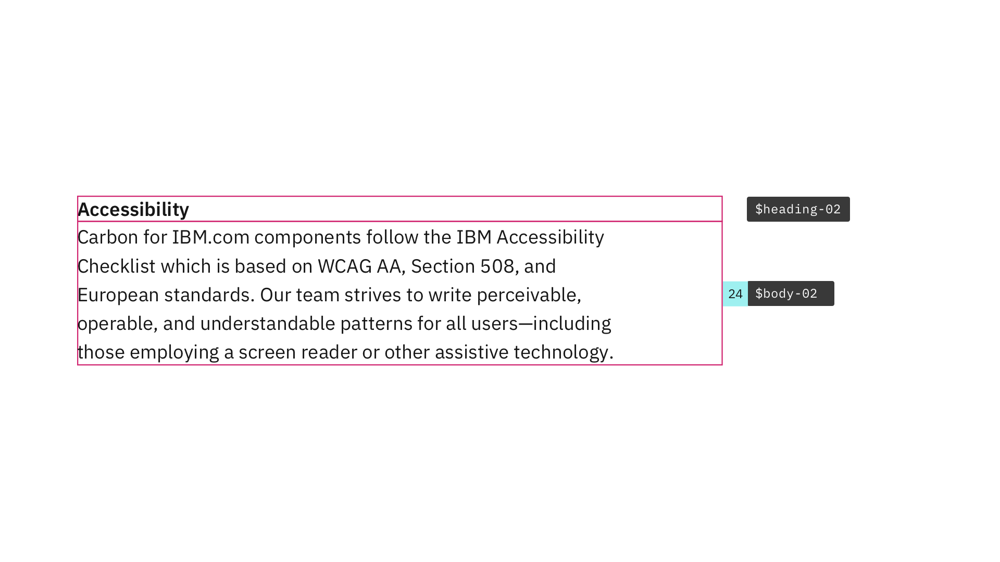
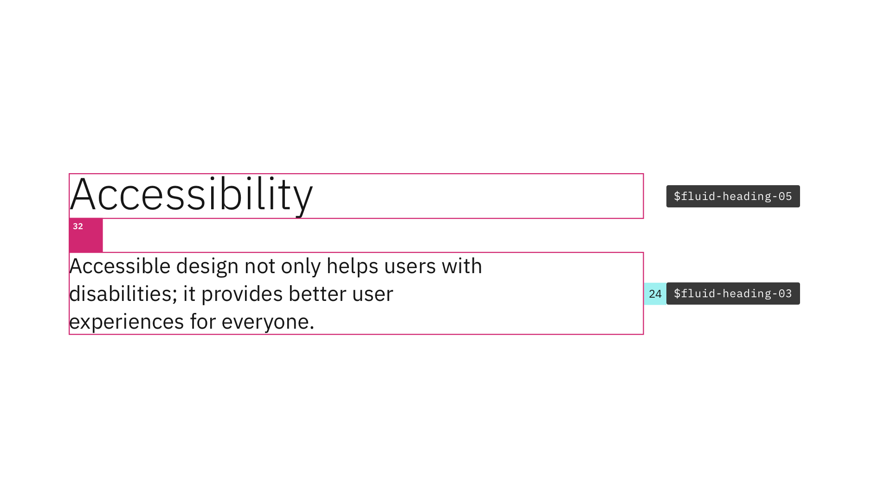
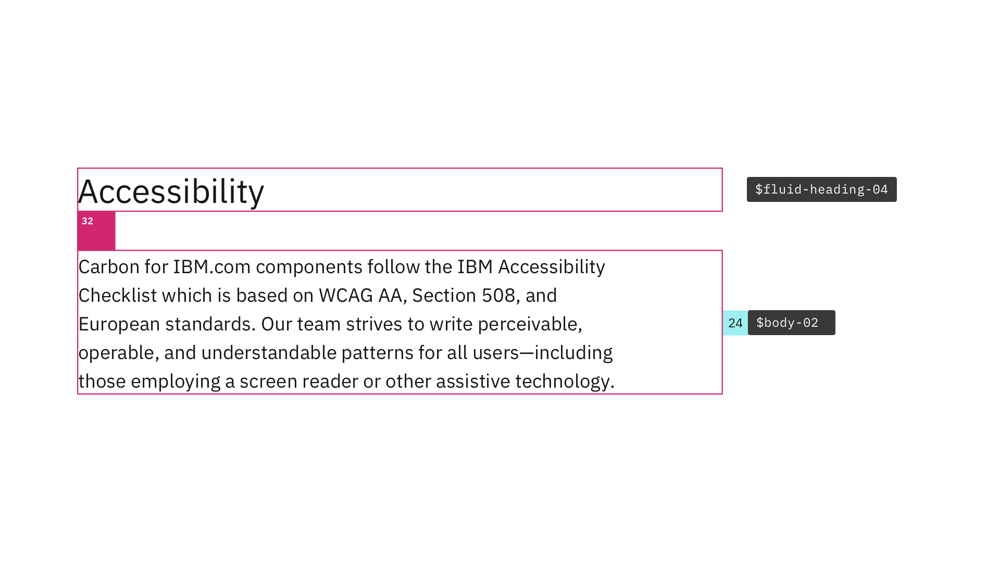

<PageDescription>

Typography can help create clear hierarchies, organize information, and guide users through a product or experience. Together with spacing, type pairings support different levels of architecture or areas that require varying typographic hierarchies.

</PageDescription>

<AnchorLinks>

<AnchorLink>Overview</AnchorLink>
<AnchorLink>Designing with type pairs</AnchorLink>
<AnchorLink>Content section</AnchorLink>
<AnchorLink>Content block</AnchorLink>
<AnchorLink>Content group</AnchorLink>
<AnchorLink>Content item</AnchorLink>
<AnchorLink>Support</AnchorLink>

</AnchorLinks>

## Overview

Within Carbon, there are two type sets available for use with productive and expressive experiences, and each type set includes styles that have been designed with expectations about hierarchy in mind. People unconsciously use type size as a signal of hierarchy, and so it's important to follow the correct type pairings when choosing which styles to use on your page.

Below are some common type pairings and spacings that provide clear visual cues for hierarchy and information organization.

<InlineNotification>

For more information about typography, type usage, and the type set details see the [Carbon typography guidelines](https://carbondesignsystem.com/guidelines/typography/overview/). 

</InlineNotification>

## Content section

Content section pairs `$heading-02` and `$body-02` with no space between the two type styles.

<Row>
<Column colMd={8} colLg={8}>

<Caption>Example of $heading-02 and $body-02 pairing, shown at the large breakpoint</Caption>

</Column>
</Row>

### Tokens for Content section

| `Type token` | `Breakpoint` | `info` |
| --- | --- | --- |
|`$heading-02`| Large |Type: IBM Plex Sans  Size: 16px / 1rem  Line-height: 24px / 1.5em  Weight: 600 / Semi-Bold  Letter-spacing: 0px |
|`$body-02`| Large |Type: IBM Plex Sans  Size: 16px / 1rem  Line-height: 24px / 1.5em  Weight: 400 / Regular  Letter-spacing: 0px |

### Spacing for Content section

| Breakpoint | `max` | `xlg` | `lg` | `md` | `sm` | 
| --- | --- | --- | --- | --- | --- |
| Padding top | `spacing-09` 48px | `spacing-09` 48px | `spacing-09` 48px | `spacing-09` 48px | `spacing-09` 48px |
| Padding bottom | `spacing-10` 64px | `spacing-10` 64px | `spacing-10` 64px | `spacing-10` 64px | `spacing-10` 64px |

 

## Content block

Content block pairs `$fluid-heading-05` and `$fluid-heading-03` with 32px of space between the two type styles.

<Row>
<Column colMd={8} colLg={8}>

<Caption>Example of $fluid-heading-05 and $fluid-heading-03 pairing, shown at the large breakpoint</Caption>

</Column>
</Row>

### Tokens for Content block

| `Type token` | `Breakpoint` | `info` |
| --- | --- | --- |
|`$fluid-heading-05`| Large |Type: IBM Plex Sans  Size: 42px / 2.625rem  Line-height: 50px / 3.125em  Weight: 300 / Light  Letter-spacing: 0px |
|`$fluid-heading-03`| Large |Type: IBM Plex Sans  Size: 20px / 1.25rem  Line-height: 28px / 1.75em  Weight: 400 / Regular  Letter-spacing: 0px |

### Spacing for Content block

| Breakpoint | `max` | `xlg` | `lg` | `md` | `sm` | 
| --- | --- | --- | --- | --- | --- |
| Margin top | `spacing-10` 64px | `spacing-10` 64px | `spacing-10` 64px | `spacing-07` 32px | `spacing-07` 32px |
| Margin bottom | `spacing-13` 160px | `spacing-13` 160px | `spacing-13` 160px | `spacing-12` 96px | `spacing-10` 64px |

 

## Content group

Content group pairs `$fluid-heading-04` and `$body-02` with 32px of space between the two type styles.

<Row>
<Column colMd={8} colLg={8}>

<Caption>Example of $fluid-heading-04 and $body-02 pairing, shown at the large breakpoint</Caption>

</Column>
</Row>

### Tokens for Content group

| `Type token` | `Breakpoint` | `info` |
| --- | --- | --- |
|`$fluid-heading-04`| Large |Type: IBM Plex Sans  Size: 28px / 1.75rem  Line-height: 36px / 2.25em  Weight: 400 / Regular  Letter-spacing: 0px |
|`$body-02`| Large |Type: IBM Plex Sans  Size: 16px / 1rem  Line-height: 24px / 1.5em  Weight: 400 / Regular  Letter-spacing: 0px |

### Spacing for Content group

| Breakpoint | `max` | `xlg` | `lg` | `md` | `sm` | 
| --- | --- | --- | --- | --- | --- |
| Margin top | `spacing-07` 32px | `spacing-07` 32px | `spacing-07` 32px | `spacing-07` 32px | `spacing-07` 32px |
| Margin bottom | `spacing-09` 48px | `spacing-09` 48px | `spacing-09` 48px | `spacing-09` 48px | `spacing-07` 32px |

 

## Content item

Content item pairs `$heading-02` and `$body-02` with no space between the two type styles, the example below shows the large breakpoint.

<Row>
<Column colMd={8} colLg={8}>

<Caption>Example of $heading-02 and $body-02 pairing, shown at the large breakpoint</Caption>

</Column>
</Row>

### Tokens for Content item

| `Type token` | `Breakpoint` | `info` |
| --- | --- | --- |
|`$heading-02`| Large |Type: IBM Plex Sans  Size: 16px / 1rem  Line-height: 24px / 1.5em  Weight: 600 / Semi-Bold  Letter-spacing: 0px |
|`$body-02`| Large |Type: IBM Plex Sans  Size: 16px / 1rem  Line-height: 24px / 1.5em  Weight: 400 / Regular  Letter-spacing: 0px |

### Spacing for Content item

| Breakpoint | `max` | `xlg` | `lg` | `md` | `sm` | 
| --- | --- | --- | --- | --- | --- |
| Padding top | `spacing-07` 32px | `spacing-07` 32px | `spacing-07` 32px | `spacing-07` 32px | `spacing-07` 32px |
| Padding bottom | `spacing-07` 32px | `spacing-07` 32px | `spacing-07` 32px | `spacing-07` 32px | `spacing-07` 32px |

## Support

If for any reason, the type pairings or spacings listed above do not meet your needs, please contact the Digital Design System team via the [#carbon-for-ibm-dotcom slack channel](https://cognitive-app.slack.com/archives/C2PLX8GQ6). 
