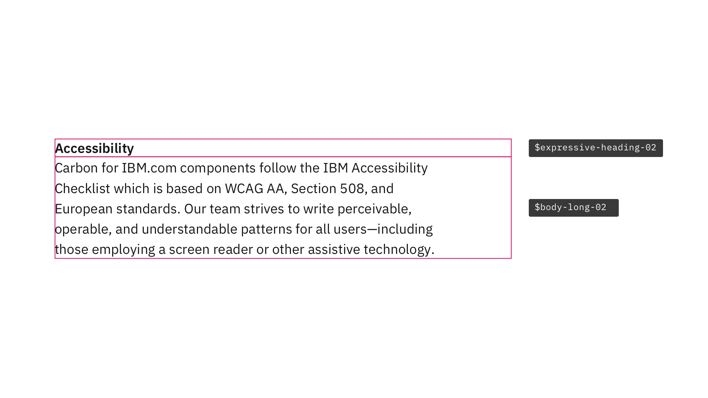

<PageDescription>

Typography can help create clear hierarchies, organize information, and guide users through a product or experience. It's essential to understand the [typeface](https://www.carbondesignsystem.com/guidelines/typography/overview/#typeface:-ibm-plex), [type scale](https://www.carbondesignsystem.com/guidelines/typography/overview/#scale), [type tokens](https://www.carbondesignsystem.com/guidelines/typography/overview/#type-tokens-and-sets), and the [expressive type sets](https://www.carbondesignsystem.com/guidelines/typography/expressive) before diving into creating an IBM.com experience.

</PageDescription>

 

## Designing with type pairs

Consistent type pairing, along with the correct spacing, can support different levels, which are the keys to making the best IBM.com experience.

Below are some common type pairings and spacings when designing for IBM.com to ensure you create clear hierarchies, proper information organization, and the best experience to guide users through the IBM.com journey.
 

### Content section

Content section pairs `$expressive-heading-02` and `$body-long-02` with no space between the two type styles, the example below shows the large breakpoint.

<Row>
<Column colMd={8} colLg={8}>

</Column>
</Row>

**Tokens**

| `Type token` | `Breakpoint` | `info` |
| --- | --- | --- |
|`$expressive-heading-02`| Large |Type: IBM Plex Sans  Size: 16px / 1rem  Line-height: 24px / 1.5em  Weight: 600 / Semi-Bold  Letter-spacing: 0px |
|`$body-long-02`| Large |Type: IBM Plex Sans  Size: 16px / 1rem  Line-height: 24px / 1.375em  Weight: 400 / Regular  Letter-spacing: 0px |

**Spacing**

| Breakpoint | `max` | `xlg` | `lg` | `md` | `sm` | 
| --- | --- | --- | --- | --- | --- |
| Padding top | `spacing-09` 48px | `spacing-09` 48px | `spacing-09` 48px | `spacing-09` 48px | `spacing-09` 48px |
| Padding bottom | `spacing-10` 64px | `spacing-10` 64px | `spacing-10` 64px | `spacing-10` 64px | `spacing-10` 64px |

 

### Content block

Content block pairs `$expressive-heading-05` and `$expressive-heading-03` with 32px of space between the two type styles, the example below shows the large breakpoint.

<Row>
<Column colMd={8} colLg={8}>

</Column>
</Row>

**Tokens**

| `Type token` | `Breakpoint` | `info` |
| --- | --- | --- |
|`$expressive-heading-05`| Large |Type: IBM Plex Sans  Size: 42px / 2.625rem  Line-height: 50px / 3.125em  Weight: 300 / Light  Letter-spacing: 0px |
|`$expressive-heading-03`| Large |Type: IBM Plex Sans  Size: 20px / 1.25rem  Line-height: 28px / 1.75em  Weight: 400 / Regular  Letter-spacing: 0px |

**Spacing**

| Breakpoint | `max` | `xlg` | `lg` | `md` | `sm` | 
| --- | --- | --- | --- | --- | --- |
| Margin top | `spacing-10` 64px | `spacing-10` 64px | `spacing-10` 64px | `spacing-07` 32px | `spacing-07` 32px |
| Margin bottom | `spacing-13` 160px | `spacing-13` 160px | `spacing-13` 160px | `spacing-12` 96px | `spacing-10` 64px |

 

### Content group

Content group pairs `$expressive-heading-04` and `$body-long-02` with 32px of space between the two type styles, the example below shows the large breakpoint.

<Row>
<Column colMd={8} colLg={8}>

</Column>
</Row>

**Tokens**

| `Type token` | `Breakpoint` | `info` |
| --- | --- | --- |
|`$expressive-heading-04`| Large |Type: IBM Plex Sans  Size: 28px / 1.75rem  Line-height: 36px / 2.25em  Weight: 400 / Regular  Letter-spacing: 0px |
|`$body-long-02`| Large |Type: IBM Plex Sans  Size: 16px / 1rem  Line-height: 24px / 1.375em  Weight: 400 / Regular  Letter-spacing: 0px |

**Spacing**

| Breakpoint | `max` | `xlg` | `lg` | `md` | `sm` | 
| --- | --- | --- | --- | --- | --- |
| Margin top | `spacing-07` 32px | `spacing-07` 32px | `spacing-07` 32px | `spacing-07` 32px | `spacing-07` 32px |
| Margin bottom | `spacing-09` 48px | `spacing-09` 48px | `spacing-09` 48px | `spacing-09` 48px | `spacing-07` 32px |

 

### Content item

Content item pairs `$expressive-heading-02` and `$body-long-02` with no space between the two type styles, the example below shows the large breakpoint.

<Row>
<Column colMd={8} colLg={8}>

</Column>
</Row>

**Tokens**

| `Type token` | `Breakpoint` | `info` |
| --- | --- | --- |
|`$expressive-heading-02`| Large |Type: IBM Plex Sans  Size: 16px / 1rem  Line-height: 24px / 1.5em  Weight: 600 / Semi-Bold  Letter-spacing: 0px |
|`$body-long-02`| Large |Type: IBM Plex Sans  Size: 16px / 1rem  Line-height: 24px / 1.375em  Weight: 400 / Regular  Letter-spacing: 0px |

**Spacing**

| Breakpoint | `max` | `xlg` | `lg` | `md` | `sm` | 
| --- | --- | --- | --- | --- | --- |
| Padding top | `spacing-07` 32px | `spacing-07` 32px | `spacing-07` 32px | `spacing-07` 32px | `spacing-07` 32px |
| Padding bottom | `spacing-07` 32px | `spacing-07` 32px | `spacing-07` 32px | `spacing-07` 32px | `spacing-07` 32px |

 

## Support

If for any reason, the type pairings or spacings listed above do not meet your needs, please contact the Digital Design System team via the [#carbon-for-ibm-dotcom slack channel](https://cognitive-app.slack.com/archives/C2PLX8GQ6). 
