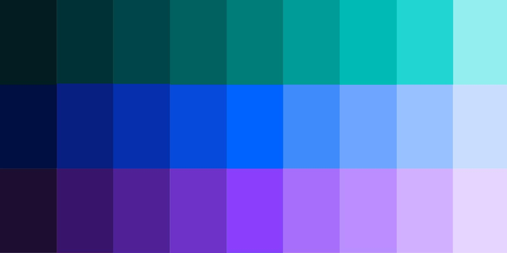
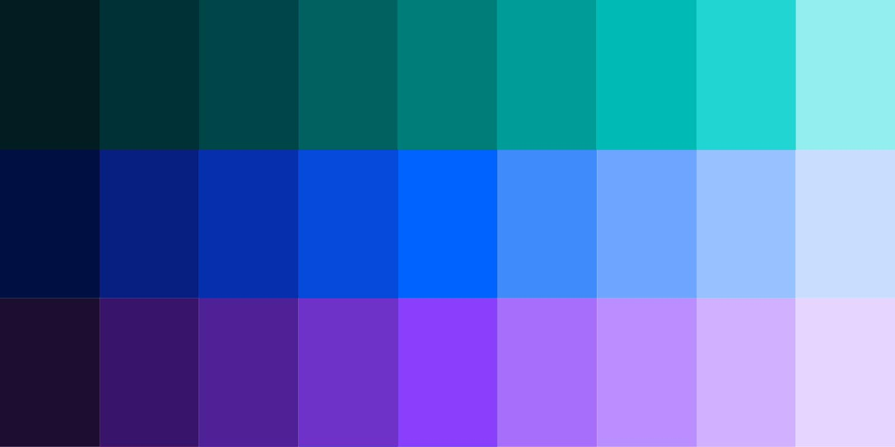
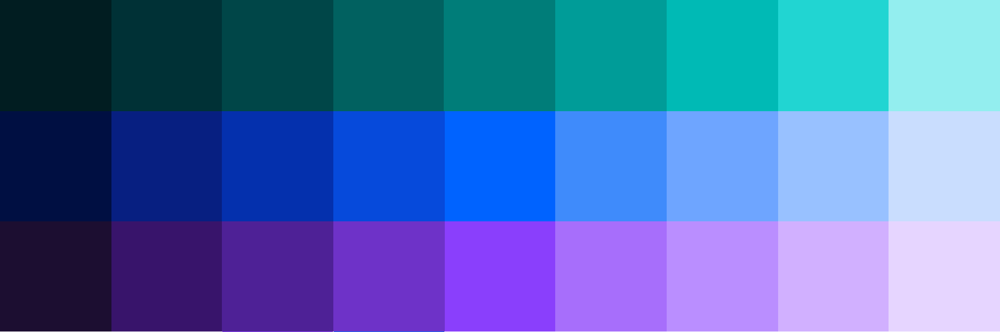
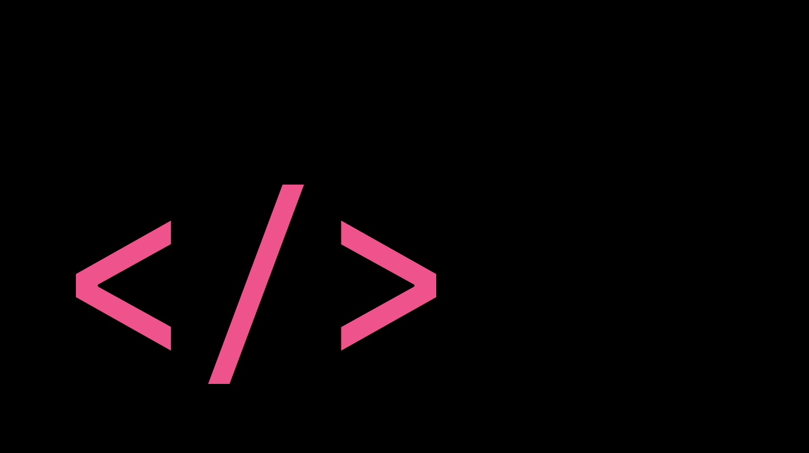
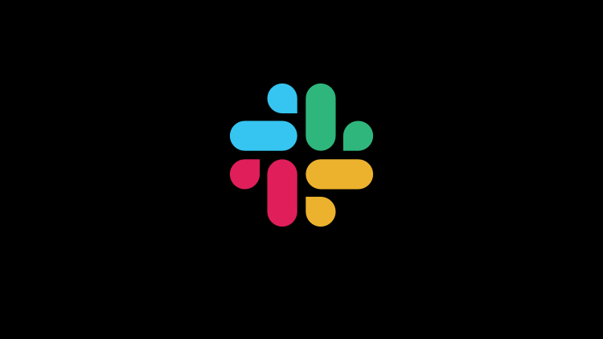

import HomepageTemplate from 'gatsby-theme-carbon/src/templates/Homepage';

export default HomepageTemplate;

### Getting Started

<FeatureCard
    color="dark"
    href="getting-started/designing"
    subTitle="Start"
    title="Designing"
    actionIcon="arrowRight"
    className="homepage-feature"
    >

<ArtDirection>

</ArtDirection>

</FeatureCard>

<FeatureCard
    color="dark"
    href="getting-started/coding"
    subTitle="Start"
    title="Coding"
    actionIcon="arrowRight"
    className="homepage-feature"
    >

<ArtDirection>

</ArtDirection>

</FeatureCard>

### Other resources

The component libraries give developers a collection of reusable components for
building websites and user interfaces. See a
[complete list of resources.](/resources)

<Row className="resource-card-group">
  <Column colMd={4} colLg={4} noGutterSm>
    <ResourceCard
      color="dark"
      subTitle="Sketch Theme libraries"
      href="/resources#theme-libraries"
      >

</ResourceCard>
  </Column>
  <Column colMd={4} colLg={4} noGutterSm>
   <ResourceCard
       color="dark"
       subTitle="IBM.com Library Components Repo"
       href="https://github.com/carbon-design-system/ibm-dotcom-library"
       >

   
</ResourceCard>
  </Column>
<Column colLg={4} colMd={4} noGutterSm>
  <ResourceCard
    color="dark"
    subTitle="IBM.com Library Components React Storybook"
    href="https://ibmdotcom-react.netlify.com/?path=/story/*"
    >

  </ResourceCard>
</Column>
<Column colLg={4} colMd={4} noGutterSm>
  <ResourceCard
    color="dark"
    subTitle="IBM.com Library Pattern React Storybook (experimental)"
    href="https://ibmdotcom-patterns-react-experimental.netlify.com/?path=/story/*"
    >

  </ResourceCard>
</Column>
</Row>

### Latest news

<Row>
  <Column colLg={4} colMd={4} noGutterMdLeft>
<ArticleCard
    color="dark"
    title="Roadmap"
    author="Last updated"
    date="December 20, 2019"
    href="https://github.com/carbon-design-system/ibm-dotcom-library/wiki/Roadmap"
    >

</ArticleCard>
</Column>
<Column colLg={4} colMd={4} noGutterMdLeft>
<ArticleCard
    color="dark"
    title="Release schedule"
    author=""
    date="IBM.com Library"
    href="https://github.com/carbon-design-system/ibm-dotcom-library/issues"
    >

</ArticleCard>
</Column>

<Column colLg={4} colMd={4} noGutterMdLeft>
<ArticleCard
    color="dark"
    title="Slack channel"
    author=""
    date="#ibm-digital-design"
    href="https://cognitive-app.slack.com/archives/C2PLX8GQ6"
    >

</ArticleCard>
</Column>
</Row>
