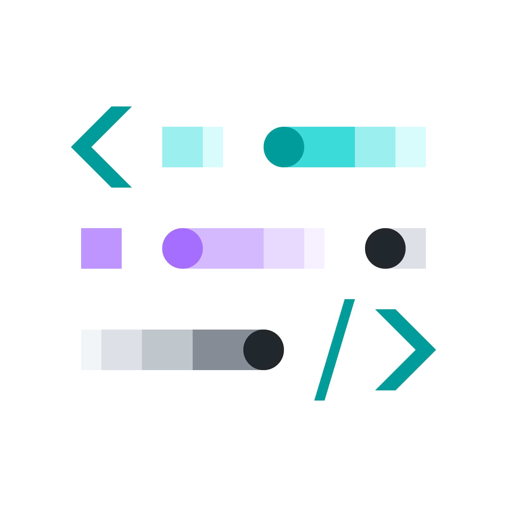
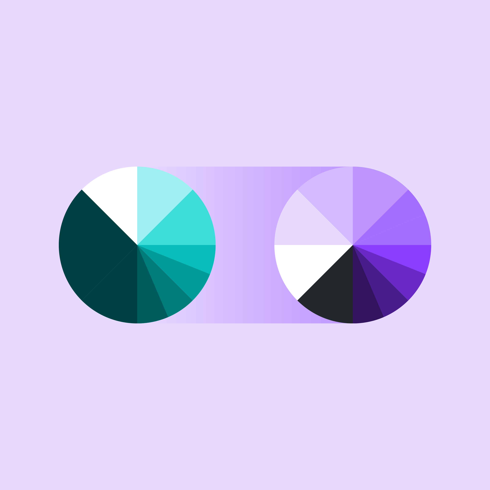
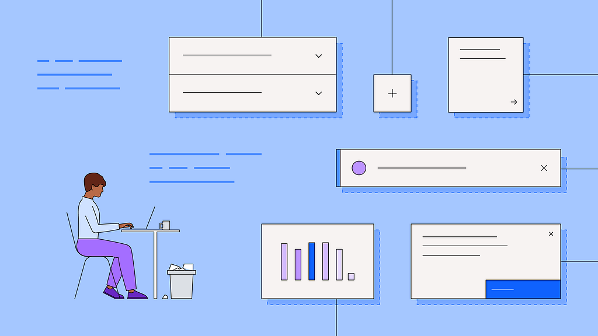

import HomepageTemplate from 'gatsby-theme-carbon/src/templates/Homepage';

export default HomepageTemplate;

<Row className="resource-card-group feature-card-group">
<Column colMd={4} colLg={4} noGutterSm>
    <ImageCard
      title="Design"
      aspectRatio="1:1"
      href="/designing"
      actionIcon="arrowRight"
      titleColor="dark"
      subTitleColor="dark"
      iconColor="dark"
      >

  </ImageCard>
</Column>

<Column colMd={4} colLg={4} noGutterSm>
    <ImageCard
      title="Develop"
      aspectRatio="1:1"
      href="/developing"
      actionIcon="arrowRight"
      titleColor="dark"
      subTitleColor="dark"
      iconColor="dark"
      >

  </ImageCard>
</Column>

<Column colMd={4} colLg={4} noGutterSm>
    <ImageCard
      title="Migration guide"
      aspectRatio="1:1"
      href="/contributing/overview"
      actionIcon="arrowRight"
      titleColor="dark"
      subTitleColor="dark"
      iconColor="dark"
      >

  </ImageCard>
</Column>
</Row>

## The Foundations

Carbon for IBM.com is built with foundations from IBM Design Language and Carbon Design System, while also following IBM Web Standards. This is how we maintain consistency and alignments across IBM digital experiences.

<Row className={principlesSection}>
<Column colMd={2} colLg={4}>

### IBM Design Language

</Column>
<Column colMd={6} colLg={8}>

The <a href="https://www.ibm.com/design/language/" target="_blank">IBM Design Language</a> provides the guidance and assets used to express the IBM brand in products, communications, marketing, events and digital experiences. Carbon for IBM.com looks to the Design Language for the grid best practices, pictogram, and icons.

</Column>
</Row>

<Row className={principlesSection}>
<Column colMd={2} colLg={4}>

### Carbon Design System

</Column>
<Column colMd={6} colLg={8}>

The <a href="https://carbondesignsystem.com/" target="_blank">Carbon Design System</a> is IBM's open source design system for products and digital experiences. Carbon for IBM.com depends on Carbon Design System’s elements packages like type, color, and spacing tokens, along with the core components.

</Column>
</Row>

<Row className={principlesSection}>
<Column colMd={2} colLg={4}>

### IBM Web Standards

</Column>
<Column colMd={6} colLg={8}>

The <a href="https://www.ibm.com/standards/web/" target="_blank">IBM Web Standards</a> ensure design excellence, along with technical and legal compliance. It is extremely important that teams follow the governance and adhere to the standards. <em>IBMer access only</em>.

</Column>
</Row>

<ExpressiveListContainer
  title="IBM Design Language"
  text="The <a href="https://www.ibm.com/design/language/" target="_blank">IBM Design Language</a> provides the guidance and assets used to express the IBM brand in products, communications, marketing, events and digital experiences. Carbon for IBM.com looks to the Design Language for the grid best practices, pictogram, and icons.">
</ExpressiveListContainer>

<ExpressiveListContainer
  title="Carbon Design System"
  text="[The Carbon Design System](https://carbondesignsystem.com/) is IBM's open source design system for products and digital experiences. Carbon for IBM.com depends on Carbon Design System’s elements packages like type, color, and spacing tokens, along with the core components.">
</ExpressiveListContainer>

<ExpressiveListContainer
  title="IBM Design Language"
  text="The [IBM Web Standards](https://www.ibm.com/standards/web/) ensure design excellence, along with technical and legal compliance. It is extremely important that teams follow the governance and adhere to the standards. <em>IBMer access only</em>.">
</ExpressiveListContainer>

## Resources

<Row className="resource-card-group">
  <Column colMd={4} colLg={4} noGutterSm>
   <ResourceCard
       title="Web Components Storybook"
       target="_blank"
       href="https://www.ibm.com/standards/carbon/web-components/"
       >

</ResourceCard>
  </Column>
<Column colLg={4} colMd={4} noGutterSm>
  <ResourceCard
    title="Web Components React Wrapper Storybook"
    target="_blank"
    href="https://www.ibm.com/standards/carbon/react/"
    >

  </ResourceCard>
</Column>

<Column colLg={4} colMd={4} noGutterSm>
  <ResourceCard
    title="Figma kit"
    actionIcon="arrowRight"
    href="/designing/figma-kit"
    >

</ResourceCard>
</Column>
</Row>

## Latest news and articles

<Row>
<Column colMd={4} colLg={4} noGutterMdLeft>
    <ArticleCard
      title="Carbon Web Components V2: Full Release"
      author="Ariella Gilmore"
      date="Aug 17, 2023"
      href="https://medium.com/carbondesign/carbon-web-components-v2-full-release-40fc25c73bef"
      actionIcon="arrowRight">

  </ArticleCard>
  </Column>

<Column colMd={4} colLg={4} noGutterMdLeft>
    <ArticleCard
      title="Release Candidate: Carbon Web Components v2"
      author="Ariella Gilmore"
      date="Jun 27, 2023"
      href="https://medium.com/carbondesign/carbon-web-components-v2-release-candidate-2f3acb940406"
      actionIcon="arrowRight">

  </ArticleCard>
  </Column>

<Column colMd={4} colLg={4} noGutterMdLeft>
    <ArticleCard
      title="Introducing: Carbon Web Components v2"
      author="Ariella Gilmore"
      date="Mar 30, 2023"
      href="https://medium.com/carbondesign/introducing-carbon-web-components-v2-bfc5fc8d58d9"
      actionIcon="arrowRight">

  </ArticleCard>
  </Column>
</Row>

## Community

Our design system is as strong as the community we serve. Connect with us, use our resources,
contribute back. Let's work together to build great experiences!

<Row className="resource-card-group">
  <Column colMd={4} colLg={4} noGutterSm>
    <ResourceCard
      title="Slack"
      actionIcon="arrowRight"
      href="https://app.slack.com/client/T1GPWGMPT/C2PLX8GQ6"
      >

</ResourceCard>
  </Column>
<Column colLg={4} colMd={4} noGutterSm>
  <ResourceCard
    title="GitHub"
    actionIcon="arrowRight"
    href="https://github.com/carbon-design-system/carbon-for-ibm-dotcom"
    >

</ResourceCard>
  </Column>
</Row>
