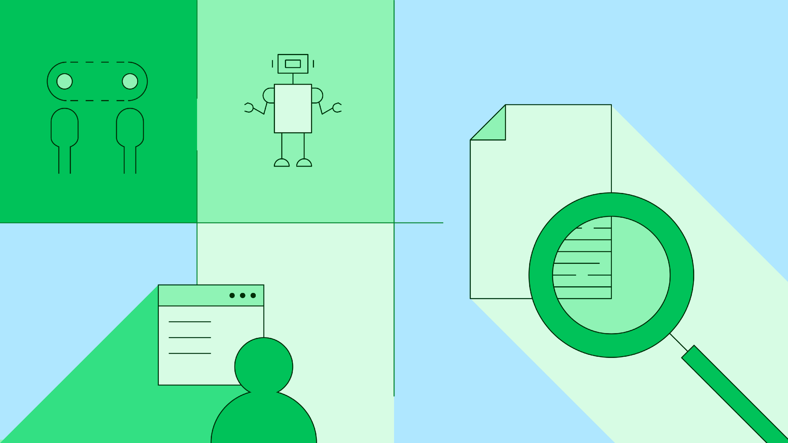
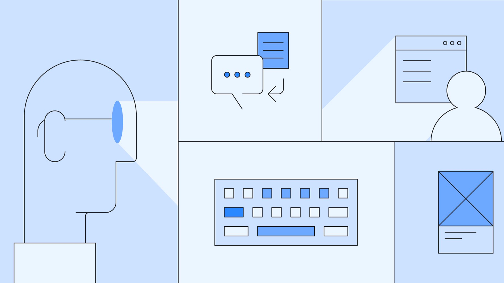
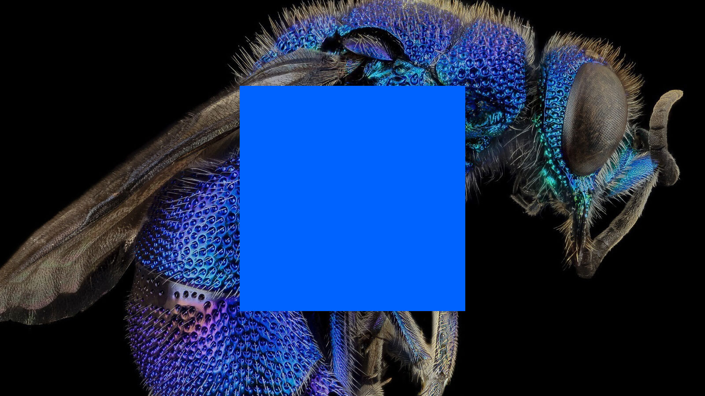

import HomepageTemplate from 'gatsby-theme-carbon/src/templates/Homepage';

export default HomepageTemplate;

## Getting started

<Row className="resource-card-group feature-card-group">
<Column colMd={4} colLg={4} noGutterSm>
    <ImageCard
      title="Designing"
      aspectRatio="1:1"
      href="/designing"
      actionIcon="arrowRight"
      titleColor="light"
      subTitleColor="light"
      >

  </ImageCard>
</Column>

<Column colMd={4} colLg={4} noGutterSm>
    <ImageCard
      title="Developing"
      aspectRatio="1:1"
      href="/developing"
      actionIcon="arrowRight"
      titleColor="light"
      subTitleColor="light"
      >

  </ImageCard>
</Column>

<Column colMd={4} colLg={4} noGutterSm>
    <ImageCard
      title="Contributing"
      aspectRatio="1:1"
      href="/contributing/overview"
      actionIcon="arrowRight"
      titleColor="dark"
      subTitleColor="dark"
      iconColor="dark"
      >

  </ImageCard>
</Column>
</Row>

## The Foundations

Carbon for IBM.com is built on strong foundations. Learn how the IBM Web Standards,
the Carbon Design System, and the IBM Design Language define what's
possible for your page implementations.

<FeatureCard
    color="dark"
    href="https://www.ibm.com/standards/web/"
    title="IBM Web Standards"
    actionIcon="arrowRight"
    className="homepage-feature"
    >

<ArtDirection>

</ArtDirection>

</FeatureCard>

<Row className="resource-card-group">
  <Column colMd={4} colLg={4} noGutterSm>
    <ResourceCard
      color="dark"
      title="Carbon Design System"
      actionIcon="launch"
      target="_blank"
      href="https://carbondesignsystem.com/"
      >

</ResourceCard>
  </Column>
<Column colLg={4} colMd={4} noGutterSm>
  <ResourceCard
    color="dark"
    title="IBM Design Language"
    actionIcon="launch"
    target="_blank"
    href="https://ibm.com/design/language"
    >

</ResourceCard>
  </Column>
</Row>

## Resources

<Row className="resource-card-group">
  <Column colMd={4} colLg={4} noGutterSm>
    <ResourceCard
      color="dark"
      title="Sketch kits"
      actionIcon="arrowRight"
      href="/designing/sketch-kit"
      >

</ResourceCard>
  </Column>
<Column colLg={4} colMd={4} noGutterSm>
  <ResourceCard
    color="dark"
    title="Figma kit"
    actionIcon="arrowRight"
    href="/designing/figma-kit"
    >

</ResourceCard>
  </Column>
  <Column colMd={4} colLg={4} noGutterSm>
   <ResourceCard
       color="dark"
       title="Web components Storybook"
       target="_blank"
       href="https://www.ibm.com/standards/carbon/web-components/"
       >

</ResourceCard>
  </Column>
<Column colLg={4} colMd={4} noGutterSm>
  <ResourceCard
    color="dark"
    title="React components Storybook"
    target="_blank"
    href="https://www.ibm.com/standards/carbon/react/"
    >

  </ResourceCard>
</Column>
</Row>

## Latest news and articles

<Row>
  <Column colMd={4} colLg={4} noGutterMdLeft>
    <ArticleCard
      title="Automating a Design System"
      author="Jeff Chew"
      date="Oct 6, 2021"
      readTime="Read time: 6 min"
      color="dark"
      href="https://medium.com/carbondesign/automating-a-design-system-69bd2414f75"
      actionIcon="arrowRight">

  </ArticleCard>
  </Column>
  <Column colMd={4} colLg={4} noGutterMdLeft>
    <ArticleCard
      title="Navigating the Browser Blind"
      author="Ariella Gilmore"
      date="Sep 14, 2021"
      readTime="Read time: 4 min"
      color="dark"
      href="https://medium.com/carbondesign/navigating-the-browser-blind-520a9ef2d812"
      actionIcon="arrowRight">

  </ArticleCard>
  </Column>
  <Column colMd={4} colLg={4} noGutterMdLeft>
    <ArticleCard
      title="Because, colors are beautiful"
      author="Shixie"
      date="Sep 25, 2019
	"
      readTime="Read time: 11 min"
      color="dark"
      href="https://medium.com/carbondesign/because-colors-are-beautiful-52dd4cc39f09"
      actionIcon="arrowRight">

  </ArticleCard>
  </Column>
</Row>

## Community

Our design system is as strong as the community we serve. Connect with us, use our resources,
contribute back. Let's work together to build great experiences!

<Row className="resource-card-group">
  <Column colMd={4} colLg={4} noGutterSm>
    <ResourceCard
      color="dark"
      title="Slack"
      actionIcon="arrowRight"
      href="https://app.slack.com/client/T1GPWGMPT/C2PLX8GQ6"
      >

</ResourceCard>
  </Column>
<Column colLg={4} colMd={4} noGutterSm>
  <ResourceCard
    color="dark"
    title="GitHub"
    actionIcon="arrowRight"
    href="https://github.com/carbon-design-system/carbon-for-ibm-dotcom"
    >

</ResourceCard>
  </Column>
</Row>
