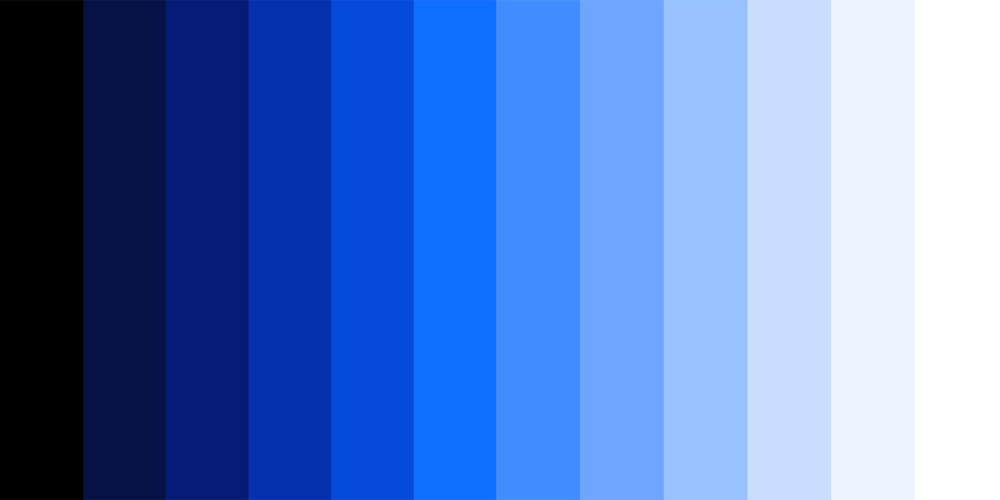

import HomepageTemplate from 'gatsby-theme-carbon/src/templates/Homepage';

export default HomepageTemplate;

<FeatureCard
    color="dark"
    href="getting-started/designing"
    subTitle="Start"
    title="Designing"
    actionIcon="arrowRight"
    className="homepage-feature"
    >

<ArtDirection>

</ArtDirection>

</FeatureCard>

<FeatureCard
    color="dark"
    href="getting-started/coding"
    subTitle="Start"
    title="Developing"
    actionIcon="arrowRight"
    className="homepage-feature"
    >

<ArtDirection>

</ArtDirection>

</FeatureCard>

### Other resources

The component libraries give developers a collection of reusable components for
building websites and user interfaces. See a
[complete list of resources.](/resources)

<Row className="resource-card-group">
<Column colLg={4} colMd={4} noGutterSm>
  <ResourceCard
    color="dark"
    subTitle="Sketch libraries"
    href="/resources#theme-libraries"
    >
      <MdxIcon name="sketch" />
  </ResourceCard>
</Column>
<Column colLg={4} colMd={4}  noGutterSm>
  <ResourceCard
    color="dark"
    subTitle="Carbon for IBM.com Components"
    href="https://github.com/carbon-design-system/carbon/tree/master/packages/components"
    >

<MdxIcon name="github" color="inverse" />

  </ResourceCard>
</Column>
<Column colLg={4} colMd={4} noGutterSm>
  <ResourceCard
    color="dark"
    subTitle="Carbon for IBM.com Components React"
    href="https://github.com/carbon-design-system/carbon/tree/master/packages/react"
    >

<MdxIcon name="github" color="inverse" />

  </ResourceCard>
</Column>
<Column colLg={4} colMd={4} noGutterSm>
  <ResourceCard
    color="dark"
    subTitle="Carbon Components Angular"
    href="https://github.com/IBM/carbon-components-angular"
    >

<MdxIcon name="github" color="inverse" />

  </ResourceCard>
</Column>
<Column colLg={4} colMd={4} noGutterSm>
  <ResourceCard
    color="dark"
    subTitle="FAQ"
    href="help/faqs"
    >

<MdxIcon name="github" color="inverse" />

  </ResourceCard>
</Column>
</Row>

### Latest news

<Row>
  <Column colLg={4} colMd={4} noGutterMdLeft>
<ArticleCard
    color="dark"
    title="Roadmap"
    author="Last updated"
    date="December 9, 2019"
    href="https://github.com/carbon-design-system/ibm-dotcom-library/wiki/Roadmap"
    >

</ArticleCard>
</Column>
<Column colLg={4} colMd={4} noGutterMdLeft>
<ArticleCard
    color="dark"
    title="Release schedule"
    author="Last updated"
    date="December 13, 2019"
    href="https://github.com/carbon-design-system/ibm-dotcom-library/issues"
    >

</ArticleCard>
</Column>

<Column colLg={4} colMd={4} noGutterMdLeft>
<ArticleCard
    color="dark"
    title="Slack channel"
    author="Last updated"
    date="December 10, 2019"
    href="https://cognitive-app.slack.com/archives/C2PLX8GQ6"
    >

</ArticleCard>
</Column>
</Row>
