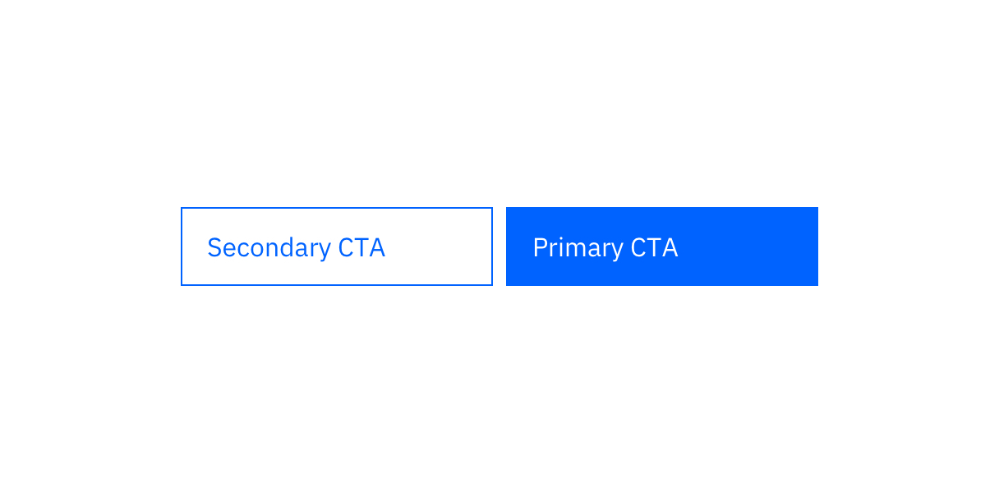
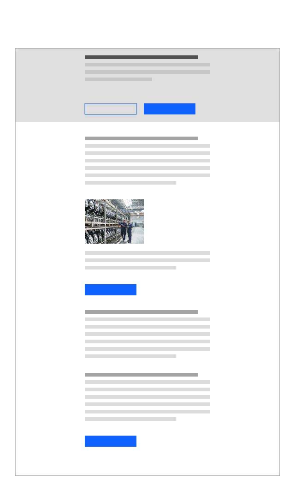
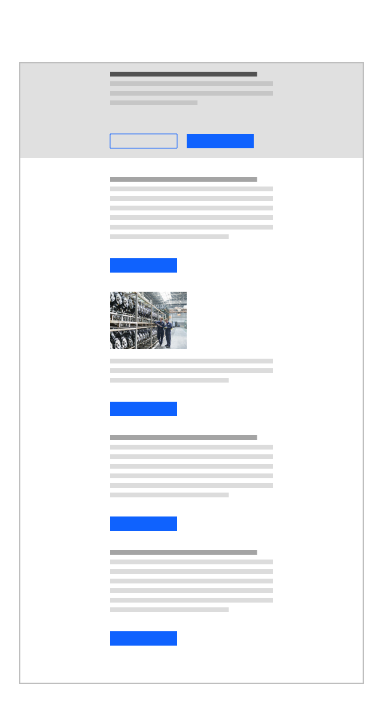
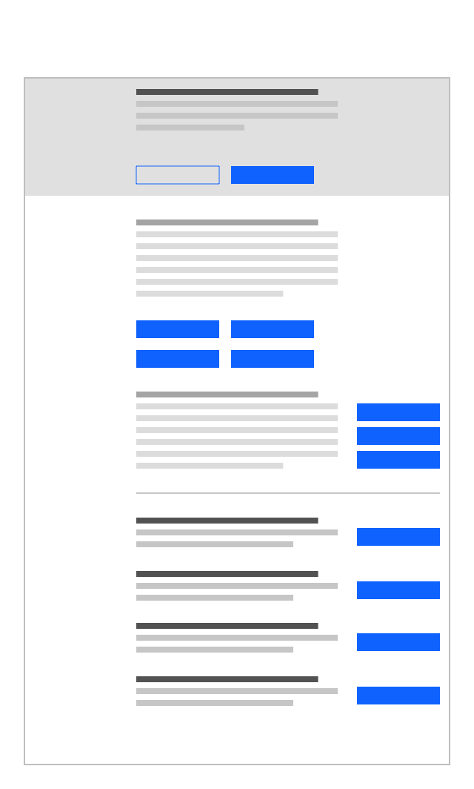

<PageDescription>

A CTA, or call-to-action, is used to present the user with next steps, typically by clicking on a button, link or card. A well designed and placed CTA can impact the user's experience and business results significantly. Follow the best practices presented on this page for optimal performance and consistency across IBM.com.

</PageDescription>

<AnchorLinks>

<AnchorLink>Primary and secondary CTAs</AnchorLink>
<AnchorLink>Labels</AnchorLink>
<AnchorLink>Best practices</AnchorLink>
<AnchorLink>Summary</AnchorLink>

</AnchorLinks>

## Primary and secondary CTAs

Use multiple CTAs when you want to provide alternative actions. A primary and secondary CTA are typically related, but you’re offering a choice to your reader in case a single action may not be the sole course of desired action. When using buttons on IBM.com, use the Primary button component for the primary CTA and the Tertiary button component to show the secondary CTA. When buttons are placed side by side, it is recommended that the primary CTA is placed on the right side.

<Row>
<Column colMd={8} colLg={8}>

</Column>
</Row>

## Labels

Convey your message in a voice and tone that are action statements that refer to the goal of your page, while taking into account the reader's stage in the buyer’s journey. For example, if your page is about informing, use "Explore the capabilities"; if the page is about selling, use "Buy now"; and if the page is about signing up, use "Create an account". In as few words as possible, use words that accurately describe the user’s potential action and summarizes what the landing page is about. Be concise, but fully explain the consequence of clicking on the CTA. The CTA text should match the landing page experience to avoid confusion.

Use these editorial guidelines when creating labels:

- Start with an action verb (e.g., Try, View, Shop).
- Write short CTAs with a maximum of 25 characters. Be as specific as possible (e.g., Shop now, Start your free trial, Try Watson APIs for free).
- If space allows, always use articles in the CTAs (e.g., "View the demo" not "View demo").
- Do not repeat any words in the product name or in other text that immediately precedes the CTA. Real estate is tight and we should add more context with the CTA, not duplicate text.
- Use sentence case ("Buy now" not "Buy Now") for all CTA labels.
- Avoid "Learn more" as a CTA; it’s generic and doesn’t add context for the user.

## Best practices

### How many CTAs should there be on a page?

The right question is what are the key moments when the user is potentially ready to take action in the page narrative or experience?

Every page that you build should always have at least one CTA. Beyond that, some pages may have more than one intended goal or objective, which would require more than one CTA. For example, you may want a reader to sign up for a new account and, simultaneously, you may want them to learn more by signing up to read a gated white paper or watch a gated video. We recommend distilling the overall objectives of your page into a very small number of objectives, then creating a CTA for each of those objectives.

### Placement

CTAs should be spread throughout the page and placed at key moments when the user is potentially ready to take action.

<Row>
<Column colMd={4} colLg={4} >
  <DoDontExample type="do" >

  </DoDontExample>
</Column>  
<Column colMd={4} colLg={4}>
  <DoDontExample>

  </DoDontExample>
</Column>
</Row>

### Cognitive overload

Avoid presenting too many CTAs on one screen.

<Row>
<Column colMd={4} colLg={4} >
  <DoDontExample type="do" >

  </DoDontExample>
</Column>  
<Column colMd={4} colLg={4}>
  <DoDontExample>

  </DoDontExample>
</Column>
</Row>

## Summary

We emphasize that there is no "one size fits all" for CTAs. We recommend experimenting with various CTA layouts through A/B testing to yield the best performing deployments.
