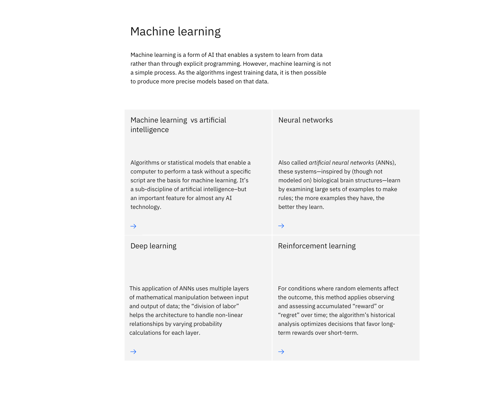

<PageDescription>

Cards display a snapshot of information in an easily scannable and digestible way. Cards encourage user interactions such as tapping, hovering, and clicking to view more details or to take action.
They can be used as navigational components or to highlight secondary editorial content.

</PageDescription>

<AnchorLinks>

<AnchorLink>Overview</AnchorLink>
<AnchorLink>Call-to-action</AnchorLink>
<AnchorLink>Navigational</AnchorLink>
<AnchorLink>Featured content</AnchorLink>
<AnchorLink>Informational</AnchorLink>
<AnchorLink>Resources</AnchorLink>
<AnchorLink>Use of icons</AnchorLink>
<AnchorLink>Related components and patterns</AnchorLink>

</AnchorLinks>

## Overview
Cards are used commonly across digital experiences. They can accommodate a range of content types and are often used to drive or progress users to a supporting page, resource or external destination.

## Call-to-action

Cards can be used as a call-to-action (CTA) to direct users to a key piece of content. A CTA card behaves much like a button or text link but is more prominent in size and descriptive in content. CTA cards are not a replacement or alternative for regular CTA buttons and should be used with careful consideration only to support specific content needs.

Examples of cards used as a call-to-action:

<Title>Card link</Title>

<Caption>
A single card is placed at the bottom of this section to encourage users to learn more about the preceding content.
</Caption>

### When to use call-to-action cards

* Use to progress users to associated content and resources
* Use to direct readers to other web pages that directly relate to the topic  at hand
* Use sparingly, to enhance learning of use cases only

### When not to use call-to-action cards

* Do not use if the desination does not have immediately relevant information
* Do not use if the next section on the page is a group of cards
* Do not use as a global replacement or alternative for buttons

## Navigational

A group of cards can be used to help users navigate to various pieces of information about the subject matter they are interested in learning about or the offering they intend to purchase.

Examples of card-based designs that serve navigational intent:

<Title>Cards — navigational</Title>

<Caption>
These cards are used as navigational drivers with each one leading to a unique industry page.
</Caption>

### When to use navigational cards

* Use to present a range of potential pathways to users
* Use to present content in a scannable and accessible way
* Use as an interactive browsing device

### When not to use navigational cards

* Do not use if you want the user to choose a specific pathway
* Do not use if there is an intended hierarchy for reading or scanning
* Do not use to display detailed descriptions

## Featured content

Cards can be used to surface key associated content, showcase significant supporting material, or aesthetically highlight an important next step.

Examples of cards that can be used to call attention to features:

<Title>Feature card</Title>

<Caption>
In this example, a single large card is used to highlight available industry examples that address the user’s need.
</Caption>

### When to use featured content cards

* Use to call attention to important content
* Use when linking to a single destination
* Use to feature compelling imagery and messaging

### When not to use featured content cards

* Do not use if the information is not vital to the main content or user need
* Do not use if you want the user to stay on the current page
* Do not use as a decorative element

## Informational

Cards are often used to organize a group of related items into short, digestible content pieces.

Examples of cards that can be used to inform users:

<Title>Content group cards</Title>

<Caption>
These cards provide a short but comprehensive overview for each topic presented.
</Caption>

### When to use informational cards

* Use to give equal hierarchy to all content items
* Use to link users to important features, services or topics
* Use to group multiple text-based content items together

### When not to use informational cards

* Do not use to group unrelated content or resources
* Do not use to display lists of features
* Do not use to accommodate long-form reading

## Resources

Cards can be used to link to diverse resources such as learning material or media that support the main content or offering. Grouping resources together using cards provides a preview to each resource and allows a user to choose their own journey based on their needs.

Examples of cards that can be used to showcase diverse resources:

<Title>Card section — with images</Title>

<Caption>
Cards with images, when grouped together, provide a visual glimpse into the additional resources available.
</Caption>

### When to use resource cards

* Use to present an array of resources in a single section of the page
* Use when users need to continue learning about a topic or offering
* Use to group different content types and destinations together

### When not to use informational cards

* Do not use if a resource is specifically tied to content elsewhere on the page
* Do not use when users are at the end of their pre-purchase journey

## Use of icons

Cards often include an icon that indicates the behavior or direction in which the user will take or the type of content available to the user after they click on a card.

<Title>Icon usage</Title>

* Use the `arrow—right` icon to indicate moving to a different page
* Use the `arrow—down` icon to indicate jumping to a section of the same page
* Use the `launch` icon to indicate opening a separate application or website
* Use the `download` icon to indicate a file download
* Use the `video` icon to indicate launching a video player

<Title>Icon position</Title>

In general, the usual content flow which places the CTA as the last element applies to cards too.

1. The default position: lower-left corner

<Row>
<Column colMd={8} colLg={8}>

</Column>
</Row>

2. When there are more than one icon, place the content elements in the counterclockwise order with the CTA icon as the last element.

<Row>
<Column colMd={8} colLg={8}>

</Column>
</Row>

3. For large cards used either in a group of small number or alone, depending on the design, the icon can be placed on in the lower-right corner.

<Row>
<Column colMd={8} colLg={8}>

</Column>
</Row>

Less common but also effective, this option works best on single large cards such as the [Feature card.](..components/feature-card)

When there are multiple cards grouped together, each icon should be in the same position on each card. Do not alternate the position of the icon from card to card.

<Title>Icon color</Title>

Card icons act as the primary indicator or call-to-action and therefore should use the color token `$interactive-04` when possible. In some cases, white arrows may be used on gray90 or gray100 cards.

When grouping multiple cards together, all icons should use the same color token.

Do not use icons as a way to express brand colors or gradients.

## Related components and patterns

<Title>Components</Title>

* [Card](../components/card)
* [Card link](../components/card-link)
* [Card section](../components/card-section)
* [Content group cards](../components/content-group-cards)
* [Feature card](../components/feature-card)

<Title>Patterns</Title>

* [Call-to-action](../patterns/call-to-action)
* [In-page navigation](../patterns/in-page-navigation)
