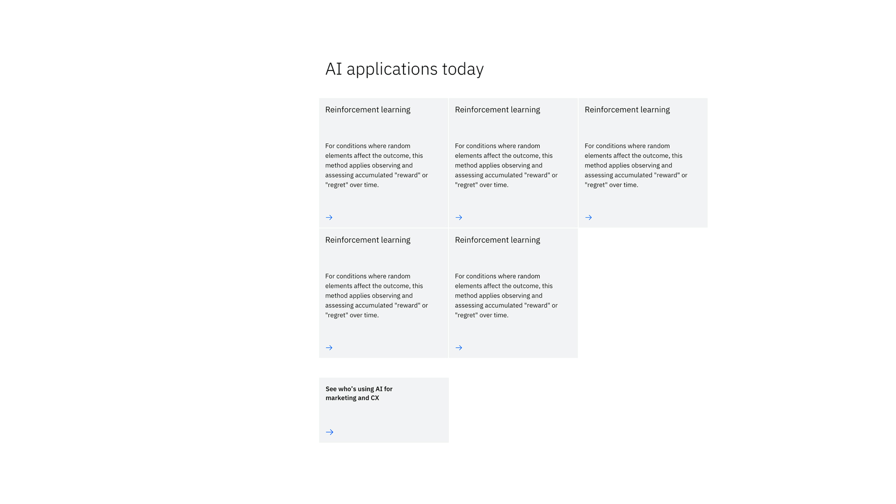
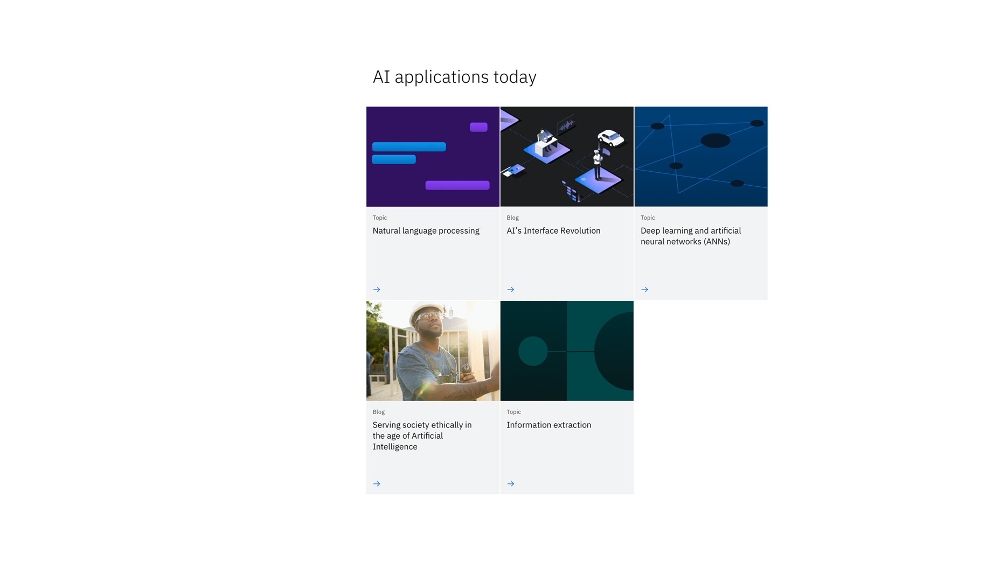
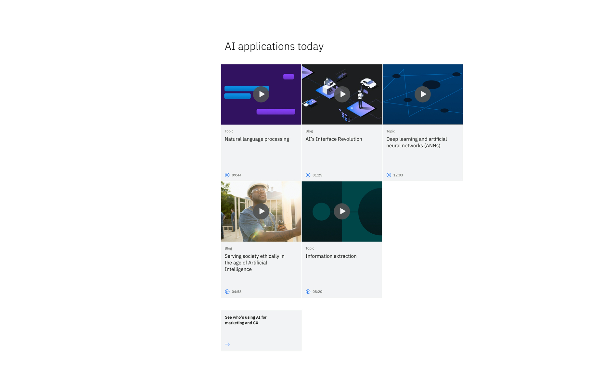

<PageDescription>

The Content block &mdash; with cards is used to present small self-contained pieces of information as cards. Use this when the cards are part of the main narrative, as opposed to secondary links or resources.

</PageDescription>

<AnchorLinks>

<AnchorLink>Default</AnchorLink>
<AnchorLink>With images</AnchorLink>
<AnchorLink>With videos</AnchorLink>
<AnchorLink>Development documentation</AnchorLink>
<AnchorLink>Design and functional specifications</AnchorLink>
<AnchorLink>Feedback</AnchorLink>
    
</AnchorLinks>

## Default

By default the Content block &mdash; with cards simply supports only text for moments needing richer content, and sets proper expectations for the user to make their next journey decision from within the page's narrative.

## With images
The Content block &mdash; with cards can use images to help tell its story to the user. This is great for breaking up dense text, adding a little visual flare, and creating instant recognition.

## With videos 
Sometimes a video will support the pages' narrative, but should not be prominently featured. This variation can be used to provide those types of videos from within the page without creating a distraction that leads them out of the narrative.

## Development documentation

| Language | Status | Sandbox |
| -------- | ------ | ------- |
| React | 
<pre>Stable</pre>
 | <a href="https://ibmdotcom-react.mybluemix.net/?path=/story/components-contentblockcards--default" target="_blank">View storybook</a> |
| Web Components | 
<pre>Under construction</pre>
 | Coming soon |

## Design and functional specifications

The design specs and functional specs for Content block &mdash; with cards can be viewed <a href="https://ibm.ent.box.com/folder/111084561933" target="_blank">here</a>.

## Feedback

Help us improve this component by providing feedback, asking questions, and leaving any other comments on <a href="https://github.com/carbon-design-system/ibm-dotcom-library" target="_blank">GitHub</a>.
