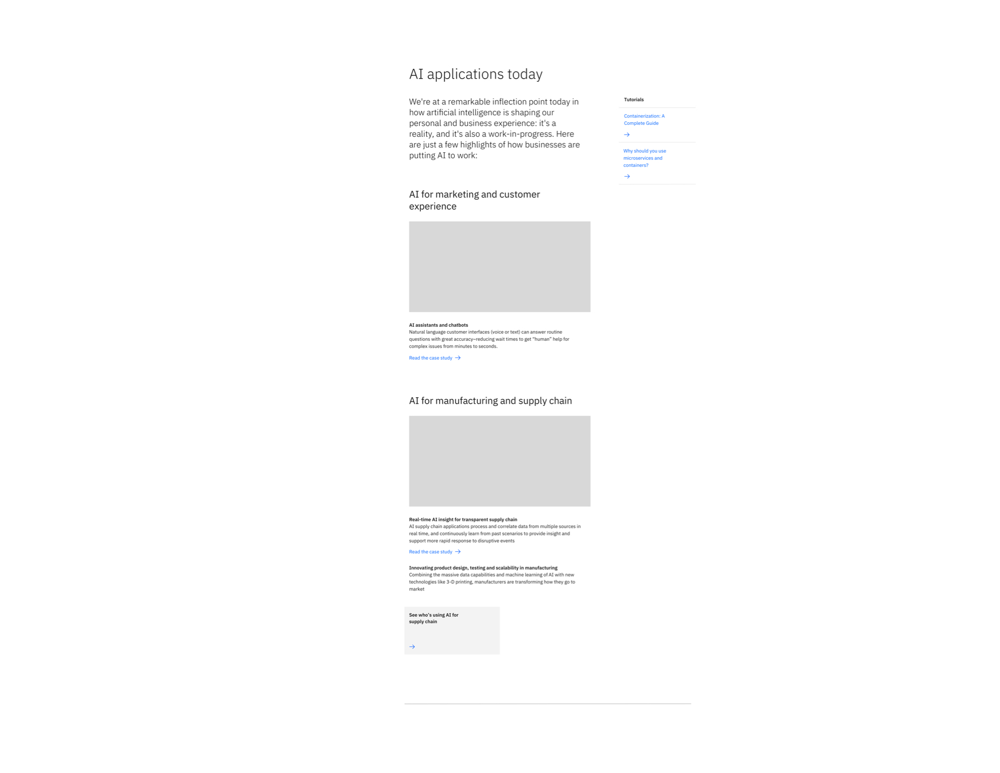

<PageDescription>

Content block &mdash; with media is used to present information with images in a group setting.

</PageDescription>

<AnchorLinks>

<AnchorLink>Default</AnchorLink>
<AnchorLink>With aside elements</AnchorLink>
<AnchorLink>Development documentation</AnchorLink>
<AnchorLink>Design and functional specifications</AnchorLink>
<AnchorLink>Feedback</AnchorLink>

</AnchorLinks>

## Default

By default the Content block &mdash; with media starts with a brief overview before going into one or more detailed points. At strategic points it allows for an optional piece of media to support its content.

## With aside elements
This variant is the same as the default version except that it allows for a list of related navigational items off to the side.

## Development documentation

| Language | Status | Sandbox |
| -------- | ------ | ------- |
| React | 
<pre>Stable</pre>
 | <a href="https://ibmdotcom-react.mybluemix.net/?path=/story/components-contentblockmedia--default" target="_blank">View storybook</a> |
| Web Components | 
<pre>Under construction</pre>
 | Coming soon |

## Design and functional specifications

The design specs and functional specs for Content block &mdash; with media can be viewed  <a href="https://ibm.ent.box.com/folder/94760926421" target="_blank">here</a>.

## Feedback

Help us improve this component by providing feedback, asking questions, and leaving any other comments on <a href="https://github.com/carbon-design-system/ibm-dotcom-library" target="_blank">GitHub</a>.
