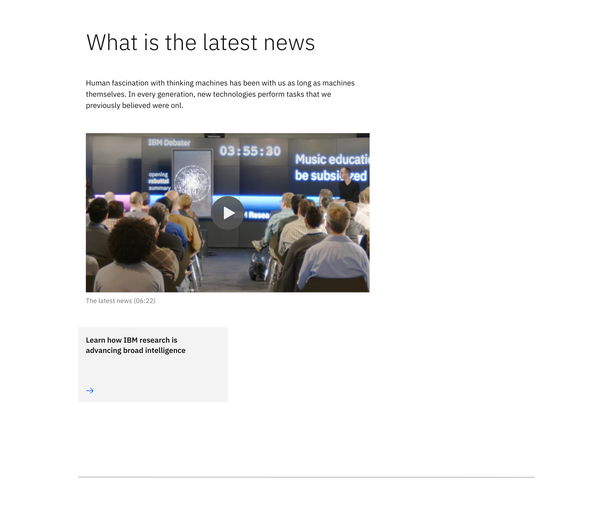
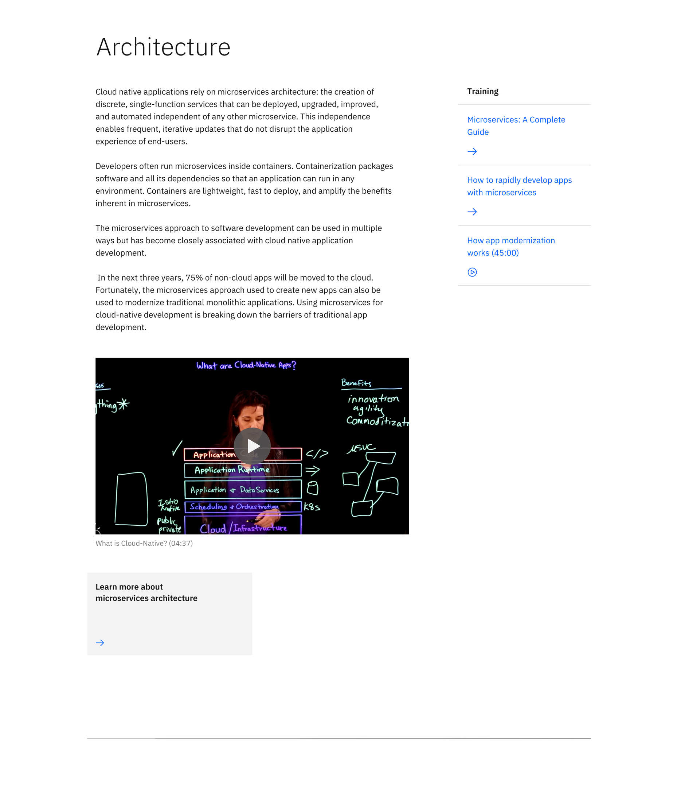

<PageDescription>

The content block &mdash; simple pattern is typically used for the introductory section on a page.

</PageDescription>

<AnchorLinks>

<AnchorLink>Default</AnchorLink>
<AnchorLink>Content block &mdash; simple with aside elements</AnchorLink>
<AnchorLink>Development documentation</AnchorLink>
<AnchorLink>Specification documentation</AnchorLink>
<AnchorLink>Feedback</AnchorLink>

</AnchorLinks>

## Default
Default content block &mdash; simple pattern is a top-level pattern meaning it ideally lives at the top of a page for introducing page content. It includes a heading, introductory paragraph, optional media (image or video), optional CTA, and horizontal rule.

## Content block  &mdash; simple with aside elements
Content block &mdash; simple with aside elements pattern is also used for introducing page content but includes navigational quick links on the right side. These quick links provide an alternate route directing users to resources related to the content in the main body.

## Development documentation

| Language      | Status        | Sandbox                                                                              |
| ------------- | -----------   | ------------------------------------------------------------------------             |
| React         | 
<pre>Stable</pre>
        | [View storybook](https://ibmdotcom-react.mybluemix.net/?path=/story/patterns-blocks-contentblocksimple--default)     |
| Web Components       | 
<pre>Under construction</pre>
  | Coming soon |

## Specification documentation

Structure and spacing measurements for "Content &mdash; block simple" can be viewed [here](https://ibm.box.com/s/26ze6is6ff50nohlx5v28fubkh2w2f2x).

## Feedback

Help us improve this component by providing feedback, asking questions, and leaving any other comments on [GitHub](https://github.com/carbon-design-system/ibm-dotcom-library).
